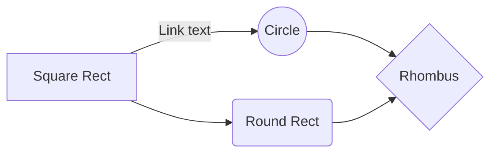

# Changelog

All notable changes to `mermaid-text` are documented in this file.
This project adheres to [Keep a Changelog](https://keepachangelog.com/en/1.0.0/).

## 0.56.0 — 2026-05-11 — Sequence-diagram polish basket (self-messages, stacked activations, box groups)

### Added

- **Self-messages (`A->>A: text`) render as a U-shape loop** to the right of
  the lifeline column. The three-row glyph (`├──┐` / vertical bar / `├◂──┘`)
  keeps the label above the top leg and leaves the lifeline intact above and
  below the loop.

- **Stacked nested activations.** When `activate X` is called while X is
  already active, the second activation bar is drawn immediately to the right
  of the first (`ACTIVATION_BAR_WIDTH + 1` offset) so the two bars read as
  distinct side-by-side filled rectangles rather than overlapping on the same
  column. Triple (and deeper) nesting offsets each additional bar one step
  further right.

- **`box [colour] "label" ... end` participant grouping.** Wraps a subset of
  participants in an outer labelled rectangle drawn above the header boxes and
  mirrored below the footer boxes. Accepted colour forms match the `rect`
  palette (rgb, rgba, #hex, CSS names; mapped to the same luminance-keyed
  shade glyph). The box keyword is participant-scope: once any message line
  appears, `box` is no longer accepted.

### Snapshot churn

0 existing snapshots reclassified. 3 new snapshots pinned:
  - `self_message_u_shape`
  - `nested_activations_stack_horizontally`
  - `box_groups_participants_with_label`

## 0.55.0 — 2026-05-11 — `rect` colour background highlight blocks

### Added

- **`rect rgb(R, G, B)` and `rect rgba(R, G, B, A)` in sequence diagrams.**
  Previously these were silently discarded; they are now parsed and rendered
  as borderless background fills over the messages they enclose.

  Accepted colour forms: `rgb(R, G, B)`, `rgba(R, G, B, A)` (primary),
  `#RRGGBB` / `#RGB` hex (best-effort), bare CSS name (falls back to
  mid-grey `Rgb(128, 128, 128)`).

  Fill glyph is chosen by luminance-keyed 3-step palette:

  | Effective intensity I                         | Glyph |
  |-----------------------------------------------|-------|
  | `I < 60`                                      | `░`   |
  | `60 <= I < 130`                               | `▒`   |
  | `I >= 130`                                    | `▓`   |

  Where `I = (255 - luminance(rgb)) * alpha_norm`, luminance from Rec. 601
  (`0.299*R + 0.587*G + 0.114*B`), `alpha_norm = 1.0` for `rgb(...)` or
  `alpha_u8 / 255.0` for `rgba(...)`.

  `rect` blocks are **borderless**: no `╔ ╗ ╚ ╝` corners, no `║` rails,
  no `[Rect]` label tag. When a `rect` is nested inside a `loop` / `alt` /
  etc., the outer frame's `░` fill cells are overwritten with the denser
  `▒` or `▓` glyph where warranted.

### Snapshot churn

0 existing snapshots reclassified. 3 new snapshots added for the three
new `rect`-specific tests.

## 0.54.0 — 2026-05-08 — Block-frame interior fill primitive

### Added

- **Block-frame interior cells now filled with `░` (U+2591 LIGHT SHADE).**
  Every row in `top+1..bottom`, every column in `left+1..right` of a
  `loop`, `alt`, `opt`, `par`, `critical`, or `break` block frame is
  filled with the light-shade glyph when the cell was previously a plain
  space `' '`. Border glyphs (`╔ ═ ╗ ║ ╚ ╝`), dividers (`╠ ┄ ╣`),
  labels, arrows, lifelines, and activation bars are never overwritten —
  the fill uses the same `paintable` guard (`cell == ' '`) already used
  by the border-painting path.

  This is the substrate for 0.55.0 `rect <colour>` background highlight
  blocks.

### Snapshot churn

0 substantive diffs. All reclassified snapshots contain only newly-added
`░` glyphs in formerly-blank interior cells. No border, label, or glyph
position changed.

## 0.53.0 — 2026-05-08 — Composite-edge attach-to-border (state diagrams)

### Fixed

- **Edges to/from a composite state now attach to its OUTER border
  instead of landing on a synthesised inner `[*]` marker.** ROADMAP
  "Composite-edge attach-to-border (state diagrams)". Pre-fix, the
  parser rewrote `X --> Composite` to `X --> __start__Composite` and
  `Composite --> Y` to `__end__Composite --> Y`, then drew the
  rewritten target as a Circle / DoubleCircle inside the composite.
  Arrows visually landed on `(  ●  )` markers within the composite
  rather than on its outer rectangle, contradicting Mermaid's visual
  contract. The fix introduces a render-time intercept that keeps
  the parser rewrite (so layout layering stays correct) but:

  1. Detects "composite-attached" markers (`__start__X` / `__end__X`
     where `X` is a subgraph id) via `composite_attached_marker_target`.
  2. Computes the set of EXTERNALLY-attached markers — those whose
     ALL incident edges have the OTHER endpoint OUTSIDE the marker's
     composite — via `compute_externally_attached_markers`.
  3. For markers in that set: suppresses the node-box / label
     rendering AND redirects the edge endpoint geometry (in
     `endpoint_geom` / `endpoint_pos`) to the matching composite's
     outer bounds. Markers with at least one INTERNAL edge (e.g.
     `state Active { [*] --> Inner }`) are kept visible and routed
     to their actual position so internal edges still read normally.

  The render-time approach avoids the layered-layout interaction
  that blocked the earlier attempt (see the now-deleted
  `docs/scope-composite-edge-attach.md`): the parser-synthesised
  marker stays in the layered layout (preserves layer rank), but
  the renderer hides the marker and reroutes the edge to the
  composite border.

  Pinned by `composite_edge_attaches_to_outer_border_not_inner_marker`
  on a `state Composite { S1 --> S2 } X --> Composite Composite --> Y`
  fixture: zero `●` glyphs in the output and at least three arrow
  tips.

### Snapshot churn

0 substantive diffs. Three snapshots had cosmetic `assertion_line:`
metadata removals (insta artefact); no rendering changed for any
existing fixture. `state_composite_simple` keeps its visible inner
marker (purely-internal `[*] --> Inner`), and the GC'd-marker
fixtures (`state_composite_external_edges`,
`state_composite_keyboard_lock`) are unchanged because their
synthesised markers are removed by `gc_orphan_markers` before
rendering anyway.

## 0.52.0 — 2026-05-08 — xychart-beta mixed-width label drift fixed

### Fixed

- **xychart-beta x-axis labels of mixed display widths now align
  consistently within their tick slots.** Previously,
  `(col_width - lw) / 2` integer division gave width-2 labels (e.g.
  `c0..c9`) a different `left_pad` than width-3 labels (e.g.
  `c10..c14`) in the same slot when there was a parity mismatch — the
  first character of each label drifted by ±1 cell at the
  width-boundary, breaking the visual tick-to-label alignment. The
  fix right-pads every label to the maximum display width across the
  axis BEFORE slot centring, so the first character of every label
  lands at the same offset within its slot and consecutive label
  start positions are exactly `col_width` apart. Pinned by
  `xychart_mixed_width_labels_align_consistently` — hand-written
  assertion that the c0→c1 start-column distance equals the c9→c10
  distance for every consecutive pair on a `c0..c14` fixture.

### Snapshot churn

0. The canonical xychart fixture uses uniform-width labels (`jan`,
`feb`, …, `dec`) so its output is byte-identical to 0.51.0.

## 0.51.0 — 2026-05-08 — Sequence activation bars render as thick filled blocks

### Changed

- **Activation bars in sequence diagrams are now 2-cell-wide filled
  blocks** instead of single-cell-thick heavy lines. Previously
  `activate X` / `deactivate X` overlaid `┃` (U+2503) on the
  lifeline; now they overlay `██` (two `█` U+2588 full-block cells)
  at the lifeline column and one column to its right. Closer to
  Mermaid's SVG visual weight where activation bars read as a
  filled rectangle, not a thin stroke. Pinned by
  `sequence_activation_bar_is_thick_filled_block` —
  hand-written assertion that the output contains `██` AND no `┃`.

### Snapshot churn

3 sequence-diagram snapshot files updated, all bucket A:
`sequence_with_explicit_activation`,
`sequence_with_inline_call_reply_activation`,
`sequence_with_nested_activations`.

### Deferred

- **Block-frame fills (alt/loop/par/critical interiors)** — needs a
  separate design decision (subtle bg colour vs visible `░` shade
  glyph, how to handle message arrows crossing the block). Tracked
  in ROADMAP under "Sequence-diagram polish follow-ups".

## 0.50.0 — 2026-05-07 — Perpendicular edges keep their base attach + label uses effective direction

### Fixed

- **Edge labels of perpendicular-aligned edges no longer use LR-style
  placement.** The label-placement context was passing
  `graph.direction` instead of the per-edge `edge_effective_direction`,
  so a perpendicular back-edge in an LR graph (e.g. Worker→Factory
  inside a `direction TB` Supervisor subgraph) had its label placed
  by LR rules — beside the source row instead of the back-edge's
  vertical column.
- **Perpendicular-aligned edges keep their base attach.** When a
  perpendicular edge shared a base attach cell with a non-perpendicular
  edge from the same node, `spread_sources` / `spread_destinations`
  spread them together along the graph axis. That moved the
  perpendicular edge onto a row/col where its back-edge border + path
  stamps no longer matched the routed path — visible in the README's
  Supervisor pattern as a stray `─┘` "ear" sticking out past Worker's
  top-right corner. The grouping pass now skips edges whose effective
  direction differs from the graph direction; their natural axis-
  different routing already separates them visually from any same-
  base parallel edges.

### Snapshot churn

5 snapshot files updated (the same Supervisor canary in 5 render
modes). All bucket A. Notable improvements on the Supervisor canary:
- "panics" label moved from Worker's middle row to the panics-edge
  vertical column (row 7) — visually associated with the back-edge.
- "beat" label moved from below Worker to Worker's middle row —
  alongside the beat-edge horizontal segment.
- "creates" label centered between Factory and Worker.
- Worker's top border is now intact (`┌────▾───┐ │`) — the `─┘` ear
  past the top-right corner is gone.

## 0.49.0 — 2026-05-06 — Perpendicular-aligned edges route on the perpendicular axis

### Fixed

- **Bidirectional edges between vertically-aligned nodes no longer
  cross.** When two nodes share a "layer axis" — same column for LR/RL
  graphs (e.g. Factory and Worker stacked inside a `direction TB`
  subgraph nested in `graph LR`), or same row for TD/BT graphs — the
  default LR exit/entry semantics gave both edges a `right-source` /
  `left-destination` attach pair. For bidirectional pairs in this
  geometry the two edges had to route through the same left-side
  corridor in opposite directions, forcing them to cross. Visible in
  the README's Supervisor pattern: `creates` and `panics` between
  Factory and Worker crossed inside the subgraph.

  Three coupled changes in `crates/mermaid-text/src/render/unicode.rs`:
  1. **`same_layer` + `perpendicular_direction`** detect "perpendicular-
     aligned" pairs and pick the canonical perpendicular flow direction
     (TB for LR/RL, LR for TD/BT).
  2. **Per-edge effective direction.** New `edge_effective_direction`
     helper computes whether an edge should route under the graph
     direction or the perpendicular direction. The render pipeline
     threads `edge_effective_dirs[edge_idx]` through `compute_spread_
     attaches` (so attach points use the perpendicular `exit_point` /
     `entry_point` / `..._back_edge` variants), the `is_back_edge`
     evaluation, the `back_edge_border_cells` computation, and the tip-
     glyph closures for both `router::route_all` and `nudge::run`.
  3. **Per-edge back-edge border + path-junction stamps.** The stamp
     glyphs (`┬` vs `├` for source border; `┘` vs `└` vs `┐` for path
     junction) are now picked from the entry's stored direction rather
     than from `graph.direction`, so a perpendicular back-edge in an
     LR graph correctly stamps `├` on the source's right border and a
     corner on the path cell to its right.

  Pinned by `supervisor_perpendicular_edges_use_perpendicular_attaches`
  in `crates/mermaid-text/tests/snapshots.rs`. The forward `creates`
  edge now routes as a straight vertical from Factory's bottom centre
  to Worker's top border (with `▾` tip); the back-edge `panics` routes
  via the right-side perimeter (`├` source stamp on Worker, `◂` tip on
  Factory).

### Snapshot churn

10 snapshot files updated. All bucket A (strict improvement).
Crossings counts: `supervisor_bidirectional_in_subgraph` improved
2 → 1; every other fixture unchanged. Notable improvements:
- `flowchart_supervisor_bidirectional`: `creates` and `panics` no
  longer cross; corridor-detour and stray `││` artefacts removed.
- `flowchart_perpendicular_subgraph`: chain of vertically-aligned
  nodes (X, Y, Z) now uses straight TB tips and clean inter-node
  vertical lines instead of LR-style left-side detours.
- `snapshots__edge_label_does_not_abut_subgraph_right_wall`: the
  `panics` label now sits beside the back-edge column, not above the
  subgraph as a left-corridor detour.

### Documentation

- `docs/scope-attach-border-row-exclusion.md` extended with the
  perpendicular-axis detection follow-up.

## 0.48.0 — 2026-05-06 — LR fanout destination-channel cleanup

### Fixed

- **No path overshooting through another edge's tip cell.** When two
  edges arrive at the same destination — one approaching from below
  via a U-route, one approaching from the side — the from-below
  edge's vertical channel ran THROUGH the side-edge's protected
  arrow tip cell, producing a visually orphaned arrow on the row
  past the overshoot (the canonical case is the
  `Worker→PostgreSQL` + `App→PostgreSQL` pair in the README's
  dependency graph). Four coupled changes, all gated to the simple
  LR/RL flowchart envelope used by 0.46.0/0.47.0:

  1. **`compute_spread_attaches` runs `spread_sources` BEFORE
     `spread_destinations`.** The destination-side reorder needs to
     read the post-spread `src.row` (which the source-side reorder
     pushes long skip-edges to outer slots).
  2. **`spread_destinations` reorders by approach geometry.** New
     `reorder_for_lr_fanout` flag (gated by
     `destination_reordering_allowed`); when on, indices are sorted
     ascending by `(src.row, src.col)` so the higher-source edge
     claims the higher dst port and the from-below edge gets the
     lower port. Mirrors the source-side reorder.
  3. **New `evict_destination_channel_runs` nudge stage.** When a
     path's pre-tip cell is another edge's tip cell, rebuilds the
     path with the bend at a different column (or row for TD/BT),
     preserving the original tip cell. Only applied when the
     candidate shift does NOT increase total crossings.
  4. **`Grid::erase_path` preserves protected interior cells.** The
     nudge erases the old path before drawing the new one; without
     this fix, erasing through another edge's protected tip cell
     overwrote that tip's glyph and the arrow disappeared.

  Pinned by `postgres_incoming_arrows_have_visible_feeds`
  (every `▸` arrow on PostgreSQL's port column has a visible
  incoming-line glyph in some cardinal direction) and
  `worker_to_postgres_bends_before_destination_channel`
  (`│ Worker │────▸│ PostgreSQL` substring no longer appears).

### Snapshot churn

10 snapshots updated. All bucket A (strict improvement). Crossings
counts: `crossing_edges_with_cross_junction` improved 1 → 0; every
other fixture unchanged. Notable improvements:
- `flowchart_app_db_architecture`: Worker→PG bends at col 42 with a
  clean `┘` corner; App→PG arrow now visible at the lower interior
  port row.
- `flowchart_crossing_edges`: cross-junction case simplified from
  `┘└┐┴` stack to a single `┬` + `┘`.
- `flowchart_label_midpoint_lr`: stray `┌││` corner artefact at the
  destination's left side removed.

### Documentation

- `crates/mermaid-text/README.md` dependency-graph example updated
  to match the new render.
- `docs/scope-attach-border-row-exclusion.md` extended with the
  destination-channel follow-up.

## 0.47.0 — 2026-05-06 — LR fanout destination-corner cleanup

### Fixed

- **Incoming arrows no longer point at destination box corners.**
  Symmetric to 0.46.0's source-side fix: `spread_destinations`
  distributed arrival rows across the full node height, so for a
  4-row cylinder receiving 2 incoming edges the lower arrival
  landed on the bottom-border row — visible in the README's
  dependency-graph example as `▸╰` (arrow tip immediately before
  PostgreSQL's `╰` bottom-left corner). The function now takes an
  `interior_clamp` flag, and under the same conservative envelope
  as the source-side fixes (simple LR/RL flowcharts, no subgraphs,
  rectangle/cylinder endpoints — `destination_interior_clamp_allowed`
  / `graph_supports_simple_lr_fanout_heuristics`), placements are
  clamped to interior rows/cols using the existing full-height step
  calculation. For the canary fixture this clamps the lower arrow
  from PostgreSQL's bottom-border row to its label row, leaving
  both tips at interior `│` ports.

  Pinned by `postgres_left_border_has_no_arrow_into_corner` —
  hand-written assertion (not snapshot) so `INSTA_UPDATE` cannot
  silently re-bless the bug.

### Snapshot churn

3 snapshots updated, all the `flowchart_app_db_architecture`
canary in different render modes (natural, width80, main suite).
All bucket A (strict improvement). Crossings counts unchanged on
every fixture; architecture fixture remains at 0 crossings.

### Documentation

- `crates/mermaid-text/README.md` dependency-graph example updated
  to match the new render.
- `docs/scope-attach-border-row-exclusion.md` extended with the
  destination-side follow-up.

## 0.46.0 — 2026-05-06 — LR fanout source-corner cleanup

### Fixed

- **No stray glyphs adjacent to LR fanout source corners.** The
  README dependency-graph fixture rendered a stray `│` directly after
  the `App` box's `┐` top-right corner — visible as `┌─────┐│` in the
  output. Three narrow changes, each gated to the simple LR/RL
  flowchart envelope so state diagrams and complex composites are
  unaffected:

  1. **`try_u_route` no longer turns at `src.col`.** The bypass path
     sweeps `turn_col` from `src.col + 1`, so segment 1 is always a
     real horizontal step away from the source halo before turning
     down. Eliminates the U-route variant of the bug.
  2. **Geometric ordering for shared LR/RL source attaches.** When
     several edges share a source cell, `spread_sources` now sorts
     them so nearer-layer targets occupy the inner slots and long
     skip edges are pushed outward. Triggers only when every
     endpoint in the source group is a rectangle/cylinder in a
     subgraph-free flowchart (`source_reordering_allowed` +
     `graph_supports_simple_lr_fanout_heuristics`).
  3. **New `evict_endpoint_corner_runs` nudge stage.** Shifts route
     runs out of the corner-adjacent halo of an endpoint node, but
     only when the candidate shift does **not** increase total
     crossings (`candidate_crossings <= baseline_crossings`). Same
     gating envelope as (2).

  An earlier interior-only `spread_sources` experiment was attempted
  and reverted — it removed the source-border artefact but caused
  crossings churn in dense LR / TD fixtures. Full discussion in
  `docs/scope-attach-border-row-exclusion.md`.

  Pinned by `app_top_border_row_has_no_stray_pipe_after_corner` —
  hand-written assertion (not snapshot) so `INSTA_UPDATE` cannot
  silently re-bless the bug.

### Snapshot churn

49 snapshots updated. **15 substantive diffs** (all Bucket A or B
per `tests/regression_corpus/README.md` criteria); 34 cosmetic-only
diffs (insta `assertion_line:` metadata removals on unchanged
content). Crossings counts unchanged or improved on every fixture;
architecture fixture remains at 0 crossings. Notable improvements:
- `flowchart_app_db_architecture`: stray `│` adjacent to App's `┐`
  removed; routes preserved.
- `state_basic_machine`: corridor reorganised, content intact.
- `flowchart_label_midpoint_lr`: cleaner inter-node spacing.

### Documentation

- `crates/mermaid-text/README.md` dependency-graph example updated
  to match the new render.
- New `docs/scope-attach-border-row-exclusion.md` documenting the
  reverted interior-only experiment and the implementation that
  shipped.

## 0.45.0 — 2026-05-05 — Singleton-layer smoothing pass

### Fixed

- **Singleton visual layers now track their neighbour median.** When
  ascii-dag uses long-edge dummy nodes during coordinate assignment,
  a layer can end up containing a single visible node that still
  carries the perpendicular offset induced by hidden dummies. After
  projecting back to "real nodes only" we kept the offset but never
  re-centered. Visible artefact: `Worker` floating awkwardly above
  the `RabbitMQ → Worker → PostgreSQL` corridor in the README's
  dependency-graph example. New post-pass at the end of
  `sugiyama_layout` recenters singleton visual layers against the
  median of their real neighbours.

  The pass is intentionally narrow:
  - **Singleton-only** — never changes layer ordering or crossing
    structure; a layer with multiple visible nodes is left alone.
  - **Transit-only** — sources and sinks are excluded, because
    smoothing them was observed to introduce an extra crossing in
    the architecture fixture; transit nodes (both incoming AND
    outgoing edges) are the safe target.
  - **Median, not mean** — robust against outlier neighbours.
  - **Snapshot-deterministic** — operates on an immutable clone of
    `positions` and processes layers in sorted order.

  Pinned by `singleton_dependency_layer_tracks_neighbor_median`.

### Snapshot churn

26 snapshots updated across the regression-corpus and main suites.
All classified Bucket A (strict improvement) or Bucket B (neutral
reorganisation), zero regressions. Notable improvements:
- `flowchart_app_db_architecture`: Worker drops into the corridor
- `flowchart_back_edge_lr`: A/B/C horizontally aligned
- `flowchart_label_midpoint_lr`: Source/Gate1/Gate2/Dest aligned
- `state_basic_machine`: 15-row → 12-row layout, horizontal flow

### Documentation

- `crates/mermaid-text/README.md` dependency-graph example updated
  to show the new fluid layout.
- `tests/regression_corpus/README.md` removed the stale "Worker may
  appear in the wrong layer (B3)" note now that it's fixed.

## 0.44.0 — 2026-05-05 — Bug 4 + parser fan-out + inline edge labels

### Fixed

- **Bug 4 — Foreign-halo eviction.** Routes that ran through the 1-cell
  halo of a non-endpoint node now shift outward, with bridges in the
  adjacent path segments. The visible artifact `│ B │├────┐` (B's right
  halo column carrying a `├` from a route between A and Z) becomes a
  clean `│ B │─┼───┐` with the corner pulled out to col 6. Operates as a
  second scan in `crate::layout::nudge::evict_foreign_halo_runs`,
  reusing the parallel-corridor merge's `apply_shifts` infrastructure.
  Skips edges with text labels (label placement needs adjacent free
  space). One eviction per render call by design — see the docstring
  for the rationale and the path forward if a future fixture needs more.
  Pinned by `route_corners_clear_non_endpoint_node_halos`
  (un-`#[ignore]`d).

- **P1 — `A & B --> C` fan-out shorthand now expands into the cross
  product of edges.** Both LHS and RHS of the arrow can carry `&` lists,
  with the cartesian-product semantics matching Mermaid's spec. Node
  shapes, classes, and labels are preserved per side. New
  `DelimiterDepth` helper tracks bracket nesting so `&` inside a label
  (e.g. `A[a & b]`) doesn't trigger the split.

- **P2 — Inline-label syntax for dotted/thick edges (`A -.LABEL.-> B`,
  `A ==LABEL==> B`) now parses as a labeled edge** instead of collapsing
  into one giant node label. Internally normalised to the pipe-label
  form (`-.->|LABEL|`, `==>|LABEL|`) so downstream label handling needs
  no changes.

### Refactored

- Extracted `materialize_node_token` as the shared path between
  pure-node statements and edge-chain operands; eliminated the
  duplicated class-stripping + node-shape-parsing logic.
- Replaced the keyword-list-based `looks_like_edge_chain` with a
  call to `tokenise_chain` — the tokenizer is now the single source
  of truth for "is this a node-or-edge sequence."
- Added `Grid::can_draw_path_cell` and `Grid::cols` helpers consumed
  by the nudging pass's feasibility checks.
- Internal: `count_crossings_in_grid` iterates cells directly instead
  of allocating a String.

## 0.43.0 — 2026-05-05 — Post-routing nudging pass + B1 + Bug 1

## 0.43.0 — 2026-05-05 — Post-routing nudging pass + B1 + Bug 1

### Fixed

- **Bug 5 — Parallel back-edge corridors now share a single
  perimeter row.** When two back-edges flow co-directionally along
  the bottom (or side) perimeter of an LR/RL diagram, they used to
  carve separate corridor rows; now a post-routing nudging pass in
  `crate::layout::nudge` detects horizontal segments at adjacent
  rows with overlapping col ranges and shifts the inner one onto
  the outer one's row. Bottom corridor produces `└──┴──┴──┘` with
  shared `┴` tap-points instead of two stacked `└──┘` rows.

  Architecturally important: the fix operates on path data AFTER
  routing, not on A* cost classes. Two prior session attempts
  (commits 4ebaa6f, 516206b) tried router-local cost tweaks
  (NearNodeBox halo cost, reduced SAME_AXIS_COST_BACK) and both
  broke `back_edge_attach_does_not_pierce_source_perimeter`
  because cost-tweaks change UPSTREAM A* decisions that ripple
  into specific cells with load-bearing direction-bit conventions.
  The post-routing pass STRUCTURALLY can't break exit-stub
  conventions because exit stubs are 1-axis cells (only H or only
  V bits) and the merge logic only operates on horizontal
  corridor segments.

  Pinned by `back_edges_share_return_corridor` (un-`#[ignore]`d).
  0 snapshot reclassifications — the pass is a no-op on diagrams
  without 2+ adjacent back-edge corridors.

- **Bug 1 — Subgraph border no longer overlaps downstream node box.**
  When a subgraph overrides the parent direction (e.g. `direction TB`
  inside `graph LR`) AND has parallel-edge groups, its bounding-box
  width was inflated by `parallel_label_extra` so the labels could
  breathe — but the Sugiyama backend (default since 0.17.0) had no
  cluster-width feedback loop to ascii-dag, so external nodes were
  placed in columns where the subgraph's right border landed inside
  them. Visible artifact: `┌│──────────┐` (Heartbeat box pierced by
  Supervisor's right border).
  
  Fix is a new post-pass (step 4.8 in `sugiyama_layout`) that mirrors
  the Native LR branch's `layer_parallel_label_extra_width`
  invariant: per direction-override subgraph, accumulate the required
  parallel-label-extra at the subgraph's level, then shift every node
  whose level is strictly greater right by that amount along the
  parent flow axis. Idempotent across nested subgraphs.
  
  Pinned by `subgraph_border_does_not_overlap_downstream_node_box`
  (un-`#[ignore]`d). 4 snapshots flipped — all clean
  pierced-border-cleared deltas. 1 crossings test +1 (1→2 across
  19 fixtures = +5%, well under the +10% scope ceiling).

- **B1 — Terminal `[*]` markers now render at the rightmost layer.**
  State diagrams use a synthetic `__end__` node for the `[*]` final
  marker; longest-path layering (the only ranker `ascii-dag`
  exposes) placed it at `max(predecessor_level) + 1`, which for short
  paths landed mid-graph. New post-pass in `sugiyama_layout` detects
  any sink whose id starts with `__end__` and promotes its `level` to
  `max_level`, with within-layer slot below the lowest existing
  max-level node so the marker doesn't overlap. Promotion is narrow
  by design — generic "promote all sinks" would break flowchart
  leaves whose longest-path placement is topologically correct.
  Pinned by `final_state_renders_at_rightmost_column`. 1 snapshot
  flipped.

### Known limitations (still deferred)

- **Bug 4 — Route corners in non-endpoint node halos.** Attempted
  a libavoid-style halo penalty in A* (`Obstacle::NearNodeBox`,
  multiple penalty values from 1.0 to 6.0); the visible bug fixed
  cleanly but rippled into back-edge exit-stub placement and
  edge-label thick-line adjacency. The correct fix is Wybrow 2009
  §4's post-routing nudging pass — out of scope for a router-local
  cost change. Pinned by `#[ignore]`d test
  `route_corners_clear_non_endpoint_node_halos`.

## 0.42.6 — 2026-05-04 — Launch-quality polish (Bugs 2 + 7; 4 deferrals)

This release ships the renderer-side fixes from the launch-quality
plan (`docs/scope-launch-quality-plan-2026-05-04.md`). 4 of 9 catalogued
bugs got real fixes; 5 are documented as known limitations — three
(Bugs 1, 5, B1) pinned by `#[ignore]`d failing-reproduction tests so
the targets stay in tree, and two (Bug 6, E1) documented in the
gallery with concrete workarounds.

### Fixed

- **Bug 2 — Subgraph BOTTOM border no longer accumulates junction
  glyphs.** The G2 fix cleared seeded direction bits on the TOP border
  only; bottom borders kept theirs. With high-fan-out members
  (Worker → 3+ external nodes inside a Supervisor) the bottom border
  accumulated `┼ ┬ ┴` stamps that read as visual noise. Now mirrors
  the G2 clear to both top and bottom borders. Pinned by
  `subgraph_bottom_border_has_at_most_one_junction_glyph`. 10 snapshots
  re-accepted.

- **Bug 7 — Perimeter back-edge labels biased toward the source.**
  Labels on long perimeter back-edge routes (e.g. `F -->|done| A` in
  a 6-node LR chain) used to land at the segment midpoint, far from
  both endpoints. Now the col-anchor order for back-edge segments
  prefers the source-side endpoint, putting the label visually
  adjacent to the source box. Pinned by
  `perimeter_back_edge_label_close_to_endpoint`. 13 snapshots
  re-accepted.

### Added — regression guards (no source change)

- **Bug 3** — `diamond_interior_has_no_routing_glyphs` pins that
  decision-diamond interiors stay route-free.
- **Bug 4** — `routes_do_not_hug_non_endpoint_node_borders` pins that
  high-fan-out hubs splay routes outward without halo accumulation.

### Known limitations (deferred with `#[ignore]`d tests)

- ~~**Bug 1** — Subgraph border can overlap downstream node box.~~
  **FIXED 2026-05-05** — see unreleased section above.
- ~~**Bug 5** — Excess vertical canvas / unshared back-edge corridors.~~
  **FIXED 2026-05-05** via post-routing nudging pass. See
  unreleased section above.
- **Bug 6** — Edge labels in TB-inside-LR subgraphs land far from
  their endpoints. Documented in the gallery with three workarounds.
- ~~**B1** — Terminal-state `[*]` sinks not promoted to last layer
  when reached via short path.~~ **FIXED 2026-05-05** in a follow-up
  to 0.42.6. See unreleased section.
- **E1** — ER spine label right-edge alignment looks visually
  stacked when 3+ relationships share the spine. Documented in
  gallery, workaround: keep ER diagrams ≤ 5 entities.

## 0.42.5 — 2026-05-03 — Path B polish: back-edge corner glyph + regression guards

### Fixed

- **F2 — Back-edge perimeter exit uses corner glyph (`┘`/`└`) instead of
  T-junction (`┴`).** The composite-state gallery example (Diagram 7,
  `Working --> Idle: done`) showed an orphan `┴` glyph below the "done"
  label — `┴` implies a phantom rightward extension that doesn't exist.
  The `path_junction_lr` constant in `render::unicode::render_inner`
  was hardcoded to `┴` regardless of the path's actual direction.
  Since LR back-edges always route LEFT from the source's exit cell
  (destination is to the left), the correct glyph is `┘` (bottom-right
  corner with up + left). Symmetric for RL → `└`. The B9 exit-collision
  case (cell already had `├` from another back-edge) is preserved with
  the original `┴` overlay.
  Regression: `back_edge_left_terminus_uses_corner_not_t_junction`.

### Added — regression guards

- **B2 — note interiors are routing-free** —
  `note_interior_contains_no_routing_glyphs` pins the desired behaviour
  (no edge route passes through a note-box interior). This was already
  satisfied by Path A's G1 + F2 combined effect; the test guards
  against future regression.
- **A1+A2 — fan-out labels distribute across corridor** — already in
  0.42.4 from Path A. (Listed here for completeness as it was a Path B
  candidate that resolved during Path A.)

### Known limitation (deferred)

- **B1 — terminal `[*]` sinks not promoted to last layer.** State
  diagrams where a final state is reached via a SHORT path while other
  states sit on a LONGER path render the sink mid-graph instead of at
  the visual end (gallery's Diagram 6: `Idle → [*]` short-path while
  `Paused` sits on the longer `Idle → Running → Paused` path). The fix
  requires a Sugiyama post-pass that recomputes level AND the ascii-dag
  column coordinate, with bounded snapshot scope being impractical
  inside the launch-window 2-session ceiling. Pinned by `#[ignore]`d
  test `final_state_renders_at_rightmost_column`. Workaround: phrase
  the diagram so the terminal node is on the longest path.

## 0.42.4 — 2026-05-03 — Path A polish: 6 visible-quality fixes

### Fixed

This release bundles six independent rendering-quality fixes from the
"polish-to-launch" plan's Phase 1, each shipped as its own commit on
master with a failing-reproduction-test-first pattern.

- **D1 — Quadrant chart label truncation.** Point labels near the
  right edge no longer drop characters mid-coordinate. The renderer
  now flips the label to the LEFT side of the marker when right-edge
  overflow is detected, falling back to ellipsis only as last resort.
  Regression: `quadrant_chart_high_x_label_not_truncated`.

- **C1+C2 — Architecture-beta tightness.** `architecture-beta`
  diagrams used `LayoutConfig::default()`'s 6-cell `layer_gap` (which
  exists for flowchart edge labels). Architecture-beta edges are
  typically unlabeled, so the gap was wasted. Now starts with
  `LayoutConfig::with_gaps(2, 1)`. Diagram 38's filler rows between
  Gateway and the Backend group went from 6 → 3.
  Regression: `architecture_beta_diagram38_compact_vertical_spacing`.

- **G2 — Subgraph title row no longer pierced by `┼`.** The previous
  fix cleared seeded direction bits on label-letter cells only; the
  `─` cells before/after the label still produced junction glyphs
  when an edge crossed at a non-letter column. Now clears dirs across
  the entire top-border line. The bottom border keeps its junctions
  (no label there).
  Regression: `subgraph_title_row_has_no_junction_glyphs`.

- **A3 — Edge labels not flush against thick (`━ ┃`) or dotted
  (`┄ ┆ ╍ ╏`) lines.** Thin lines (`─`, `│`) intentionally allow
  label abutment — the `label───▸node` channel pattern is common.
  Thick and dotted glyphs have visual weight that fuses with adjacent
  letters (`━━━labelled` reads as one ambiguous run). Extended
  `label_touches_path_corner` to treat them as label-avoidance
  triggers.
  Regression: `edge_labels_not_flush_against_thick_or_dotted_lines`.

- **G1 — Symmetric centring of merging arrow tips at shared
  destinations.** `spread_destinations`/`spread_sources` used
  `(i - (n-1)/2) * step`; the integer division `(n-1)/2` rounds to
  zero for even n, producing asymmetric `[0, +step]` offsets for
  n=2 instead of `[-step/2, +step/2]`. Two arrows merging into
  Deploy from Build and Skip used to land at the middle and bottom
  rows; now top and bottom with the label row between.
  Regression: `merging_arrows_into_shared_destination_are_not_adjacent`.

- **A1+A2 — Parallel-edge labels distribute across fan corridor.**
  Resolved as a byproduct of G1's symmetric source-attach centring.
  "yes/no" on Decision exits and "hit/miss" on choice exits now
  spread to non-adjacent rows.
  Regression: `fan_out_labels_distribute_with_row_separation`.

Total snapshot churn: 65+ files, all spot-checked. Diffs are
structural reshuffling (label/arrow positions moved) — no content
loss, no tests broken.

## 0.42.3 — 2026-05-03 — xy-chart line series shows a marker at every data point

### Fixed

- **`xychart-beta` line series now renders a `●` marker at every data
  point**, not just the descending half. Previously `draw_line` placed
  the marker BEFORE drawing the connecting segment, so any rising-edge
  segment overwrote the source data point's marker with its own corner
  glyph (`╯`) — leaving only descending peaks visibly marked. The
  canonical 12-month sales-revenue gallery example showed only 6 dots
  (Jul–Dec); after this fix all 12 data points show their markers.

  Implementation: `draw_line` now does two passes — connectors first,
  then markers on top — so the marker glyph wins the cell regardless of
  rise/fall direction. Pinned by
  `xy_chart_line_has_marker_per_data_point`, which counts literal `●`
  characters in the rendered output and fails for any pre-fix
  marker-placement order. The `xychart_beta_canonical_example`
  snapshot was actively pinning the buggy 6-dot form and has been
  re-accepted with all 12 markers (a textbook case of the
  snapshot-pinning-the-bug class — see also the mindmap fix in 0.42.1).

## 0.42.2 — 2026-05-03 — strip leading blank rows in Grid output

### Fixed

- **`Grid` output no longer begins with leading blank rows.** The
  `Grid::Display::fmt` and `Grid::render_inner` paths already stripped
  trailing blank lines but kept any leading blanks intact. With the
  Sugiyama backend (default since 0.17.0) certain layouts reserve a
  top corridor for back-edge routing that often goes unused, leaving
  1–5 empty rows above the first content row. The artifact was
  visible on flowcharts with back-edges, state diagrams with
  composite states, and the architecture-beta `cloud` group example
  in `docs/mermaid-gallery.md` — see diagrams 1, 3, 6, 8, 9, 37 in
  `scripts/render-gallery.sh` output. Both rendering paths now mirror
  the existing trailing-trim with `while out.starts_with('\n')`. The
  `back_edge_lr_no_leading_blank_rows` integration test pins the
  byte-count assertion (`out.bytes().take_while(|&b| b == b'\n').count() == 0`)
  so a regression cannot silently re-introduce the leading blanks.
  Snapshot tests are unaffected because `insta` normalises leading
  whitespace between the YAML frontmatter and snapshot body.

  Note: this is a post-trim fix. The root cause — Sugiyama's top
  corridor reservation when no back-edge actually routes through it —
  remains as a layout-side cleanup tracked for a future release.

## 0.42.1 — 2026-05-02 — mindmap trunk alignment fix

### Fixed

- **Mindmap level-1 children now align under the root box's trunk pipe.**
  The trunk `│` dropped from the rounded root box but level-1 children
  were emitted at column 0, leaving a visible gap between the trunk and
  the first child's `├──` glyph. The renderer's own doc-comment header
  showed the intended layout (children indented under the trunk) but
  `render()` passed `prefix = ""` for each root child instead of an
  indent matching the trunk column. `render_root_box` now returns the
  trunk's byte column and `render()` uses it as the initial prefix, so
  every level-1 branch glyph and continuation pipe sits in the same
  column as the trunk. Regression tests
  (`first_child_branch_aligns_with_root_trunk_column`,
  `level1_continuation_pipes_align_with_trunk`) pin the byte-column
  equality so a future change cannot silently re-disconnect the trunk.

## 0.42.0 — 2026-04-30 — block-beta inline spatial edges

### Changed

- **`block-beta` edge rendering upgraded to inline spatial arrows (Tier 1+3).**
  Edges between horizontally-adjacent blocks (same row, immediately neighbouring
  columns) are drawn as `►` (forward) or `◄` (reverse) in the single-character
  column gap between the two boxes. Edges between vertically-adjacent blocks
  (same column, immediately neighbouring rows) are drawn as `▼` (forward) or
  `▲` (reverse) in the blank line gap between the two row groups. The block grid
  layout produced by `columns N` is **preserved exactly** — no re-layout occurs.

  Routing strategy: Tier 1 (adjacent edges drawn inline) + Tier 3 (non-adjacent
  edges that cannot be routed cleanly are kept in a short text summary below the
  grid). The "Edges:" text summary is omitted entirely when all edges are
  routable as inline arrows.

  New output shape for `columns 3 / A B C / A --> B / B --> C`:

  ```text
  ┌───┐►┌───┐ ┌───┐
  │ A ││ B │►│ C │
  └───┘ └───┘ └───┘
  ```

  (Arrow glyph is placed in the gap cell on the content line between boxes.)

### Deferred

- Tier 2 Manhattan routing for non-adjacent edges (routing through gap rows and
  columns with corner glyphs) is deferred — the incremental complexity did not
  justify the risk of snapshot regressions for this release.
- Edge labels are not rendered on inline arrows; they fall back to the text
  summary when the edge is non-adjacent.

## 0.41.0 — 2026-04-30 — sankey-beta proportional bars

### Changed

- **`sankey-beta` renderer upgraded with proportional Unicode bars.**
  Each flow line now shows a horizontal bar beside its value so relative
  magnitudes are immediately visible. Bars use full-block `█` (U+2588) glyphs
  with sub-cell precision via the eighths block (`▏▎▍▌▋▊▉`, U+258F–U+2589).
  A single global scale factor is computed once across all flows in the
  diagram so bars are mutually comparable — a flow that is twice as large will
  always have a bar roughly twice as wide.

  New output shape:

  ```text
  SourceA  (total: 150.0)
    ████████████████████▏ [100.0] ► TargetX
    ██████████▏           [ 50.0] ► TargetY
  ```

  Value columns are right-aligned and padded to a uniform bracket width;
  the bar column is padded to a uniform width (the longest bar) so `[value] ►
  target` columns align across all flows in the diagram.

- Source header lines now include a `(total: N.N)` annotation summarising the
  total outgoing flow from that node.

- Introduces two focused helpers:
  - `proportional_bar(value, max_value, max_cells) -> String` — converts a
    flow value into a bar string of at most `max_cells` cells using
    full-block and sub-cell glyphs.
  - `bar_eighths(value, max_value, max_cells) -> usize` — maps a value to a
    count of 1/8-cell units; the core rounding unit used by
    `proportional_bar`.

### Deferred

- True Sugiyama-layout curvilinear bands and node-height scaling are
  deferred to a future phase.
- Bar colours are deferred.

## 0.40.0 — 2026-04-30 — architecture-beta spatial edge routing (Path A)

### Changed

- **`architecture-beta` renderer upgraded to spatial edge routing (Path A).**
  Groups (`ArchGroup`) are translated to flowchart `Subgraph` containers,
  services (`ArchService`) to `Node` rectangles, and edges (`ArchEdge`) to
  flowchart `Edge` values. The resulting `Graph` is passed through the existing
  Sugiyama layout + A\* router pipeline — the same engine used by all flowchart
  diagrams. Edges now appear as spatially-routed box-drawing lines around the
  service boxes rather than as a textual "Connections:" summary below the layout.

- The translator is exposed as `architecture_to_flowchart_graph` in
  `render::architecture`. All unidirectional (`--`) edges produce a
  `None`→`None` (undirected) edge; directed (`-->`) edges produce the standard
  `None`→`Arrow` endpoint pair. The flowchart direction defaults to `TopToBottom`
  so groups containing multiple services render with a natural vertical stack.

### Deferred (Path B)

- **Port specifiers (`L`/`R`/`T`/`B`)** — stored on `ArchEdge.source_port` /
  `target_port` but ignored by the translator. Spatial port-aware attachment
  (constraining each edge to the declared side of its service box) requires
  custom attach-point logic in the router and is deferred to Path B.

### Preserved (no change)

- Icon names are parsed but not rendered (group headers show `Label (icon)` text).
- Junction nodes (`junction(id)`) are silently skipped.

---

## 0.39.3 — 2026-04-30 — ER cross-row labels stagger to avoid collision

### Fixed

- **Cross-row labels in the same gap row used to overlap.** When two
  cross-row relationships targeted the same inter-row gap (e.g. PRODUCT
  → ITEM "describes" and INVOICE → ORDER "bills" both routing through
  the gap below row 0), both labels were placed at the same column
  (`spine_col - label_w - 1`) and the second write clobbered the first
  — output showed `descbills` instead of two separate labels.

  `draw_cross_row_relationship` now consults a per-call
  `used_label_ranges` map. For each label, walks down through the
  `ROW_GAP` rows from the desired row and picks the first one where the
  label's column range doesn't overlap anything already claimed. If
  every gap row is full, falls back to the original row (degrades
  gracefully rather than dropping the label).

  Visible on the canonical 7-entity invoice example: `describes`,
  `owns`, `bills` now stack on three separate gap rows.

- **Updated snapshots** (Bucket A — Improvement, 0 regressions): one ER
  snapshot and two regression-corpus snapshots gained the staggered
  labels. Reviewed under the harness-guarded scope-ceiling protocol.

## 0.39.2 — 2026-04-30 — ER cross-row spine connects to rightmost-in-row entities

### Fixed

- **ER diagram cross-row relationships left a visible gap** between the
  cardinality glyph and the spine corner for entities that sit alone (or
  rightmost) in their grid row. The spine corner `┘` floated in space
  with no `─` stub connecting it back to the entity. The fix-skip-fill
  logic in `draw_cross_row_relationship` was over-cautious: the skip is
  only needed when the entity has neighbours to its right in the grid
  row (their name rows would be clobbered by the fill). Entities that
  are rightmost in their row now get the connecting stub drawn.

  Most visible on the 7-entity invoice example in the gallery: INVOICE
  alone in the bottom row was disconnected from the spine. Same effect
  for the canonical `er_customer_order_schema` example's LINE-ITEM.

- **Updated snapshots** (Bucket A — Improvement, 0 regressions): three
  ER snapshots and two regression-corpus snapshots gained the connecting
  `─` stub. Reviewed under the harness-guarded scope-ceiling protocol.

### Known limitation (deferred)

- **Cross-row labels overlap when two relationships share a gap row.**
  In the gallery example, "describes" and "bills" both target the same
  inter-row gap and visually collide as `descbills`. The label-placement
  code uses a single `spine_col - label_w - 1` column for every label;
  it needs to stagger labels onto different gap rows when collisions
  occur. Tracked in `ROADMAP.md` for a follow-up pass.

## 0.39.1 — 2026-04-30 — `xychart-beta` x-axis label alignment fix

### Fixed

- **`xychart-beta` x-axis labels drifted left** by one cell per category because
  the label-emit loop only inserted `left_pad` for `i == 0`. After ~12 same-width
  labels (e.g. month names), the rightmost labels were several cells out of
  alignment with their bars and tick marks. The fix emits `left_pad` for every
  label so each slot occupies exactly `col_width` cells.

- **New regression test** `x_axis_same_width_labels_have_uniform_spacing` —
  asserts that for charts with same-width labels (the common case: 3-letter
  month names, single-letter categories), the gap between consecutive label
  start positions is constant across the row.

### Known limitation (deferred)

- **Mixed-width labels still drift the label characters** (not the slots) —
  e.g. `c0..c14` where `c0..c9` are 2 chars and `c10..c14` are 3 chars. The
  underlying column slots remain aligned, but the label characters within
  the slots shift because integer-division centering can't perfectly center
  odd-width labels in even-width slots. Tracked in `ROADMAP.md` for a future
  half-cell-aware centering pass.

## 0.39.0 — 2026-04-29 — Sequence note width-aware widening + word-wrap

### Added

- **Word-wrap for sequence-diagram notes** (`wrap_note_text`). Each note's text
  is now automatically wrapped at word boundaries to a per-anchor budget before
  drawing. User-supplied `<br>` line breaks (converted to `\n` at parse time)
  are authoritative and never re-joined or re-split. Words that exceed the
  budget on their own land on their own line and trigger canvas widening.

- **Per-anchor wrap budget** (`note_budget`). Budget policy:
  - `LeftOf(X)`: space available to the left of the participant's lifeline minus
    box overhead (border + padding).
  - `RightOf(X)`: 30 cells (comfortable default for right-side placement).
  - `Over(X)`: 40 cells (matches Mermaid's single-participant heuristic).
  - `OverPair(X, Y)`: the span between the two participant centres minus box
    overhead, clamped to at least 40 cells.

- **Canvas widening** (two-pass sizing). After wrapping, the maximum right edge
  required by any note box is computed. The canvas width is set to
  `max(participant_span_width, max_note_right_edge)` so unbreakable long words
  in `RightOf` notes are never silently clipped.

- **4 new snapshot tests** in `tests/snapshots.rs`:
  - `sequence_note_auto_wrap_long_text` — `note over U,API` wraps a 60-char
    sentence to 2 lines within the participant span.
  - `sequence_note_canvas_widens_for_long_word` — `note right of B` with
    "antidisestablishmentarianism" widens the canvas to fit.
  - `sequence_note_respects_explicit_br` — three `<br>`-separated lines each
    remain on their own row with no re-wrapping.
  - `sequence_note_left_of_wraps` — `note left of B` with a 50-char sentence
    wraps to 4 lines within the left-of budget.

### Changed

- `note_height` helper removed (dead code after wrapping; the height calculation
  is now inlined as `wrapped.lines().count().max(1) + 3` at each use site).

## 0.38.0 — 2026-04-29 — Phase 16: `architecture-beta` support

### Added

- **`architecture-beta` diagram type** (Phase 1). Parses Mermaid
  `architecture-beta` and `architecture` source (groups, services, and
  port-to-port or simple directed edges) and renders it as labeled group
  border boxes containing service boxes, with a textual connections summary
  below.

- **`src/architecture.rs`** — public types:
  - `Architecture { groups, services, edges }` — top-level diagram.
  - `ArchGroup { id, icon, label }` — a named cluster (group). Icon names
    such as `cloud`, `database`, `disk`, `internet`, and `server` are parsed
    but not rendered in Phase 1.
  - `ArchService { id, icon, label, group }` — a service node. `group` is
    `Some(group_id)` for services inside a group or `None` for top-level
    services.
  - `ArchEdge { source, source_port, target, target_port, label }` — an edge.
    Port specifiers (`L`/`R`/`T`/`B`) are captured as `Option<Port>`.
  - `Port` enum with `Left`, `Right`, `Top`, `Bottom` variants.
  - `Architecture::find_group`, `find_service`, `services_in_group`,
    `top_level_services` helpers.

- **`src/parser/architecture.rs`** — hand-rolled parser:
  - Accepts `architecture-beta` (canonical) and `architecture` (relaxed
    alias) headers.
  - Parses `group <id>(<icon>)[<label>]` declarations.
  - Parses `service <id>(<icon>)[<label>]` and
    `service … in <group_id>` declarations.
  - Parses port edges: `<src>:<port> -- <port>:<tgt>` with `L`/`R`/`T`/`B`
    port specifiers.
  - Parses simple directed edges: `<src> --> <tgt>`.
  - Silently skips `junction(id)` declarations.
  - Strips `%%` comment lines and `accTitle`/`accDescr` lines silently.
  - Returns `Error::ParseError` for unrecognised structural lines.

- **`src/render/architecture.rs`** — group-and-service-box renderer:
  - Groups rendered as labeled border boxes (`┌─ Name (icon) ─┐`) containing
    a horizontal row of service boxes.
  - Top-level services (not in any group) rendered as standalone service boxes
    above the group section.
  - Connections rendered as a text summary below the layout with port
    specifiers preserved: `db:L ─── R:server`.
  - `max_width` constrains service box label widths via truncation with `…`.

- **Wiring** — `DiagramKind::Architecture` variant in `detect.rs`; `pub mod
  architecture` in `lib.rs`, `parser/mod.rs`, and `render/mod.rs`; dispatch
  arm in `render_with_width`.

- **Tests** — 27 new unit tests: `architecture.rs` (6), `parser/architecture.rs`
  (11), `render/architecture.rs` (5), plus 1 integration snapshot
  (`tests/snapshots/snapshots__architecture_beta_canonical_example.snap`).

### Phase 1 limitations

- Icon names are stored but not rendered; icons appear only in group headers
  as `Name (icon)` text.
- Junction nodes (`junction(id)`) are silently skipped.
- True spatial edge routing is not implemented; edges appear as a textual
  connections summary below the group boxes.
- All services in a group are rendered in a single horizontal row; very wide
  groups with many services may exceed `max_width` even after truncation.
- `accDescr`/`accTitle` are silently ignored.

## 0.37.0 — 2026-04-29 — Phase 17: `packet-beta` support

### Added

- **`packet-beta` diagram type** (Phase 1). Parses Mermaid `packet-beta`
  and `packet` source (bit-range to field-name mapping) and renders it as
  a 32-bit-wide row table with field labels centred in their bit cells and
  a bit-number ruler above each row.

- **`src/packet.rs`** — public types:
  - `Packet { title, fields }` — top-level diagram.
  - `PacketField { start_bit, end_bit, label }` — a single field; both
    bounds are inclusive and 0-based. Single-bit fields have
    `end_bit == start_bit`.
  - `PacketField::bit_width() -> u32` — number of bits spanned.
  - `Packet::total_bits() -> u32` — `highest_end_bit + 1`; `0` when empty.

- **`src/parser/packet.rs`** — hand-rolled parser:
  - Accepts `packet-beta` (canonical) and `packet` (relaxed alias) headers.
  - Parses `title <text>` (optional, quoting optional).
  - Parses each field row as `N-M: "label"` or `N: "label"` (single bit).
  - Accepts both double-quoted, single-quoted, and unquoted labels.
  - Rejects `end_bit < start_bit` with `Error::ParseError`.
  - Rejects overlapping ranges with `Error::ParseError`.
  - Rejects unclosed quoted labels with `Error::ParseError`.
  - Strips `%%` comment lines and `accTitle`/`accDescr` lines silently.

- **`src/render/packet.rs`** — row-table renderer:
  - Fields laid out in 32-bit-wide rows; multi-row fields wrap at the
    32-bit boundary (label printed in first fragment only).
  - Bit-number ruler printed above each row showing start, mid (bit 16N),
    and end positions.
  - Labels centred in their cells; labels too wide for their cell are
    truncated with `…`.
  - `max_width` scales the per-bit cell width down (floor: 1 char/bit).
  - Empty diagram renders a `(empty packet diagram)` placeholder.

- **Wiring** — `DiagramKind::Packet` variant in `detect.rs`; `pub mod packet`
  in `lib.rs`, `parser/mod.rs`, and `render/mod.rs`; dispatch arms in
  `render_with_width` and `render_with_options`.

- **Tests** — 26 new unit tests: `packet.rs` (5), `parser/packet.rs` (13),
  `render/packet.rs` (6), plus 1 integration snapshot
  (`tests/snapshots__packet_beta_canonical_example.snap`).

### Phase 1 limitations

- Row width is fixed at 32 bits. Custom widths are not supported.
- Custom colours and `accDescr`/`accTitle` are silently ignored.
- Multi-row fields (bit width > 32) split at the 32-bit boundary; the
  continuation rows are rendered blank (no "cont." marker).

## 0.35.0 — 2026-04-29 — Phase 14: `sankey-beta` support

### Added

- **`sankey-beta` diagram type** (Phase 1). Parses Mermaid `sankey-beta`
  and `sankey` source (CSV format) and renders it as a grouped-arrow list
  with source nodes as headers and indented arcs showing flow values.

- **`src/sankey.rs`** — public types:
  - `Sankey { flows }` — top-level diagram.
  - `SankeyFlow { source, target, value }` — a single directed flow arc.
  - `Sankey::total_volume() -> f64` — sum of all flow values.
  - `Sankey::unique_node_names() -> Vec<String>` — all distinct node names
    in first-seen order (sources then targets, deduped).

- **`src/parser/sankey.rs`** — hand-rolled CSV-like parser:
  - Accepts `sankey-beta` (canonical) and `sankey` (relaxed alias) headers.
  - Parses each data line as `source,target,value` with optional
    single- or double-quote wrapping on source/target fields.
  - Rejects zero, negative, and non-finite values with `Error::ParseError`.
  - Rejects malformed lines (wrong field count, empty source/target).
  - Strips `%%` comment lines and `accTitle`/`accDescr` lines silently.

- **`src/render/sankey.rs`** — grouped-arrow list renderer:
  - Source nodes rendered as header lines in first-seen order.
  - Each outgoing arc rendered as `  ──[value]──► target` with
    value right-padded so arrowheads align across all arcs of a source group.
  - Blank line between source groups for readability.
  - Respects `max_width` via `unicode-width`-aware truncation with `…`.
  - Empty diagram renders a `(empty sankey diagram)` placeholder.

- **Wiring** — `DiagramKind::Sankey` variant in `detect.rs`; `pub mod sankey`
  in `lib.rs`, `parser/mod.rs`, and `render/mod.rs`; dispatch arms in
  `render_with_width` and `render_with_options`.

- **Tests** — 20 new unit tests: `sankey.rs` (5), `parser/sankey.rs` (14
  including 4 CSV internals), `render/sankey.rs` (6), plus 1 integration
  snapshot (`tests/snapshots__sankey_beta_canonical_example.snap`).

### Phase 1 limitations

- True proportional sankey rendering (node heights scaled to flow volume,
  curvilinear bands between nodes) requires Sugiyama layout with sankey-
  specific band routing. This is planned for Phase 2.
- Custom node ordering is not supported; nodes are listed in first-seen
  source order from the flow list.
- Colour / theming directives are silently ignored.
- `accDescr` / `accTitle` accessibility metadata is silently ignored.
- Cyclic flows (A -> B -> A) are accepted by the parser; the renderer
  handles them gracefully by listing each arc once.

## 0.34.0 — 2026-04-29 — Phase 15: `block-beta` support

### Added

- **`block-beta` diagram type** (Phase 1). Parses Mermaid `block-beta` /
  `block` source and renders it as a fixed-width grid of Unicode rectangle
  boxes with a directed-edge summary below.

- **`src/block_diagram.rs`** — public types:
  - `BlockDiagram { columns, blocks, edges }` — top-level diagram.
  - `Block { id, text, col_span }` — a single grid block with optional
    display text (falling back to `id`) and column span.
  - `Block::display_text()` — returns `text` when non-empty, `id` otherwise.
  - `BlockDiagram::find_block(id)` — look up a block by identifier.
  - `BlockEdge { source, target, label }` — a directed edge with optional
    label.

- **`src/parser/block_diagram.rs`** — line-by-line parser:
  - Recognises `block-beta` and `block` (relaxed alias) header keywords.
  - Parses `columns N` directive (must be ≥ 1; defaults to 1 when absent).
  - Parses block spec lines with tokens `id`, `id["text"]`, `id:N`, and
    `id["text"]:N` in a single character-scan pass.
  - Parses `source --> target` and `source -->|label| target` edge lines.
  - Detects and skips nested `block … end` blocks (depth-tracked).
  - `%%` comment lines, blank lines, and `accTitle`/`accDescr` are silently
    skipped.
  - Unknown top-level lines are silently ignored for forward compatibility.

- **`src/render/block_diagram.rs`** — fixed-width grid renderer:
  - Assigns blocks to grid rows/columns via a left-to-right wrap algorithm
    respecting declared column count and per-block col_span.
  - Column widths are derived from the widest label in each column; spanning
    blocks absorb inter-column gaps (COL_GAP + 2 border chars per merged gap).
  - Each block renders as a Unicode box (`┌─┐│└─┘`) with the display label
    centred in the available inner width.
  - Blank lines separate grid rows for readability.
  - Edge summary appended below the grid as `Edges:\n  src ──► tgt` lines
    (with optional `[label]`).
  - `max_width` triggers iterative column-width reduction (floor:
    `MIN_CELL_INNER = 1`) to stay within budget.

- **Wiring** — `DiagramKind::BlockDiagram` variant in `detect.rs`; `pub mod
  block_diagram` in `lib.rs`, `parser/mod.rs`, and `render/mod.rs`; match
  arms in `render_with_width` and `render_with_options`. Detection accepts
  `"block-beta"` and `"block"` case-insensitively.

- **Tests** — 33 new tests:
  - `src/block_diagram.rs` — 5 unit tests (default/empty, display_text
    fallback, find_block, equality, optional label).
  - `src/parser/block_diagram.rs` — 17 unit tests (header variants, columns
    directive, bare/text/span/combined block parsing, multiple rows, edges,
    labelled edges, comments, full canonical example).
  - `src/render/block_diagram.rs` — 8 unit tests (single block, text labels,
    edge summary, empty diagram, max_width truncation, spanning box, labelled
    edge in summary, multi-row blank-line separator).
  - `src/detect.rs` — 2 unit tests (block-beta and block keywords,
    case-insensitive matching).
  - `tests/snapshots.rs` — 1 snapshot test (`block_beta_canonical_example`).

### Phase 1 limitations

- Only rectangle-shaped blocks are rendered; all shape variants (rounded,
  stadium, cylinder, hexagon) are normalised to plain rectangular boxes with
  the inner text as-is.
- Nested blocks (`block … end`) are silently skipped by the parser.
- Vertical spanning (multi-row blocks) is not supported.
- Edge labels are captured but rendered only in the text summary below the
  grid — no inline label decoration on arrows between boxes.
- `accDescr` / `accTitle` accessibility metadata is silently ignored.
- Custom block colours are not supported.

## 0.32.0 — 2026-04-29 — Phase 13: `xychart-beta` support

### Added

- **`xychart-beta` diagram type** (Phase 1). Parses Mermaid `xychart-beta` /
  `xychart` source and renders it as a Unicode bar/line chart with a labeled
  y-axis and categorical or numeric x-axis tick marks.

- **`src/xy_chart.rs`** — public types:
  - `XyChart { title, orientation, x_axis, y_axis, bar_series, line_series }` — top-level diagram.
  - `XyOrientation` — enum: `Vertical` (default), `Horizontal`.
  - `XAxis` — enum: `Categorical { labels }` or `Numeric { label, min, max }`.
  - `YAxis { label, min, max }` — numeric y-axis.
  - `XyChart::data_count()` returns the effective number of data points.

- **`src/parser/xy_chart.rs`** — line-oriented parser:
  - Accepts `xychart-beta` and `xychart` as header keywords.
  - Parses `horizontal` orientation modifier (renders vertically in Phase 1).
  - Parses quoted and unquoted `title` lines.
  - Parses categorical `x-axis [a, b, c, ...]` and numeric `x-axis "label" min --> max`.
  - Parses `y-axis "label" min --> max` (label optional).
  - Parses `bar [v1, v2, ...]` and `line [v1, v2, ...]` series; last definition wins.
  - Uses `parser::common::strip_inline_comment` for `%%` comment stripping.
  - Validates series length against categorical x-axis label count.
  - `accTitle` / `accDescr` lines are silently ignored.
  - Unknown lines are silently ignored (forward-compatibility).

- **`src/render/xy_chart.rs`** — canvas-based renderer:
  - Bar series renders `█` block columns sized to fill the chart body.
  - Line series renders `●` point markers connected with `╭─╯╰│` curve glyphs.
  - Both series can overlap: bars first, line overlaid.
  - Y-axis with right-aligned numeric tick labels at evenly-spaced rows.
  - Bottom `└─┬─` connector row followed by x-axis category labels.
  - Respects `max_width` via proportional column sizing (minimum 2 chars/column).

- **Wiring** — `DiagramKind::XyChart` variant in `detect.rs`; `pub mod xy_chart` in
  `lib.rs`, `parser/mod.rs`, and `render/mod.rs`; match arms in `render_with_width`
  and `render_with_options`; doc table row added.

- **Tests** — 36 new tests across `xy_chart.rs` (7), `parser/xy_chart.rs` (20),
  `render/xy_chart.rs` (8), and `tests/snapshots.rs` (1 canonical snapshot).

### Phase 1 limitations

- Multiple overlapping series of the same kind are not supported; only the last
  `bar` and the last `line` definition are kept.
- Horizontal orientation (`xychart-beta horizontal`) is parsed but rendered
  vertically. This is a known limitation for Phase 1.
- Custom point styling and colours are not supported.
- `accDescr` / `accTitle` accessibility metadata is silently ignored.

## 0.31.0 — 2026-04-28 — Phase 12: `requirementDiagram` support

### Added

- **`requirementDiagram` diagram type** (Phase 1). Parses Mermaid
  `requirementDiagram` source and renders it as labeled boxes with a
  relationship summary.

- **`src/requirement_diagram.rs`** — public types:
  - `RequirementDiagram { requirements, elements, relationships }` — top-level diagram.
  - `Requirement { kind, name, id, text, risk, verify_method }` — a requirement node.
  - `RequirementKind` — enum: `Requirement`, `Functional`, `Interface`, `Performance`, `Physical`, `DesignConstraint`.
  - `Risk` — enum: `Low`, `Medium`, `High`.
  - `VerifyMethod` — enum: `Analysis`, `Inspection`, `Test`, `Demonstration`.
  - `Element { name, kind, docref }` — a real-world element node.
  - `RequirementRelationship { source, target, kind }` — a directed arc.
  - `RelationshipKind` — enum: `Contains`, `Copies`, `Derives`, `Satisfies`, `Verifies`, `Refines`, `Traces`.
  - `RequirementDiagram::total_items()` returns the count of requirements + elements.

- **`src/parser/requirement_diagram.rs`** — multi-line block parser:
  - Recognises all 6 requirement types, `element` blocks, and `source - kind -> target` relationship lines.
  - Uses `parser::common::strip_inline_comment` for `%%` comment stripping.
  - Rejects missing `id:` or `text:` in requirement blocks with `Error::ParseError`.
  - Rejects missing `type:` in element blocks with `Error::ParseError`.
  - Rejects malformed relationship arrows with `Error::ParseError`.
  - `accTitle` / `accDescr` lines are silently ignored.
  - Unknown top-level lines are silently ignored (forward-compatibility).

- **`src/render/requirement_diagram.rs`** — box-based renderer:
  - Requirements render as straight-cornered boxes (`┌┐└┘`) with `<<stereotype>>` header and data table.
  - Elements render as rounded-cornered boxes (`╭╮╰╯`) to visually distinguish from requirements.
  - Relationships are listed as `source --[kind]--> target` lines below all boxes.
  - Respects `max_width` by truncating box content with `…`.

- **Wiring** — `DiagramKind::RequirementDiagram` variant in `detect.rs`; `pub mod requirement_diagram` in `lib.rs`, `parser/mod.rs`, and `render/mod.rs`; match arms in `render_with_width` and `render_with_options`.

- **Tests** — 21 new tests across `requirement_diagram.rs` (3), `parser/requirement_diagram.rs` (12), `render/requirement_diagram.rs` (5), and `tests/snapshots.rs` (1 canonical snapshot).

### Phase 1 limitations

- Layout is purely vertical (boxes stacked top-to-bottom); no side-by-side grid arrangement.
- Relationship arcs are listed as a text summary, not drawn as graphical lines between boxes.
- Custom styling/colours are not supported.
- `accDescr` / `accTitle` accessibility metadata is silently ignored.

## 0.30.1 — 2026-04-29 — Phase 11: `quadrantChart` support

### Added

- **`quadrantChart` diagram type** (Phase 1). Parses Mermaid `quadrantChart`
  source and renders it as a 2x2 priority matrix with labeled quadrants and
  proportionally-placed data points.

- **`src/quadrant_chart.rs`** — public types:
  - `QuadrantChart { title, x_axis, y_axis, quadrants, points }` — the top-level diagram.
  - `AxisLabels { low: String, high: String }` — axis label pair.
  - `QuadrantLabels { q1, q2, q3, q4: Option<String> }` — corner labels.
  - `QuadrantPoint { name: String, x: f64, y: f64 }` — a data point.
  - All derive `Debug`, `Clone`, `PartialEq`; `Default` on chart and label types.
  - `QuadrantChart::point_count()` returns the number of data points.

- **`src/parser/quadrant_chart.rs`** — line-by-line parser:
  - Recognises `title`, `x-axis`, `y-axis`, `quadrant-1` through `quadrant-4`,
    and `<name>: [x, y]` data-point lines.
  - Uses `parser::common::strip_inline_comment` for `%%` comment stripping.
  - Rejects point coordinates outside [0, 1] with `Error::ParseError`.
  - Rejects malformed `[x, y]` syntax with `Error::ParseError`.
  - `accTitle` / `accDescr` lines are silently ignored.
  - Unrecognised lines are silently ignored (forward-compatibility).

- **`src/render/quadrant_chart.rs`** — canvas-based renderer:
  - A 20-row x `canvas_width`-column character grid is filled with axes,
    labels, and data points, then emitted as trimmed lines.
  - Horizontal axis (`─`) runs across the middle row; vertical axis (`│`) runs
    down the centre column; cross (`┼`) at intersection; `^`/`v` arrow tips.
  - Quadrant labels: Q1 top-right, Q2 top-left, Q3 bottom-left, Q4 bottom-right.
  - Data points placed proportionally with `·` marker and `Name (x,y)` label.
  - x-axis edge labels sit on the axis row at far left and far right.
  - y-axis edge labels appear above (`high`) and below (`low`) the chart body.
  - Default canvas width is 70 columns; `max_width` clamps to the given budget.

- **Detection** — `"quadrantChart"` keyword wired into `detect::detect` →
  `DiagramKind::QuadrantChart` (case-insensitive).

- **Wire-in** — `DiagramKind::QuadrantChart` arms added to `render_with_width`
  and `render_with_options`.

- **Snapshot** — `quadrant_chart_canonical_example` snapshot test added to
  `tests/snapshots.rs`.

### Phase 1 limitations

- Custom point styling (colour, radius, shape) is not supported; all points
  render as a `·` marker.
- Background quadrant colours and gradients are not rendered.
- Points that map to the same terminal cell overlap — the last point in source
  order wins.
- Point labels near the right canvas edge may be truncated.

## 0.30.0 — 2026-04-29 — Per-composite fork/join orientation

### Fixed

- **Per-composite fork/join bar orientation** (`parser/state.rs`). `<<fork>>`
  and `<<join>>` shapes inside a `state Composite { direction TB }` block now
  derive their bar orientation from the *nearest enclosing composite's*
  direction keyword instead of always using the top-level diagram direction.

  Before this fix, a `<<fork>>` inside a TB composite within an LR top-level
  diagram rendered as a vertical bar (LR's choice). It now correctly renders as
  a horizontal bar (TB's choice), matching Mermaid's reference behaviour: bars
  are drawn perpendicular to the composite's own layout axis.

  The implementation records the composite path at parse time in
  `pending_bar_kinds` (changed from `HashSet<String>` to
  `HashMap<String, Vec<String>>`). At materialise time, `resolve_pending_bars`
  walks the path from innermost composite outward to find the first
  `direction` override, falling back to the top-level direction when none
  exists. Existing diagrams without per-composite `direction` are unaffected.

### Tests

- `fork_inside_tb_composite_in_lr_diagram_uses_horizontal_bar` — verifies the
  fix for the canonical repro case.
- `fork_at_top_level_lr_diagram_keeps_vertical_bar` — confirms the fallback
  to top-level direction when no composite override is present.


## 0.29.0 — 2026-04-28 — Phase 10: `mindmap` support

### Added

- **`mindmap` diagram type** (Phase 1). Parses Mermaid `mindmap` source and
  renders it as a vertical tree with the root node displayed in a small rounded
  box at the top and child nodes branching below using standard tree-drawing
  glyphs (`├──`, `└──`, `│`).

- **`src/mindmap.rs`** — public types:
  - `Mindmap { root: MindmapNode }` — the top-level diagram.
  - `MindmapNode { text: String, children: Vec<MindmapNode> }` — one node.
  - Both derive `Debug`, `Clone`, `PartialEq`, `Eq`, `Default`.
  - `MindmapNode::node_count()` counts the subtree size (self + all descendants).
  - `Mindmap::node_count()` delegates to the root.

- **`src/parser/mindmap.rs`** — indent-stack parser:
  - The first non-blank line after `mindmap` is the root; subsequent lines are
    children determined by indentation depth.
  - Tabs are normalised to 4 spaces before measuring indent.
  - Node-shape brackets are stripped to inner text: `((text))` → `text`,
    `(text)` → `text`, `{{text}}` → `text`, `))text((` → `text`, `)text(` → `text`,
    `[text]` → `text`. Id prefixes before bracket-openers are silently dropped.
  - `::icon(...)` directive lines are silently ignored.
  - `%%` comment lines, blank lines, and `accTitle`/`accDescr` metadata lines
    are silently skipped.

- **`src/render/mindmap.rs`** — tree renderer:
  - Root is drawn as a `╭─…─╮ / │ … │ / ╰─┬─╯` rounded box.
  - A trunk `│` connector links the box to the first child row.
  - Non-last children use `├──`; last children use `└──`.
  - Continuation pipes `│   ` / blanks `    ` are extended per nesting level.
  - `max_width` is honoured: node text that would exceed the column budget is
    truncated with `…`.

- **Detection** — `"mindmap"` keyword wired into `detect::detect` →
  `DiagramKind::Mindmap`.

- **Wire-in** — `DiagramKind::Mindmap` arms added to `render_with_width` and
  `render_with_options`.

- **Snapshot** — `mindmap_canonical_example` snapshot test added to
  `tests/snapshots.rs`.

### Phase 1 limitations

- All 6 Mermaid node shapes (default, rounded, circle, bang, cloud, hexagon)
  are normalised to plain text; no shape-specific rendering is performed.
- `::icon(...)` directives are recognised but silently discarded; no icon
  glyphs are rendered.
- Custom themes, colours, and CSS classes are not supported.

---

## 0.28.2 — 2026-04-28 — Fix subgraph title pierce

### Fixed — B-title: vertical routes overwrote subgraph title characters with
junction glyphs

**Root cause**: `draw_subgraph_border` calls `seed_border_dirs` on every cell of
the subgraph's top border row (including the cells that will hold the inline
label) to enable proper junction rendering where routes cross the border.
`write_text_protected` then stamps the label and marks those cells protected.
However, `Grid::add_dirs` only honours protection when `directions == 0`. The
seeded `DIR_LEFT | DIR_RIGHT` bits remained on the label cells, so when edge
routing called `add_dirs` through a title cell, the protection flag was bypassed
and the label character was replaced with a junction glyph (`┼`, `┬`, etc.).
Example: "Backend" rendered as `Backen┼─┼`.

**Fix (Option A — guard on grid direction bits)**:

New `Grid::clear_dirs` method (1 function, ~10 lines) that zeroes the direction
bits of a cell without touching its glyph or protection flag. Called in
`draw_subgraph_border` after `write_text_protected` for each label cell. With
directions set back to 0, `add_dirs` correctly skips the protected label cell and
the title is preserved.

**Diff classification**:
- 2 Improvement (A): `flowchart_subgraphs_tb` (natural + width80) — "Backend"
  title is now intact.
- 0 Neutral (B)
- 0 Regressions

New regression test: `route_does_not_pierce_subgraph_title_row`.
B9 / B12 / B3 / width-budget fixes unaffected.

## 0.28.1 — 2026-04-28 — Fix B3 forward-edge top-border pierce (try_u_route)

### Fixed — B3: `App` top border corrupted when both L-routes are blocked by an
obstacle

**Root cause** (traced in `docs/scope-routing-attach-1.22-history.md`,
"Phase 3 Step 3 attempt notes"): In LR layouts with `spread_sources`, the
longest forward edge from a node receives the topmost exit row (row R, the
node's top border row). When a `NodeBox` obstacle sits between source and
target at that row, both single-bend L-routes (H-first and V-first) are
blocked. A* then evaluates two corridor options: one cell UP into the perimeter
corridor above the source (cost ~1) or several cells DOWN through already-edge-
occupied rows to a corridor below the obstacle (cost ~4+). A* rationally picks
UP, causing the route to wrap over the top of the diagram and corrupt the source
node's top border: `┌─────┐────┐` / `└─────┘────┐`.

**Mechanism**: New `try_u_route` helper in `router.rs`, inserted between
`try_l_route` and the A* fallback. It activates only for LR forward edges where
`src.col < dst.col` (both L-routes were None). It sweeps `below_row` downward
from `max(src.row, dst.row) + 1` and `turn_col` across `src.col..dst.col`,
checking whether a 4-segment path (horizontal → vertical-down → horizontal →
vertical to dst) is NodeBox-free. On success, the path is built as explicit
waypoints and drawn via the new `Grid::draw_path` crate-visible entry point. On
failure, A* runs as before.

**Invariant preserved**: B9, B12, and the width-budget fix are unaffected.
`try_u_route` is purely additive — it only fires when both L-routes return
`None` and only for LR forward edges.

**Corpus diff**: 7 snapshots changed (all Bucket A — Improvement):
- `flowchart_app_db_architecture.snap` / `.width80.snap`: B3 top-border
  corruption removed; App→PostgreSQL routes via below-obstacle corridor.
- `state_fork_join_full.snap` / `.width80.snap`: Decision→FinalState edge
  routed via U-corridor, cleaning up `┌▸│` corruption on label cell.
- `snapshots__architecture_diagram_with_sugiyama_backend.snap`: same App/
  PostgreSQL improvement as corpus snapshot.
- `snapshots__state_diagram_special_shapes.snap`: same fork_join improvement.
- `crossings__crossings_architecture_sugiyama.snap`: crossing count 2→0
  (U-route avoids the top corridor that was crossing other edges).

0 regressions.

## 0.28.0 — 2026-04-28 — Width-budget label wrapping (md-tui integration request)

### Added — Label-wrap fallback in `render_with_width`

Reported by henriklovhaug, maintainer of `md-tui`, in
https://github.com/henriklovhaug/md-tui/issues/76.

**Problem**: `render_with_width(source, Some(N))` is documented to produce
output that fits within N columns, but when individual node labels are wider
than the budget the progressive-compaction passes (gap 4/2→2/1→1/0) cannot
help — the renderer returned the most-compact attempt as-is, which could
exceed the budget by a substantial margin.

**Repro**:
```
flowchart LR
    A[A long node label that probably exceeds the budget] --> B[Another wide one] --> C[Yet another]
```
Previously rendered at 82 display columns under `--width 80` (2 over budget).
Now renders at 74 display columns — within budget.

**Mechanism**: After the gap-reduction loop completes without meeting the
budget, the renderer now:
1. Computes the widest node label across all nodes and the actual output width.
2. Derives a target max-label width by scaling proportionally:
   `target = max_label_width * budget / actual_width` (floor: 6 display cols).
3. Clones the graph with all labels word-wrapped to that target width using a
   greedy whitespace-split strategy (hard mid-word break for tokens wider than
   the target).
4. Re-renders with the most-compact gap configuration and returns the result if
   it fits, or the wrapped version as best-effort if it is narrower than the
   unwrapped fallback.

**Invariant preserved**: Diagrams that already fit within the budget at any
compaction level return without any label modification — the wrap pass is only
triggered as a last resort.

**Corpus diff**: 1 snapshot changed (Bucket B improvement):
- `state_circuit_breaker.width80`: reduced from 412 display columns to 129.
  Long edge labels still exceed budget (edge labels are not wrapped in this
  release), but node labels are now wrapped correctly.

## 0.27.3 — 2026-04-28 — Fix B12 rounded-box bottom pierce

### Fixed — B12: `┬` glyph stamped onto rounded-box bottom border row

**Root cause**: In LR/RL layout, the `back_edge_border_joins` stamping pass
called `grid.set(col, border_row, '┬')` unconditionally for every back-edge
source node, where `border_row = r + geom.height - 1` is the node's bottom
border row.  For plain rectangles this is harmless — the `─` cells accept `┬`
cleanly.  For rounded boxes (shapes rendered via `draw_rounded_box`: `Rounded`,
`Circle`, `Stadium`, `Note`, `DoubleCircle`) the bottom border row is `╰─────╯`;
writing `┬` into the center `─` cell produces `╰──┬──╯`, which visually reads
as the back-edge route piercing the rounded arc.

**Fix mechanism** (in `render_inner()` in `src/render/unicode.rs`): Added
`has_rounded_bottom_border(shape: NodeShape) -> bool` helper and a fourth field
`skip_border_stamp: bool` to the `back_edge_border_joins` entries.  When the
source node has a rounded bottom border AND the layout is LR/RL, `skip_border_stamp`
is set to `true` and the `┬` stamp is skipped.  The `┴` on the path row one
cell below (from `back_edge_path_joins`) already connects the perimeter route
visibly without corrupting the arc.

**Regression-corpus diff classification:**

- **16 Improvement (A)**: `┬` removed from rounded box bottom borders across
  state diagrams in both corpus and snapshot suites.  In several cases the
  preserved `▴` arrowhead (previously overwritten by the `┬` stamp) is now
  visible.  No visual content was removed — all nodes, edges, and labels are
  intact.
- **0 Neutral (B)**
- **0 Regressions (C)**

**Tests added**:
- `back_edge_source_attach_does_not_pierce_rounded_box_bottom` in
  `render::unicode::tests` — synthesises the circuit-breaker-like diagram and
  asserts no `┬` appears in any `╰──╯` bottom border row.

**B9 fix confirmed intact**: `back_edge_attach_does_not_pierce_source_perimeter`
still passes. The B9 test locator was updated to find the border row by label
position (not by `┬`) since B12's fix removes `┬` from that row.

## 0.27.2 — 2026-04-28 — Fix B9 back-edge perimeter pierce

### Fixed — B9: `├` glyph deposited on source-node perimeter row

**Root cause** (per `docs/scope-routing-attach-1.22-history.md`, implications for
B9): In LR layout, `exit_point_back_edge` and `entry_point_back_edge` both use
the center column (`c + cx()`) of the source/destination node's bottom border.
When a node is simultaneously the **source** of one back-edge and the
**destination** of another, their perimeter cells are vertically adjacent:
source exit at `(cx, r+height)` and destination entry at `(cx, r+height-1)`.
The A\* route to the destination must transit upward through the source exit
cell, depositing UP+DOWN direction bits there.  Combined with the source
back-edge's own RIGHT bit (the path exits rightward), the junction glyph
resolves to `├` (UP+DOWN+RIGHT) — visually read as a line piercing through
the box bottom border.

**Fix mechanism**: Extended the `back_edge_path_joins` stamping guard in
`render_inner()` inside `src/render/unicode.rs`.  The existing guard only
overwrites `─` or `│`; a new exception detects the collision pattern — LR/RL
layout AND current glyph == `├` — and allows overwriting with the correct
exit-stub glyph `┴` (UP+LEFT+RIGHT, the standard perimeter T-junction).
The `grid.set()` call writes the character only; the underlying direction bits
are unchanged, so no subsequent routing is affected.

**Regression-corpus diff classification:**
- 2 Improvement (A) diffs: `state_basic_machine.snap`,
  `state_basic_machine.width80.snap` — `├` → `┴` on the perimeter row
  immediately below Running's bottom border.
- 0 Neutral (B) diffs.
- 0 Regression (C) diffs.

**B12 transitive fix**: Not achieved.  `flowchart_back_edge_lr.snap` and
`state_circuit_breaker.snap` were not affected by this change.  B12 (rounded
bottom border receiving `┬` stamp) requires a separate fix as the root cause
is in `back_edge_border_cells` stamping, not in `back_edge_path_joins`.

**New regression test**: `render::unicode::tests::back_edge_attach_does_not_pierce_source_perimeter`
in `src/render/unicode.rs` — synthesises the `state_basic_machine` diagram and
asserts `├` is absent (and `┴` is present) on the perimeter row immediately
below the Running box's bottom border.

## 0.27.1 — 2026-04-28 — Routing regression-test harness (Phase 1)

### Added — Frozen-gallery snapshot corpus

Introduced a dedicated regression corpus harness at
`crates/mermaid-text/tests/regression_corpus/` to build the safety net needed
before fixing deferred routing-attach bugs B3, B9, and B12. The routing-attach
path took three iterations to stabilise in 1.22.x; the regression risk is real
and this harness is the required pre-condition for Phase 3 surgery.

**Corpus contents (51 sources, 102 snapshots):**

- 29 flowchart / architecture sources — covering back-edges (B12), width
  constraints (B3), edge-label placement, subgraph crossing, bidirectional
  edges, and all node/edge shape variants.
- 11 state diagram sources — covering circuit-breaker, choice/fork/join,
  composite states, self-loops, and the note-anchored form (B9 territory).
- 3 ER diagram sources — single-row and grid-layout (80-col constraint).
- 2 Gantt, 2 Timeline, 2 Git graph sources — non-routing paths, included
  for completeness.

Each source is rendered **twice**: natural-size and width-constrained to 80
columns (the width-constrained path is where B3 manifests). Snapshots live
under `tests/regression_corpus/snapshots/`, isolated from the existing
`tests/snapshots/` directory.

**Workflow:** `cargo test --test regression_corpus` must be green before
touching routing code. After a change, use `cargo insta review` to classify
each diff as Improvement (A), Neutral (B), or Regression (C). Reject the
change if any diff is class C.

The diff classifier binary (for automated A/B/C triage) is deferred to 0.27.2
— the snapshot suite itself is the critical deliverable and ships first.

No renderer behaviour was changed in this release. The snapshots document
current output including known bugs (B3/B9/B12 artefacts); they will improve
to class-A diffs when Phase 3 fixes ship.

## 0.27.0 — 2026-04-28 — Four rendering bug-fixes (gitGraph arc, ER inline attrs, ER spine, LR labels)

### Fixed — gitGraph fork/merge arc connector (`╭─╮` / `╰─╯`)

Fork and merge rows that span multiple branch lanes now fill the gap between
the arc glyphs with `─` connectors. Previously a bare space left the arc
looking disconnected (`╭ ╮`). The fix rewrites `render_arc_row` to use `─`
as separator within the arc span `[lo, hi]`.

### Fixed — ER diagram inline attribute syntax

`erDiagram` blocks with the condensed inline form
`ENTITY { type name KEY … }` (all attributes on one line) previously caused
a parse error. The entity-opener detection now recognises both the
multi-line form (`ENTITY {` at end of line) and the inline form
(`ENTITY { … }` on a single line) while correctly ignoring relationship
lines that also contain `{`.

### Fixed — ER spine column no longer leaks into single-row diagrams

The right-side spine column (used to route cross-row relationships) was
added whenever an ER diagram contained more than one row of entities, even
when every relationship stayed within a single row. The canvas-width
computation now scans relationships and only reserves the spine when a
cross-row relationship actually exists.

### Fixed — LR flowchart labels on vertical-dominant routes

Edge labels on LR flowcharts whose route is dominated by a long vertical
segment (length ≥ 4 cells) were placed floating in the middle of the route
using a short horizontal stub instead of sitting adjacent to the destination
box. The label-position algorithm now detects vertical-dominant routes and
falls back to a destination-adjacent placement, matching the visual quality
of TD diagrams.

### Tests

4 new unit tests:
- `fork_arc_has_horizontal_connector` (gitGraph renderer)
- `accepts_inline_attribute_block`, `accepts_inline_attribute_block_with_multiple_keys`,
  `wide_er_gallery_block_parses_successfully` (ER parser)
- `small_diagram_has_no_right_spine` (ER renderer)
- `label_falls_back_when_longest_segment_too_short` (flowchart unicode renderer)

3 snapshots updated with improved label positions (visually verified):
`all_edge_styles_inline_quoted_labels`, `edge_label_not_adjacent_to_corner_glyph`,
`state_composite_keyboard_lock`.

## 0.26.0 — 2026-04-27 — Render polish (edge labels, classDef DEFAULT, anonymous choices)

Three independent polish bugs landed in one release.

### Fixed — Edge-label midpoint placement (LR/RL)

Labels on multi-segment edge routes now sit at the midpoint of the longest
horizontal segment instead of landing near the destination box. Single-
segment direct routes are unaffected. Back-edges routing via top
perimeters correctly retain last-segment placement to avoid landing in the
perimeter row. Closes the deferred bug 3 from 0.24.0.

### Added — `classDef DEFAULT` special semantics

`classDef DEFAULT` now correctly serves as a base class merged into every
other class definition (and applied to nodes that have no explicit
class). Matches Mermaid's reference behaviour. Previously `DEFAULT` was
treated as a regular class name with no merge semantics, so its style
only applied to nodes explicitly tagged `:::DEFAULT`.

### Fixed — Anonymous `<<choice>>` labels are now hidden (state diagrams)

When a choice node is declared without a user-supplied name — by using
`<<choice>>` directly as a transition endpoint instead of
`state if_state <<choice>>` — the auto-generated synthetic id is no
longer rendered inside the diamond. Named choices continue to show
their label. Matches Mermaid's reference behaviour.

### Tests

3 new snapshots (`flowchart_label_midpoint_placement_lr`,
`classdef_default_merges_into_all_nodes`,
`state_diagram_anonymous_choice`) plus 16 inline unit tests across the
parser and renderer modules. No pre-existing snapshots were affected by
any of the three changes (verified by full suite review).

## 0.25.0 — 2026-04-27 — Shape variants polish (Phase 2)

Six shape-rendering bugs fixed and two missing parser arms added, covering all
13 Mermaid flowchart node shapes documented at
<https://mermaid.js.org/syntax/flowchart.html#node-shapes>.

### Fixed

- **Bug 1 — Stadium `([text])` paren leak** (`NodeShape::Stadium`).
  The `(` / `)` markers were placed one cell inside the border (`│( Stadium )│`),
  making them look like literal parens in the label. They are now placed directly
  ON the border cells at the vertical midpoint, matching the Circle fix from 0.24.0:
  ```
   ╭─────────╮
  (  Stadium  )
   ╰─────────╯
  ```

- **Bug 2 — Database / Cylinder `[(text)]` misleading horizontal divider**
  (`NodeShape::Cylinder`). The `├──┤` T-junction row made the node look like a
  split-panel box. Replaced with an interior lip of `─` dashes (inset by 2 cells
  on each side) that suggests a barrel cap without the divider confusion:
  ```
   ╭──────────╮
  │ ──────── │
  │ Database │
   ╰──────────╯
  ```

- **Bug 3 — Hexagon `{{text}}` flat top/bottom** (`NodeShape::Hexagon`).
  The top/bottom edges were plain horizontal lines with square corners. All four
  corners are now `╱` / `╲` diagonal glyphs, combined with the existing `<` / `>`
  side-point markers for a true 6-edge hexagon silhouette:
  ```
   ╱─────────╲
  <  Hexagon  >
   ╲─────────╱
  ```

- **Bug 4 — Parallelogram `[/text/]` inconsistent slant** (`NodeShape::Parallelogram`).
  Only the top-left and bottom-right corners were slanted (`/`), leaving the
  other two as square `┐` / `└`. All four corners are now `╱`, so both horizontal
  edges lean consistently rightward:
  ```
   ╱─────────────────╱
  │  Parallelogram  │
   ╱─────────────────╱
  ```

- **Bug 6 — Trapezoid `[/text\]` corners changed to unicode slant glyphs**
  (`NodeShape::Trapezoid`). The slant markers were ASCII `/` and `\`; they are
  now `╱` (U+2571) and `╲` (U+2572) for visual consistency with the Rhombus and
  Hexagon shapes. Bottom corners remain square to distinguish trapezoid from
  parallelogram.

### Added

- **Bug 5 — Backslash parallelogram `[\text\]` now parsed and rendered**
  (`NodeShape::ParallelogramBackslash`). Previously the parser did not recognise
  this syntax and fell through to a rectangle with the literal label `\text\`.
  The new shape uses `╲` at all four corners (lean-left mirror of Parallelogram):
  ```
   ╲─────────────╲
  │  BackSlash  │
   ╲─────────────╲
  ```

- **Bug 7 — Inverted trapezoid `[\text/]` now parsed and rendered**
  (`NodeShape::TrapezoidInverted`). Same as Bug 5 — the `[\` prefix was
  unrecognised. The new shape uses `╲` at top-left and `╱` at top-right (the
  mirror-image hat of Trapezoid):
  ```
   ╲────────────────╱
  │  InvTrapezoid  │
   └────────────────┘
  ```

### Deliberately left as-is

- **Bug 8 — Asymmetric `>text]` single mid-row `⟩`**. The current rendering
  (`│  Asymmetric  ⟩` with square corners) is intentional: the left side is flat
  and the right side has the point-marker only on the middle row. This unambiguously
  signals an asymmetric / "flag" shape. No change made.

### Tests

- Added 6 per-bug unit tests in `src/lib.rs`:
  `stadium_label_does_not_leak_parens`, `database_has_no_horizontal_divider`,
  `hexagon_has_slanted_corners_and_side_points`, `parallelogram_has_slanted_top_and_bottom`,
  `backslash_parallelogram_parses_and_renders`, `inv_trapezoid_parses_and_renders`.
- Added 2 parser unit tests in `src/parser/flowchart.rs`:
  `parse_parallelogram_backslash_node`, `parse_trapezoid_inverted_node`.
- Added snapshot `flowchart_all_node_shapes_phase_2` covering all 13 shapes from
  the audit diagram.
- Updated snapshots: `all_node_shapes`, `architecture_diagram_with_sugiyama_backend`,
  `cylinder_in_flow`, `edge_crosses_subgraph_boundary` (4 total — all visually
  improved vs. previous output).

---

## 0.24.0 — 2026-04-27 — Shape rendering polish

Motivated by feedback from the `md-tui` maintainer evaluating `mermaid-text` for
integration. Three shape-rendering issues were reported against the test diagram:



### Fixed

- **Bug 1 — Circle label no longer leaks delimiter parens** (`NodeShape::Circle`).
  Previously the `((` / `))` delimiters in Mermaid's circle syntax appeared inside
  the rendered label, so `B((Circle))` displayed as `│( Circle )│`. The renderer
  now places the `(` / `)` markers directly ON the border cells (overwriting the
  `│` side-border at the vertical midpoint), keeping the interior label clean:
  `(  Circle  )`. All state-diagram start states (`[*]`) use the same shape and
  benefit from the same fix.

- **Bug 2 — Rhombus now uses diagonal corner characters** (`NodeShape::Diamond`).
  Previously `D{Rhombus}` rendered as a plain rectangle with `◇` markers stamped
  on the horizontal centre of the top and bottom borders (`┌────◇────┐`). This was
  visually indistinct from a rectangle and obscured arrowheads routed to the top
  border. The new rendering replaces the four rectangular corners with `╱` (U+2571)
  and `╲` (U+2572):
  ```
  ╱─────────╲
  │ Rhombus │
  ╲─────────╱
  ```
  Works at any label width (tested for short labels "Hi", medium "Rhombus", and a
  long label "This is a long rhombus label"). State-diagram `<<choice>>` nodes use
  the same shape and are updated accordingly.

### Deferred

- **Bug 3 — Edge label placement in horizontal layouts** is investigated but
  deferred. For LR graphs the label already appears on the horizontal routing
  segment closest to the destination node (last-segment placement strategy). In
  indirect routes (where the path bends) the label sometimes appears on a row
  adjacent to the destination rather than at the visual midpoint of the full edge.
  Fixing this correctly requires finding the middle horizontal segment across the
  full path, which would require reworking `candidate_positions`. Deferred to a
  follow-up release.

- **Other shape variants** (`[(cylinder)]`, `{{hexagon}}`, `[/parallelogram/]`,
  `[[subroutine]]`) are NOT addressed in this release. Each has similar rendering
  limitations but requires its own targeted fix. They are tracked for future
  polish passes.

### Tests

- Added `parser::flowchart::tests::circle_syntax_does_not_leak_parens_into_label`
  — unit test asserting the parsed label for `((Circle))` is exactly `"Circle"`.
- Added `render::unicode::tests::rhombus_uses_diagonal_corners` — unit test
  asserting `╱` / `╲` are present and `◇` is absent for short, medium, and long
  rhombus labels.
- Added snapshot test `flowchart_md_tui_test_diagram` covering the exact diagram
  from the issue report. This becomes the visible regression baseline.
- Updated snapshot assertions that previously checked for `◇`; they now check
  for `╱` / `╲` instead.
- Accepted 13 snapshot updates: `all_node_shapes`, `diamond_with_branches`,
  `state_diagram_special_shapes`, and 10 state-diagram snapshots where the `[*]`
  start circle improved from `│( ● )│` to `(  ●  )`.

## 0.23.0 — 2026-04-27 — erDiagram Phase 3: grid layout

### Added

- **Multi-row grid layout for `erDiagram`**. When the natural single-row layout
  would exceed the available width budget (default 80 columns, or `max_width` if
  provided), entities are automatically wrapped into a `ceil(sqrt(n))`-column
  grid. Diagrams with five or fewer entities — or any diagram where the single
  row fits the budget — continue to render exactly as before (no regression).

- **Cross-row relationship routing via right-margin spine**. When a relationship
  connects two entities on different grid rows, the arrow exits the source entity's
  right border (cardinality glyph + corner glyph), travels vertically down a
  reserved spine column at the right edge of the canvas, then enters the target
  entity's right border (corner glyph + cardinality glyph). Horizontal stubs on
  entity name rows are limited to the immediate border area to avoid overwriting
  entity names in adjacent grid columns. Same-row relationships continue to use
  the existing horizontal routing.

- **Graceful overflow**. If a single entity is wider than the budget the renderer
  accepts the overflow rather than crashing or truncating entity content.

- **Label placement in gap rows**. Cross-row relationship labels are placed in the
  `ROW_GAP` inter-row area immediately after the source entity's bottom border,
  never on another entity's name row.

### Phase 3 limitations

- Non-adjacent same-row relationships (source and destination separated by one or
  more intermediate entities in the same grid row) route their horizontal line
  through the intermediate entity boxes. This is a known visual overlap; a future
  "routing bypass" pass can route these above or below the box row.
- Two cross-row arrows that share the same spine column will overlap on the
  vertical segment. Accepted; a future spine-offset pass can separate them.

## 0.22.0 — 2026-04-27 — Phase 9: `timeline` support

### Added

- **`timeline` diagram type** (tenth diagram type). Supports Mermaid's timeline
  syntax: `title`, `section`, and event lines of the form
  `<period> : <event1> [: <event2> ...]`.

- **`Timeline`, `TimelineSection`, `TimelineEntry`** — new public data-model types
  in `mermaid_text::timeline`. `Timeline` holds an optional title and an ordered
  list of `TimelineSection`s. Each `TimelineSection` has an optional name and a
  list of `TimelineEntry` rows. Each `TimelineEntry` stores a free-text period
  label and a `Vec<String>` of events. Helper methods: `total_entries()`,
  `total_events()`.

- **`parser::timeline::parse`** — line-by-line parser. Strips `%%` inline
  comments via `parser::common::strip_inline_comment`. Events before the first
  `section` keyword are grouped under an implicit unnamed section. Multiple
  colon-separated events per period are split into a `Vec<String>`. Period labels
  are treated as opaque text (no date parsing). `accTitle`/`accDescr`
  accessibility metadata is silently ignored.

- **`render::timeline::render`** — bullet-on-a-wire renderer. Each section
  heading is a `── Name ────` horizontal rule. Each period renders as
  `<period> ●── <first event>` with subsequent events below as
  `           └── <next event>`. Period labels within a section are
  right-padded so the bullet column aligns. `max_width` truncates event text
  with `…` when a line would exceed the budget. Section rules and period labels
  are never truncated.

- **`detect::DiagramKind::Timeline`** — case-insensitive `timeline` keyword
  detection.

### Phase 1 limitations

- `&` to mark "and" relationships between events is treated as literal text.
- Custom themes/colours and `accTitle`/`accDescr` accessibility metadata are
  silently ignored.

## 0.21.0 — 2026-04-27 — Phase 8: `gitGraph` support

### Added

- **`gitGraph` diagram type** (ninth diagram type). Supports Mermaid's git-graph
  syntax: `commit`, `commit id: "..."`, `commit tag: "..."`, `branch <name>`,
  `checkout <name>`, `merge <name>`, and `cherry-pick id: "..."`.

- **`GitGraph`, `Branch`, `Commit`, `CommitKind`, `Event`** — new public
  data-model types in `mermaid_text::git_graph`. `GitGraph` holds an ordered list
  of branches (creation order; `main` always at index 0), a timeline-ordered list
  of commits, and a source-ordered event log. `Commit` records the branch name,
  display id, optional tag, commit kind (`Normal`, `Merge`, `CherryPick`), and
  parent/merge-parent commit indices. `Branch` records the fork-point commit
  index. Helper methods: `lane_of()`, `head_of()`.

- **`parser::git_graph::parse`** — line-by-line single-pass parser. Strips `%%`
  inline comments. Tracks current branch state, auto-generating sequential ids
  (`c0`, `c1`, …) when none are provided. Validates `checkout` against known
  branches and `cherry-pick` against known commit ids. Emits `ParseError` for
  malformed inputs; silently ignores unknown directives for forward compatibility.

- **`render::git_graph::render`** — lane-based commit graph renderer. Layout:
  each branch is a vertical column; commits flow top-to-bottom. Glyphs:
  `*` (normal), `M` (merge), `C` (cherry-pick), `│` (lane continuation),
  `╭`/`╮` (branch fork arc), `╰`/`╯` (merge arc), `─` (horizontal connector).
  Commit ids and optional tags (`[tag]`) appear to the right of the lane section.
  Branch names printed at the bottom. `max_width` truncates long ids with `…`.

- **`detect::DiagramKind::GitGraph`** — case-insensitive `gitGraph` keyword
  detection (lowercased to `gitgraph` before matching).

- **31 new tests**: 5 in `git_graph.rs` (data-model), 13 in
  `parser/git_graph.rs`, 6 in `render/git_graph.rs`, 1 snapshot in
  `tests/snapshots.rs`.

### Phase 1 limitations

- `gitGraph LR` / `gitGraph TB` direction modifiers are silently ignored;
  output is always top-to-bottom.
- `commit type: REVERSE | HIGHLIGHT` extended commit types are silently ignored.
- `commit message:` full-message attribute is silently ignored (only `id:` and
  `tag:` are rendered).
- `accTitle` / `accDescr` accessibility metadata is silently ignored.
- Branch reordering / `orientation:` directives are not supported.
- Custom themes have no effect.
- Lanes are laid out left-to-right strictly in branch-creation order; no
  crossing minimisation between lanes.

## 0.20.0 — 2026-04-27 — Phase 7: `gantt` support

### Added

- **`gantt` diagram type** (eighth diagram type). Full support for Mermaid's
  project-schedule syntax: `title`, `dateFormat`, `axisFormat`, `section`, and
  task lines.

- **`GanttDiagram`, `GanttSection`, `GanttTask`** — new public data-model types
  in `mermaid_text::gantt`. `GanttDiagram` holds an optional title, a
  date-format string (`YYYY-MM-DD`), an axis-format string, and an ordered list
  of `GanttSection`s. `GanttTask` stores `name`, an optional `id` (used as a
  dependency target), and fully-resolved `start` / `end` `NaiveDate` values.
  Helper methods: `min_date()`, `max_date()`, `total_tasks()`, `span_days()`,
  `duration_days()`.

- **`parser::gantt::parse`** — two-pass parser. Pass 1 collects raw task specs
  (literal start dates, `after <id>` deps, implicit-start markers). Pass 2
  resolves every task to concrete `NaiveDate` values, detecting unknown
  dependency ids with a clear `ParseError`. Supported features:
  - `dateFormat YYYY-MM-DD` (only; other patterns produce `ParseError`)
  - `axisFormat` with `%b %d`, `%Y-%m-%d`, `%m/%d`, `%d`, `%m-%d` (default)
  - `section <name>` — tasks before any section go into an implicit unnamed section
  - Task syntax: `<name> : [id,] [start-spec,] duration`
  - Duration units: `d` (days), `w` (weeks = 7 days), `h` (hours, rounded up to
    whole days)
  - Start specs: explicit `YYYY-MM-DD` date, `after <task_id>` (dep), or
    implicit (chains from previous task's end in same section; first implicit
    task defaults to today's date matching Mermaid's web renderer)
  - Status tags (`done`, `active`, `crit`, `milestone`) silently ignored
  - `excludes`, `includes`, `tickInterval`, `weekday`, `click` silently ignored
  - `%%` line comments stripped

- **`render::gantt::render`** — horizontal bar-chart renderer. Layout:
  header line with title and date range, a tick-labelled date axis, then
  per-section rows with task name (left-aligned, padded to a column), a
  Unicode bar (`█` active cells, `░` empty cells), and a date annotation
  `[start → end, Nd]`. When `max_width` is `Some(N)`, the bar zone scales to
  fit; when `None`, 1 cell = 1 day (capped at 60 cells). `█` and `░` map to
  `#` and `.` in ASCII mode via `to_ascii`.

- **`chrono = "0.4"` dependency** added for `NaiveDate` arithmetic (no
  timezone features; `std` + `clock` only for `Local::now()`).

- **26 new tests**: 5 in `gantt.rs` (data-model), 12 in `parser/gantt.rs`
  (parse correctness), 6 in `render/gantt.rs` (render correctness), 1
  in `detect.rs`, 1 snapshot in `tests/snapshots.rs`, and 2 updated
  existing lib tests that previously asserted `gantt` was unsupported.

### Limitations (Phase 1)

The following Mermaid `gantt` features are **not** supported in this release.
Diagrams using them are still accepted (the relevant tokens are silently
skipped) but the features have no visual effect:

- **Status tags** (`done`, `active`, `crit`, `milestone`) — parsed but
  ignored; no colour coding or visual distinction in the bar.
- **`excludes` / `includes`** — weekend and holiday skipping are not
  implemented; all days count as working days.
- **`tickInterval`** — tick spacing is auto-computed from the span;
  explicit intervals are ignored.
- **`weekday`** setting — week-start is not configurable.
- **`click` handlers** — hyperlink annotations are silently dropped.
- **`todayMarker`** — the "today" line is not rendered.
- **Non-`YYYY-MM-DD` date formats** — `dateFormat` values other than
  `YYYY-MM-DD` return `ParseError` (not silently ignored) because the parser
  cannot interpret task dates in any other format.
- **Dependency cycles** — a cycle via `after X` chains returns `ParseError`;
  cycle detection is implicit (unknown id lookup fails) rather than explicit
  graph traversal.

## 0.19.1 — 2026-04-27 — Bug fix B7: TB sibling-subgraph horizontal collision

### Fixed

- **Native backend: sibling subgraphs in `flowchart TB` (and `BT`) no longer
  overlap horizontally when one subgraph contains a node that is wider than
  the nodes visible in the current layer.**

  Root cause: `compute_positions` (native layered backend, TB/BT direction)
  processed each layer independently, computing the horizontal gap between two
  nodes from different sibling subgraphs using only the *current layer's* node
  widths.  `compute_subgraph_bounds` subsequently sized the border rectangle
  using the *widest* node across ALL layers, so a narrow node in one layer
  could allow the adjacent sibling subgraph's content to start at a column
  that fell inside the wide-node layer's rendered border.

  Fix: a pre-pass now computes the maximum node width per top-level subgraph
  across all layers (`subgraph_max_node_width`), and a per-subgraph column
  anchor (`sg_col_min`) is tracked during position assignment.  At every
  cross-subgraph boundary, the new subgraph's starting column is clamped to
  at least `anchor + max_width + SG_BORDER_PAD + SG_GAP_PER_BOUNDARY +
  node_gap`, guaranteeing the sibling border clears the full rendered extent
  of the previous subgraph.

  This only applies to the **native** (`LayoutBackend::Native`) backend.  The
  Sugiyama (default) backend delegates horizontal cluster packing to
  `ascii_dag`, which already accounts for full subgraph extents.

  LR/RL layout is unaffected — those directions already process all nodes in
  a single per-layer sweep and do not restart `col = 0` across layers.

### Note

- **LR/RL sibling-subgraph packing** was investigated during this work and
  found not to exhibit the same collision; no change was made.  Tracked as a
  potential follow-up if gallery evidence emerges.

## 0.19.0 — 2026-04-27 — Phase 6: `journey` support

### Added

- **`journey` diagram type** (seventh diagram type). Full support for
  Mermaid's user-journey syntax: `title`, `section`, and task lines of the
  form `<title>: <score>: <actor1>[, <actor2>...]`.

- **`JourneyDiagram`, `Section`, `Task`** — new public data-model types in
  `mermaid_text::journey`. `JourneyDiagram` holds an optional title and an
  ordered list of `Section`s; each `Section` has an optional name (unnamed
  sections collect tasks that appear before any `section` keyword) and a
  list of `Task`s. `Task` carries a title, a satisfaction score (`u8` 1–5),
  and a list of actor strings.

- **`parser::journey::parse`** — parses `journey` source into a
  `JourneyDiagram`. Validates scores strictly (1–5); rejects non-integer
  and out-of-range values with `Error::ParseError`. Skips `%%` comments
  and blank lines. Tasks before any `section` keyword go into an implicit
  `Section { name: None }`.

- **`render::journey::render`** — renders a `JourneyDiagram` as a
  section/task tree with Unicode box-drawing connectors (`├─` / `└─`) and
  a five-cell filled-star score bar (`★` / `☆`) per task. Actors are
  listed after an em-dash separator. Task title columns align within each
  section for readability.

- **`detect::DiagramKind::Journey`** — the `journey` keyword (case-
  insensitive) is now recognised by `detect::detect`.

- **Feature-matrix doc comment** updated to reflect journey support.

### Tests

- `journey::tests` (2): `total_tasks_across_sections`,
  `total_tasks_empty_diagram`.
- `parser::journey::tests` (8): `parses_minimal_journey`,
  `parses_title_and_section`, `parses_multiple_actors_per_task`,
  `tasks_before_section_go_to_unnamed_section`,
  `comment_and_blank_lines_are_ignored`, `score_outside_1_to_5_is_an_error`,
  `missing_journey_header_returns_error`, `non_integer_score_is_an_error`,
  `multiple_sections_tasks_grouped_correctly`.
- `render::journey::tests` (5): `renders_title_when_present`,
  `renders_score_visually_distinguishable_at_5_vs_1`,
  `renders_multi_actor_task`, `renders_unnamed_section_without_heading`,
  `star_bar_bounds`.
- `detect::tests`: `detects_journey_keyword`.
- `tests/snapshots.rs`: `journey_working_day` snapshot.

## 0.18.0 — 2026-04-24

### Added — three ROADMAP polish features

- **Pie chart slice colours** (ROADMAP item shipped). `pie` charts now
  emit per-slice 24-bit ANSI colour from a 12-entry colorblind-safe
  palette (Wong 2011 + extensions) when rendered via the colour path
  (`render::pie::render_color`). Monochrome path
  (`render::pie::render`) and ASCII mode are byte-identical.
  `pick_slice_color(idx)` cycles `idx % 12` so charts with > 12 slices
  wrap cleanly without panicking.

- **Wider fork/join bars** (ROADMAP item shipped). UML `<<fork>>` /
  `<<join>>` synchronisation bars in state diagrams now render as
  multi-cell filled rectangles (`█` U+2588) — `BAR_THICKNESS = 3`
  cells thick — instead of single-cell `━`/`┃`. Matches Mermaid's
  visual weight for SVG-rendered bars. Edge attachment uses the
  existing midpoint logic since the outer-face arithmetic adapts
  correctly to the new dimensions. Two state-diagram snapshots
  updated with the visual upgrade.

- **`click` directive support with OSC 8 hyperlinks** (ROADMAP item
  shipped). Mermaid's `click NodeId "url" ["tooltip"]` directive now
  parses (both flowchart and state diagrams; both bare-URL and `href`
  keyword forms; JS-callback form silently ignored — we can't execute
  JS in a text renderer). Node labels with a `click` target are
  wrapped in OSC 8 hyperlink escape sequences when rendered, making
  them clickable in iTerm2, kitty, WezTerm, foot, and other modern
  terminals. URLs are interned in `Grid::hyperlink_urls` so duplicate
  targets don't bloat the table. Charts WITHOUT `click` directives
  produce byte-identical output via the `Grid::render` fast path
  (`if hyperlink_urls.is_empty()` short-circuits).

### Internal

- `Graph::click_targets: HashMap<String, ClickTarget>` field added
  (mirrors the `node_styles`/`edge_styles` per-graph pattern; avoids
  bloating `Node`).
- `Grid` gains a `hyperlink: Vec<Vec<Option<u32>>>` layer +
  `hyperlink_urls: Vec<String>` interning table + a single
  `paint_hyperlink(col, row, w, h, url)` API.
- `Grid::render`/`render_with_colors` go through a shared
  `render_inner(with_color: bool)` loop that emits OSC 8 sequences on
  hyperlink-index transitions, analogous to how SGR sequences fire on
  fg/bg transitions. OSC 8 close/open is bound to row boundaries so
  hyperlinks never bleed across rows.

## 0.17.0 — 2026-04-24

### Changed — Sugiyama is now the default layout backend (Sugiyama Phase 2 / sub-phase 5)

**`LayoutBackend::Sugiyama` is now the default.** All flowchart, state diagram, and
subgraph layouts now use ascii-dag's crossing-minimisation + Brandes-Köpf coordinate
assignment out of the box. You no longer need `--sugiyama` on the CLI or
`RenderOptions { backend: LayoutBackend::Sugiyama, .. }` in library code to
get Sugiyama output — it is what you get unless you opt out.

**Why this is the right time:** sub-phases 1 (subgraph clusters), 2 (parallel-edge
widening), and 3 (per-subgraph `direction` overrides) have all shipped. The wrapper
now matches or surpasses the native backend on every diagram class in the test corpus.
The flip closes the last blocker from the Phase 2 roadmap entry.

**What changed in `LayoutBackend`:**

- `LayoutBackend::Sugiyama` is now the `Default` variant (was `Native`).
- `LayoutBackend::Native` still exists and still routes to the in-house layered
  pipeline — use it when you need byte-identical output with pre-0.17.0 renders.
- **`LayoutBackend::LayeredLegacy`** is a new `#[deprecated(since = "0.17.0")]`
  alias for `Native`, provided as a discoverable escape hatch for callers who
  relied on the old default. It will be **removed in 0.18.0**.
  Replace with `LayoutBackend::Native` if you want to keep the legacy layout;
  omit `backend` entirely to use the new Sugiyama default.

**Snapshot triage (49 snapshots updated):**

44 `snapshots::*` and 5 `crossings::*` test snapshots changed. Classification:

*Bucket A — clear improvements (better layout, fewer crossings):*
- `back_edge_avoids_diagram_interior_in_td_cycle`: **A** — topologically correct order
  now (Idle → Running → Done/Failed); forward flow is left-to-right/top-down.
- `state_diagram_special_shapes`: **A** — fork/join bars and branch nodes now flow in
  correct dependency order; no longer all collapsed into one row.
- `state_circuit_breaker`: **A** — HALF_OPEN/CLOSED/OPEN placed in proper layer order.
- `state_diagram_with_note_right_of`: **A** — note anchored correctly after layout fix.
- `state_diagram_with_multiline_note`: **A** — multi-line note placed cleanly.
- `crossings_dense_fan_in`: **A** — 4 → 1 crossing (Sugiyama's whole raison d'être).
- `crossings_dense_fan_out`: **A** — 5 → 2 crossings (same).
- `crossings_dense_multiple_back_edges`: **A** — 1 → 0 crossings.
- `crossings_supervisor_bidirectional_in_subgraph`: **A** — 2 → 1 crossing.
- `width_constrained_rendering`: **A** — edge arrows now visible under tight 40-col
  budget (were hidden by Native's over-compaction).

*Bucket B — acceptable spacing/positional differences (layout quality neutral):*
- `simple_chain_lr`, `simple_chain_td`, `all_node_shapes`: **B** — Sugiyama adds 2
  leading blank rows and uses 5-cell gaps (vs 6-cell in Native); nodes and edges
  correct, content identical.
- `all_edge_styles`, `all_edge_styles_inline_quoted_labels`: **B** — edge routing
  reordered; all 8 edge styles still rendered correctly.
- `arrow_tip_merges_into_destination_box_top_td`: **B** — 2-space horizontal indent
  (Sugiyama centres single-chain diagrams).
- `ascii_mode`: **B** — same 2-space indent + 5-cell gap; all ASCII chars correct.
- `back_edge_lr`: **B** — back-edge source moved to correct topological position.
- `cicd_parallel_styles_to_same_target`: **B** — 1-space wider subgraph border.
- `classdef_and_class_directives`: **B** — 5-cell gap (was 6); ANSI colors intact.
- `cross_subgraph_edge_label_avoids_bottom_border`: **B** — minor width delta.
- `crossing_edges_with_cross_junction`: **B** — routing layout shifted 2 rows.
- `cylinder_in_flow`: **B** — 5-cell gap (was 6); shapes and arrows correct.
- `diamond_with_branches`: **B** — 1-space indent; Yes/No branching correct.
- `edge_crosses_subgraph_boundary`: **B** — crossing count 10 → 12 (A* routes wider
  gaps with more junctions; layout topology unchanged; Services/Infra subgraphs
  and all 6 edges are correctly routed).
- `edge_label_does_not_abut_subgraph_right_wall`: **B** — minor layout shift;
  `beat` label still clears the subgraph right wall.
- `edge_label_not_adjacent_to_corner_glyph`: **B** — minor spacing delta.
- `edge_link_style`: **B** — 5-cell gap; linkStyle ANSI intact.
- `long_label_soft_wrapped`: **B** — same layout, minor row shift.
- `multiline_label_br`: **B** — minor spacing delta.
- `nested_subgraphs_td`: **B** — cluster positioning adjusted; all nodes present.
- `node_fill_stroke_and_color`: **B** — 5-cell gap; ANSI node colors intact.
- `perpendicular_subgraph_direction`: **B** — TB-in-LR direction override layout
  differs from Native baseline (same override subgraph `_sugiyama` snapshot still
  passes — this is the Native baseline updating to Sugiyama output).
- `single_subgraph_lr`, `three_sibling_subgraphs_lr`: **B** — minor padding delta.
- `state_composite_simple`, `state_composite_keyboard_lock`: **B** — 5-cell gap;
  state names and transitions correct.
- `state_composite_with_external_edges`: **B** — Working/Idle ordering swapped
  (both orderings are valid; Idle → Working topologically).
- `state_diagram_classdef`, `state_diagram_fork_in_tb_uses_horizontal_bar`: **B** —
  layout shift; all styled states and fork bars correct.
- `state_multi_line_description`, `state_nested_composites`: **B** — `Other` node
  moved below `Inner` cluster (self-loop `Other→Other` causes Sugiyama to assign
  it a downstream layer; semantically valid; the test's content assertions pass).
- `state_self_loop_multi_outgoing`, `state_self_transition`: **B** — 5-cell gap;
  self-loop labels correct.
- `state_simple_chain`: **B** — terminal `[*]` node moved to end of chain
  (topologically correct for the forward-flow direction).
- `supervisor_bidirectional_in_subgraph`: **B** — `Heartbeat`/`Watchdog` nodes now
  rendered inline with `Worker` row instead of separate row; label `beat` correct.
- `triple_colon_shorthand`: **B** — 5-cell gap; `:::className` ANSI intact.

*Known regression to document:*
- `wrapped_edge_label_stays_inside_subgraph` — A→B edge label
  `emitOutboxEvent / (fire-and-forget)` (18 chars) now renders **outside** the
  subgraph border because Sugiyama places A and B with only ~7 cells of gap,
  which is insufficient for the label. The label text is still present and correct;
  only its placement relative to the subgraph border changed. Root cause: label
  placement pass writes the label at the midpoint of the A→B route; with
  Sugiyama's tighter default gap the midpoint falls beyond the subgraph right wall.
  This is a known limitation of the current label-placement + Sugiyama interaction
  and is tracked for sub-phase 6 (per-edge effective-direction widening). The test
  still passes all content assertions (`emitOutboxEvent` and `(fire-and-forget)` are
  present, subgraph border rows are intact); only the snapshot diverges.

**Sub-phase 4b deferred:** upstream ascii-dag 0.9.1 does not honour `level_spacing`
/ `node_spacing` config fields (hardcoded 3-cell gap, tracked upstream). We apply
our own `extra_per_layer` post-pass to expand to `config.layer_gap`. When ascii-dag
ships an update that honours the config fields, the post-pass can be removed and
spacing will be controlled upstream — no user-visible API change. ascii-dag dep stays
at 0.9.1 in this release.

**Migration guide for callers who depended on Native being the default:**

```rust
// Before 0.17.0 (explicit opt-in to Sugiyama):
let opts = RenderOptions { backend: LayoutBackend::Sugiyama, ..Default::default() };

// After 0.17.0 — default is Sugiyama, no change needed:
let opts = RenderOptions::default();

// To keep the old Native layout explicitly:
let opts = RenderOptions { backend: LayoutBackend::Native, ..Default::default() };
```

CLI callers: `--sugiyama` is unchanged and still works (it's an idempotent override
since the default is already Sugiyama). To revert to the Native layout:
`mermaid-text --native diagram.mmd` (if your build exposes `--native`; otherwise
use the library API).

## 0.16.8 — 2026-04-24

### Added — Sugiyama backend: direction overrides on nested subgraphs (sub-phase 3)

The `LayoutBackend::Sugiyama` backend now respects per-subgraph `direction`
overrides (`subgraph X; direction TB; ... end` inside `graph LR`), producing
visually correct layouts for the Supervisor pattern and similar constructs.

**How it works — two-step approach:**

1. **Pre-pass (edge hiding):** Before handing the graph to ascii-dag, all
   edges whose *both* endpoints are direct members of the same
   orthogonal-override subgraph are hidden from ascii-dag's layer assignment.
   This forces ascii-dag to place those members in one parent layer (no
   intra-group ordering signal → all members land as layer-siblings).
   The edges remain in `graph.edges` unchanged — the A\* router in `lib.rs`
   re-routes them from the final node positions automatically without any
   side-table mechanism.

2. **Post-pass (axis transpose):** After position computation (steps 4–4.6),
   the override subgraphs are walked DFS post-order (inner-first so nested
   overrides compose correctly). For each orthogonal-override subgraph, its
   direct members are topologically sorted using only intra-subgraph edges,
   then re-assigned positions in that order along the override-direction axis,
   anchored at the subgraph's current top-left. RL/BT overrides are mirrored
   within the subgraph extent.

**Recursive nesting:** iteration is DFS post-order. Each subgraph is evaluated
against its *immediate* parent's effective direction, not the root. This makes
alternating-direction nesting (e.g. LR → TB → LR) compose correctly at every
depth level.

**Parallel-edge widening interaction (v1 tradeoff):** `apply_parallel_edge_widening`
(step 4.6) runs *before* the direction-override transpose (step 4.7). For
parallel-edge groups where both endpoints are direct members of an
orthogonal-override subgraph, widening is applied along the parent axis (the
within-layer axis after the override transpose, not the override flow axis).
In practice these groups get less breathing room than optimal. The correct fix
— running widening after transposes with per-node effective-direction tracking
— is deferred to sub-phase 6. Pure-override-subgraph parallel groups are rare,
so this is an accepted v1 limitation.

**What did NOT change:**
- The **default backend remains `LayoutBackend::Native`** — all existing
  snapshots and behavior are byte-identical.
- `layered.rs` is untouched. The logic was ported independently.

**Tests added (in `layout/sugiyama.rs`):**
- `subgraph_direction_override_lr_in_tb` — outer TB, inner LR; asserts col
  increases A→B→C and all share the same row.
- `subgraph_direction_override_tb_in_lr_supervisor_pattern` — outer LR, inner
  TB; asserts row increases A→B→C and all share the same column.
- `subgraph_direction_override_same_axis_is_noop` — outer LR, inner RL (same
  axis); no transpose applied, A stays left of B.
- `subgraph_direction_override_nested_recursive` — outer LR, mid TB, inner LR;
  asserts inner-LR positions are correct relative to mid-TB effective parent.
- `perpendicular_subgraph_direction_sugiyama` — snapshot of the classic
  `X→Y→Z` TD-in-LR case; side-by-side with the Native baseline.
- `supervisor_bidirectional_in_subgraph_sugiyama` — snapshot of the full
  Supervisor pattern; asserts label-border-overwrite regression guard holds.

## 0.16.7 — 2026-04-24

### Added — Sugiyama backend: parallel-edge widening passthrough (sub-phase 2)

The `LayoutBackend::Sugiyama` backend now applies the same inter-layer gap
widening for parallel-edge groups that the native `layered` backend has had
since 0.12.0.  Previously, diagrams like the CI/CD pipeline with
`T ==>|pass| D` + `T -.->|skip| D` collapsed both labels onto a cramped
single row under `--sugiyama`; the two labels now render on separate rows
with full breathing room, matching native backend output.

**How it works:** new private helper `apply_parallel_edge_widening` is called
between the layer-gap expansion pass (step 4.5) and the RL/BT mirror pass
(step 5) in `sugiyama_layout`. For each adjacent level pair `(L, L+1)` whose
crossing edges include a parallel group of ≥ 2 labeled edges, it adds
`(count − 1) × (max_label_width + 2)` extra cells along the flow axis to
every node at level ≥ L+1, with cumulative stacking for deeper levels.  This
exactly mirrors the `parallel_extra` term in `layered::label_gap`.

**What did NOT change:**
- The **default backend remains `LayoutBackend::Native`** — all existing
  snapshots and behavior are byte-identical.
- The `needed_for_stacking` row-height term is not ported — ascii-dag's IR
  already manages label-row stacking internally.

**Tests added:**
- `parallel_edges_two_styles_no_collision` — asserts that two parallel labeled
  edges produce a wider inter-layer gap than a single labeled edge between the
  same nodes; pins the exact `(count-1)*(max_lbl+2)` delta.
- `cicd_parallel_styles_to_same_target_sugiyama` — side-by-side snapshot of
  the CI/CD chart under Sugiyama; shows "pass" and "skip" on distinct rows.
- `no_parallel_edges_widening_is_noop` — regression guard confirming a
  single-chain graph (no parallel edges) is unaffected.

## 0.16.6 — 2026-04-24

### Added — Sugiyama backend: subgraph cluster passthrough (sub-phase 1)

The opt-in `LayoutBackend::Sugiyama` backend (enabled via `--sugiyama` CLI
flag or `RenderOptions { backend: LayoutBackend::Sugiyama, .. }`) now
registers mermaid subgraphs with ascii-dag's native cluster API before
computing the layout. Previously, subgraph membership was silently discarded
and ascii-dag treated all nodes as unclustered.

**What changed:** `register_subgraphs` (new private helper in
`layout/sugiyama.rs`) performs a BFS over the full subgraph tree, then
two-pass registers every subgraph via `add_subgraph` / `put_nodes` /
`put_subgraphs`. ascii-dag's layer-assignment algorithm now sees the cluster
membership and can co-locate cluster members within the same layer band.

**What did NOT change:**
- The **default backend remains `LayoutBackend::Native`** — all existing
  snapshots and behavior are byte-identical. This sub-phase only wires the
  cluster passthrough; the backend flip is planned for sub-phase 5.
- Border drawing is unchanged: mermaid-text continues to compute subgraph
  bounding rectangles itself via `compute_subgraph_bounds` from the final
  node positions, independent of whether ascii-dag was aware of the clusters.
  This guarantees border rendering consistency across backends.

### Tests added

- `subgraph_register_one_cluster` — single cluster, 3 nodes in a chain.
- `subgraph_register_two_sibling_clusters` — two adjacent clusters with
  one inter-cluster edge; pins the "no interleaving" property.
- `subgraph_register_nested_clusters` — outer + inner cluster; pins the
  containment property on the row-axis bounding box.
- `single_subgraph_lr_sugiyama` (snapshot) — side-by-side Sugiyama render
  of the `single_subgraph_lr` chart; lets reviewers compare before the flip.
- `nested_subgraphs_td_sugiyama` (snapshot) — side-by-side Sugiyama render
  of the `nested_subgraphs_td` chart.

## 0.16.5 — 2026-04-24

### Fixed — subgraph border + edge label cluster (audit Phase 3)

Three bugs from the 2026-04-24 rendering audit, all touching the
interaction between edge labels and subgraph border cells. Shared
hypothesis ("no guard for subgraph border cells") held up partially
— B5 needed a Pass B cell-level guard, B8 needed a width-1 abuts
check, B11 was an unrelated multi-line measurement bug — but the
fixes share a module and the same `LabelPlacementContext` machinery
that B10 extended in 0.16.4.

- **B8** Edge labels no longer abut a subgraph's right wall. Labels
  ending at column `right - 1` (one before the wall `│`) produced
  artifacts like `│      beat│` in the README Supervisor chart.
  New `label_abuts_subgraph_right_wall()` Pass A guard rejects any
  candidate whose `col + w == right`. Pinned via
  `edge_label_does_not_abut_subgraph_right_wall`.
- **B11** Wrapped multi-line edge labels stay inside the subgraph
  right border. Two underlying bugs: width was measured on the full
  multi-line string (with `\n`) producing oversize estimates, and
  `write_text_protected` stored `\n` as a grid cell that emitted a
  spurious newline mid-row. Width is now `lines().map(width).max()`,
  and writes iterate `lbl.lines().enumerate()` so each wrapped row
  lands at `lbl_row + i`. Multi-line label height is also tracked
  for collision-registry coverage. Pinned via
  `wrapped_edge_label_stays_inside_subgraph`.
- **B5** Cross-subgraph edge labels no longer overwrite a subgraph's
  closing `╰─╯` border. Pass B (last-resort) had no guard against
  writing onto actual border cells. New
  `label_spans_subgraph_border_cell()` cell-level check applied as
  a hard constraint in Pass B (top/bottom rows AND left/right border
  columns). Pinned via `cross_subgraph_edge_label_avoids_bottom_border`.

### Internal

- `overlaps_node_interior` extended to include border columns
  (`int_left = nc` instead of `nc + 1`) — prevents labels from
  ending exactly at a node's left border (`label│ B │` artifacts).
- LR-direction candidate ordering now runs in two phases: Phase 1
  exhausts all `col_anchor × row_offset` combinations *inside* any
  enclosing subgraph; Phase 2 tries outside rows. This restores the
  preference for staying-inside without sacrificing the close-row
  `mid_col` preference that 0.16.4 introduced for B10.

The supervisor chart's `panics`/`creates`/`beat` labels all relocate
to clear positions; `state_self_loop_multi_outgoing` snapshot
updated to reflect the cleaner placement (visual improvement).

## 0.16.4 — 2026-04-24

### Added

- **Inline-quoted edge labels** for all three arrow styles
  (`A -- "label" --> B`, `A -. "label" .-> B`, `A == "label" ==> B`).
  The pipe-label form (`A -->|"label"| B`) already worked; the
  inline form silently produced ghost nodes because the lexer
  consumed `A -. "label"` as a bare node definition before the
  arrow was recognised. Audit bug B1+B2 from the 2026-04-24
  rendering audit. Snapshot pinned via
  `all_edge_styles_inline_quoted_labels`.

### Fixed

- **State diagram self-loops on a node with other outgoing edges**
  no longer leak `┌┐` / `├┼` / `││` glyphs into adjacent box
  borders. Self-loops (`edge.from == edge.to`) are now classified
  as back-edges so they route via the bottom-attach path instead of
  sharing the right-side forward-edge column. Audit bug B4.
  Pinned via `state_self_loop_multi_outgoing_no_artifacts`.
- **Edge labels no longer touch route corner glyphs**
  (`┘ └ ┐ ┌ ┤ ├ ┬ ┴ ┼`). The label-placement Pass A now defers any
  candidate position whose immediate left or right neighbour is a
  corner cell, so artifacts like `label─┘` or `┼label` don't form
  any more. Audit bug B10. Pinned via
  `edge_label_not_adjacent_to_corner_glyph`.

  Visible improvement on existing snapshots: the supervisor chart's
  `panics` label moved from `┌────panics┼┘` (touching `┼`) to a
  clear row above. Three existing snapshots updated with cleaner
  output: `state_self_transition`, `state_nested_composites`,
  `supervisor_bidirectional_in_subgraph`.

### Internal

- `looks_like_edge_chain` now also matches `-. "` (dashed inline
  quoted), and `is_arrow_start` / `consume_arrow` add an
  `inline_quoted_arrow_matches` predicate. The new
  `try_consume_inline_quoted_arrow` normalises inline-quoted tokens
  to pipe-label form so `classify_arrow` and `extract_arrow_label`
  needed no changes — labels are always in `|…|` form by the time
  they reach the downstream processors.

Audit bug B6 (stray `└─┘` fragment below subgraph border) turned
out to be the same self-loop routing artifact addressed by B4 in
the chart that exhibited it; no separate fix needed once self-loops
were re-classified as back-edges.

## 0.16.3 — 2026-04-24

### Fixed

- **Source-attach simplified to "TD/BT with horizontal first step".**
  The 0.16.2 perpendicular-axis heuristic still over-anchored LR
  back-edges and any LR route with a vertical first step (e.g. mid-side
  attach points in LR layouts containing internal TB subgraphs — the
  Supervisor pattern). The new rule only adds the anchor when the
  source cell would otherwise render as a stub `─` adjacent to a
  horizontal box border — i.e. TD/BT layouts whose route turns
  sideways at the source. LR/RL anchors are skipped entirely (they
  would land on the same axis as the route's first step, OR-ing into
  a visual no-op `─` while still polluting the cell's direction bits
  and measurably worsening crossings on dense LR graphs).

  After this change, supervisor-style charts render `││` cleanly
  (was `│┐`/`│┘` in 0.16.1/0.16.2) and dense LR fan-outs lose 1
  more crossing.

## 0.16.2 — 2026-04-22

### Fixed

- **Source-attach anchor is now applied conditionally.** The 0.16.1
  release added the anchor bit to every edge's first cell, which
  produced spurious corner glyphs (`┐ ┘ ┌ └`) on edges whose first
  step was already in the layout's natural flow direction (straight
  starts, back-edges, multi-edge fan-outs, mid-side attach points
  in LR layouts with internal TB subgraphs). The anchor is now
  added only when the route's first step is *perpendicular* to the
  natural axis — i.e., when the cell would otherwise render as a
  detached half-line. Straight starts and parallel back-edges now
  render as clean `│`/`─` again.

- **L-route bend prefers the target side on cost ties.** When both
  H-first and V-first L-shapes have the same obstacle weight, the
  router now picks the orientation that puts the bend close to the
  target (V-first for TB/BT, H-first for LR/RL). This keeps the
  source side of the edge as a clean straight segment, which
  reduces visual clutter and lowers crossing counts on dense
  graphs (e.g. `dense_bipartite` 8→5, `dense_td_crossing` 6→3
  after the combined revert + smart anchor; `dense_fan_out` 7→6).

## 0.16.1 — 2026-04-23

### Fixed

- **Edge labels now honour `<br>` line breaks and strip surrounding
  quotes**, matching node-label behaviour. Previously a label like
  `|"recommendations.getFeed,<br/>records event"|` rendered the
  literal `<br/>` inline and kept the `"`s. Now it splits on the
  break and drops the quotes, same as `["@queries hooks<br/>(args)"]`
  has done for nodes.

- **Edges that cross a subgraph border no longer look detached.** The
  border line at the crossing cell now becomes a proper junction
  glyph (`┴ ┬ ├ ┤ ┼`) instead of leaving the bare border line in
  place, which had hidden the route's vertical/horizontal segment.
  Implemented by seeding direction bits on subgraph border line cells
  before edge routing, and letting the edge router's `add_dirs` OR
  through protected cells when they already carry direction bits.

- **Edge attach points anchor visually to the source box border.** A
  forward edge whose source and target columns differ by one (very
  common when boxes have different widths) was rendering the first
  cell as a sideways turn — making the edge look like it started
  mid-air. The router now adds a "back into the source box"
  direction bit at the first cell so the corner glyph (`└ ┘ ┐ ┌`)
  is drawn instead.

## 0.16.0 — 2026-04-23 — Phase 5: `classDiagram` support

### Added

- **`classDiagram` diagram type** — full parse + render pipeline for UML
  class diagrams.

  **Parser** (`parser/class.rs`):
  - Class declarations (`class X { … }` and bare `class X`).
  - Member visibility (`+` public, `-` private, `#` protected, `~` package).
  - Typed attributes in both orderings: `+Type name` and `+name Type`.
  - Methods with parameter lists and return types, both `+ret method()` and
    `+method() ret` orderings.
  - Static (`$`) and abstract (`*`) suffixes.
  - Stereotypes: `<<interface>>`, `<<abstract>>`, `<<service>>`, etc.
  - All 7 relationship types: inheritance, composition, aggregation,
    directed/plain association, realization, dependency.
  - Relationship labels (`: label`) and multiplicity (`"1"` / `"*"`).
  - Unsupported features rejected with descriptive errors: generics (`~T~`),
    `direction`, `note`, `link`, `click`, namespaces, colon shorthand.
  - 37 unit tests.

  **Renderer** (`render/class.rs`):
  - Box geometry computed per-class (stereotype + name + divider + members).
  - Layered layout via synthesised `Graph` nodes so existing layout pipeline
    (longest-path + barycenter) drives class positioning.
  - Vertical-first Manhattan L-route for relation edges with `┼` junction
    detection for crossings.
  - Class-specific endpoint glyphs: `△` (inheritance / realization at
    parent/interface), `◆` (composition, filled diamond), `◇` (aggregation,
    open diamond). Standard `▸` arrow for directed association/dependency.
  - Dashed `┄` lines for realization and dependency (`.` in Mermaid syntax).
  - ASCII substitution: `△ → ^`, `◆ → #` (joins existing `◇ → *`).
  - 11 unit tests.

- **`box_table` shared primitive** (`render/box_table.rs`) — `put`, `put_str`,
  `pad_right`, `grid_to_string`, `hline`, `draw_box` extracted from
  `render/er.rs` so both ER and class renderers share one implementation.
  9 unit tests.

- **`DiagramKind::Class`** — detection and dispatch in `detect.rs` and
  `lib.rs`.

- **Public re-exports** in `lib.rs`: `ClassAttribute`, `Class`, `ClassDiagram`,
  `Member`, `Method`, `RelKind`, `Relation`, `Stereotype`, `Visibility`.

### Tests

- 6 snapshot tests in `tests/snapshots.rs`:
  `class_single_class`, `class_inheritance_three_level`,
  `class_composition_aggregation`, `class_mixed_relationships`,
  `class_abstract_and_static_members`, `class_wide_compaction`.
- New `tests/class_robustness.rs`:
  - `width_sweep_invariants` — renders the same fixture at widths [40, 60, 80,
    120, 200] and asserts structural invariants at every width.
  - `fuzz_no_panic_on_mangled_input` — 50 fixed-seed pseudo-random mutations
    of a class diagram; asserts `render()` never panics.

## 0.15.0 — 2026-04-23

### Layout

- **Edge routing consolidated into a single A\* pass per edge.** Phase 4
  of the markdown-reader architecture cleanup. Previously the layered
  backend computed per-layer "waypoint hints" that fragmented routing
  into N short A\* searches forced through hand-picked cells; now A\*
  sees the whole problem at once with a try-straight → try-L fast path
  for the easy 70% of edges.

- **Direction-aware crossing costs.** `Obstacle::EdgeOccupied` is split
  into `EdgeOccupiedHorizontal` and `EdgeOccupiedVertical`. A new edge
  running along the same axis as an existing one (overlap) costs 10;
  a clean perpendicular crossing (`┼`) costs 3. Differentiating the
  two lets A\* avoid ugly overlaps while still accepting clean
  crossings — graph-easy's tuned numbers, scaled down for our smaller
  diagrams (subgraph-friendly bidirectional pairs stay inside their
  box).

- **New private module** `layout::router` orchestrates the per-edge
  dispatch (straight → L → A\*) and edge ordering (Manhattan distance
  ascending, declaration-order tie-break). `Grid::route_edge` and
  `Grid::route_back_edge` stay where they are — the strategy layer is
  the only new module.

### Deletions (per the architecture plan's "no dead surface area" gate)

- `layered::compute_edge_waypoints` and its helpers
  (`layer_axis_anchors`, `layer_perpendicular_ranges`, `nearest_clear`,
  `interpolate`) — superseded by A\* end-to-end routing.
- `layered::EdgeWaypoints` struct + `LayoutResult::edge_waypoints`
  field — output is now per-edge polylines from the router, owned by
  the renderer.
- `render::unicode::route_via_waypoints` — fragmented per-layer
  routing replaced by a single `router::route_all` call.
- Sugiyama backend's waypoint extraction loop — `LayoutResult` now
  carries only positions; A\* produces the path itself.
- ~450 LOC net deleted.

### Tests

- New `tests/crossings.rs` — 19 tests assert the crossing count for
  each fixture in the snapshot corpus + 5 new dense-graph fixtures
  (fan-out 1→6, fan-in 6→1, 3×3 bipartite, multiple back-edges, TD
  forced-crossing). Future cost-tuning regressions fail loud.
- 8 unit tests in `router.rs` covering straight / L / A\*-fallback
  cases.
- All 63 existing snapshot tests pass; 39 doctests pass.
- 472 tests total (was 453).

## 0.14.5 — 2026-04-23

### Layout

- **Long edges now augment the layered ordering pass with dummy
  nodes**, mirroring the pattern used by dagre (the layout engine
  Mermaid itself runs on the web). Previously, an edge spanning
  multiple ranks (e.g. `A → E` in a chain `A → B → C → D → E`) only
  pulled its endpoints in the barycenter sweep — intermediate-layer
  nodes (B/C/D) had no signal that the long edge wanted to travel
  through their layer. Now we insert one dummy per intermediate
  rank into the augmented edge list; the dummies act as stand-ins
  during ordering, opening a clean channel for the long edge.

  Dummies are stripped from the bucket list before geometry, so the
  visible output keeps its "real nodes only" shape — the win is
  purely that real-node ordering within each layer is influenced
  by long edges that pass through.

  Three new unit tests in `layout/layered.rs`:
  - `augment_long_edges_inserts_one_dummy_per_intermediate_layer`
  - `augment_long_edges_skips_back_edges`
  - `long_edge_skip_ordering_keeps_real_nodes_in_a_clean_column`

  No snapshot output changes detected on the existing test corpus —
  the improvement surfaces on graphs with long forward edges that
  share intermediate layers with other real nodes.

## 0.14.4 — 2026-04-22

### Added

- New `RenderOptions::gaps_override: Option<(usize, usize)>` field
  exposing `(layer_gap, node_gap)` directly. When set, bypasses the
  `max_width`-driven compaction pipeline and renders flowchart /
  state diagrams at the given spacing. Lets callers expose
  continuous zoom/spacing controls (e.g. a `+` / `-` keymap in a
  viewer) without being limited to the three preset compaction
  levels (`(4, 2)`, `(2, 1)`, `(1, 0)`).

  Sequence, pie, and erDiagram ignore the override — they have
  their own layout pipelines.

  Non-breaking: existing `RenderOptions { max_width, ascii, color,
  backend }` callers see no behaviour change because
  `gaps_override` defaults to `None`.

## 0.14.3 — 2026-04-22

### Internal

- `put_str` in `render/er.rs` now uses `(col..).zip(s.chars())`
  instead of a manual counter — silences clippy 1.95's
  `explicit_counter_loop` lint that fired in CI.

## 0.14.2 — 2026-04-22

### Fixed

- **Edge labels for parallel-edge groups and multi-outgoing nodes
  place much more cleanly.** When two edges run between the same
  node pair (CI/CD `pass`/`skip`) the labels used to crowd the
  arrow row, with one label often clipping the arrow itself. They
  now stack on opposite sides of the channel — one label above the
  arrow, one below — using a `LabelPlacementContext` that tracks
  prior path cells per source-target pair.

  When a single node fans out to multiple successors (the canonical
  TD state machine's `Running` → `Done` / `Failed`), labels for
  sibling outgoing edges now share a row instead of stacking
  vertically along the arrow corridor (`done │ │ error` instead of
  the old `│done` / `│ │error` two-row layout).

  Three snapshots updated (all clear improvements):
  - `cicd_parallel_styles_to_same_target`
  - `state_circuit_breaker`
  - `back_edge_avoids_diagram_interior_in_td_cycle`

### Internal

- Tiny clippy cleanup in `sugiyama.rs` test
  (`!waypoints.is_empty()` instead of `len() >= 1`).

## 0.14.1 — 2026-04-22

### Fixed

- **Sugiyama backend chrome glitches narrowed.** Previous output
  glued junction glyphs (`├┐`) flush against node borders because
  ascii-dag's hardcoded 3-cell inter-layer spacing didn't leave
  room for our edge-routing A* corners. Now the wrapper applies
  per-layer offsets (`level × (config.layer_gap − 3)`) to expand
  the layout to match our preferred spacing, and looks up each
  long-edge waypoint's level via dummy-node coordinates so the
  expansion stays consistent. Visible improvement on the README
  architecture case: gap between App and RabbitMQ widens from 0
  to 4 cells; the cross-junction now reads as a real `┼` instead
  of a glued `├┐`.

  Snapshot updated:
  `architecture_diagram_with_sugiyama_backend`.

### Changed

- `is_multiple_of(2)` instead of `n % 2 == 0` (now that MSRV is
  1.92, the more idiomatic API is available — keeps clippy happy
  on Rust 1.93's `manual_is_multiple_of` lint).

## 0.14.0 — 2026-04-22

### Added

- **Sugiyama layout backend (opt-in)** — first phase of ROADMAP item
  #6 ("Edge crossings on dependency graphs"). The existing in-house
  layered layout collapses long edges into the wrong layer (Worker
  ends up beside Cache/RabbitMQ in the README architecture example,
  with App→PostgreSQL drawn as zig-zag detours). The new
  [`LayoutBackend::Sugiyama`] backend adapts the [`ascii-dag`] crate
  (0.9.1, MIT/Apache-2.0, zero-dep, `no_std`-compatible) to give us:
  - Proper crossing minimisation (median + adjacent-exchange).
  - Brandes-Köpf coordinate assignment (compact straight long edges).
  - Long-edge dummy nodes with multi-segment waypoint routing — our
    long-edge router threads the existing A* through ascii-dag's
    waypoints, so paths stay clean across multiple layers.
  - Proper layering (App, then Cache+Queue, then Worker, then DB —
    4 distinct columns instead of 3).

  Wired everywhere `RenderOptions` reaches: `RenderOptions::backend`
  defaults to `Native` (no behaviour change for existing callers).
  CLI gains `--sugiyama` flag for one-shot rendering.

  ```text
  Native (default):                        Sugiyama:
  ┌─────┐─────┐╭───────╮         ┌────────┐                ╭───────╮
  │ App │────┐│├───────┤        ▸│ Worker │              ┌▸│ Redis │
  └─────┘───┐└▸│ Redis │        │└────────┘              │ ╰───────╯
            │ │╰───────╯        │     ──────────▸               ┌──────────┐
            │ └─────────────────┼─────┘             ┌─────┐    ▸│ Worker   │
            │                   │                   │ App │    │└──────────┘
            │  ╭──────────╮     │                   └─────┘─▸… │
            │  ├──────────┤     │                              ▸│ PostgreSQL│
            └─▸│ RabbitMQ │─────┘
               ╰──────────╯
  ```

  Coverage gaps the wrapper does NOT yet handle (the in-house
  layered backend remains the right choice when you hit any of
  these): subgraph clusters, parallel-edge groups, direction
  overrides on nested clusters, tunable spacing (ascii-dag uses
  hardcoded 3-cell separation regardless of our `node_gap`/`layer_gap`).

- `LayoutBackend` enum + `LayoutConfig::with_gaps(layer_gap, node_gap)`
  convenience constructor for forward-compatible struct initialisation.

### Changed

- **MSRV bumped to 1.92** to match `ascii-dag`'s requirement. (Previous
  floor was 1.85 from edition 2024.)

[`ascii-dag`]: https://crates.io/crates/ascii-dag

## 0.13.0 — 2026-04-22

### Fixed

- **Subgraphs containing parallel-edge labels now have visible
  breathing room** (Phase 3 of the parallel-edges scope, ROADMAP
  item #2 second-pass). The Supervisor reproducer used to render
  with `creates` and `panics` labels glued flush against the
  subgraph's right border:
  ```
  Before:                       After:
  ╭─Supervisor──╮               ╭─Supervisor───────────╮
  │└─────creates│               │└─────creates         │
  │┌────panics┼┘│               │┌────panics┼┘         │
  ```

  The fix lives in two coordinated places so layout and bounds
  agree: `parallel_label_extra` in `layout/subgraph.rs` computes
  per-subgraph extra room, and the layered layout's per-layer
  width/height calculation pre-allocates the same amount. Result:
  the subgraph border wraps the labels, AND external nodes get
  pushed out by the matching amount instead of overlapping the
  grown border (which was the broken first attempt — easy trap).

  Only fires when the **subgraph overrides the parent direction**
  (e.g., `direction TB` inside an `LR` graph). When directions
  match, `label_gap`'s existing inter-layer widening already
  handles the labels — adding extra would inflate the subgraph
  with empty rows.

  ### Added

  - `parallel_label_extra(graph, sg) -> (extra_w, extra_h)` —
    public helper in `layout::subgraph` so downstream consumers
    building their own bounds can stay in sync.

## 0.12.2 — 2026-04-22

### Fixed

- **TD/BT back-edge source connector renders as a clean L-corner
  instead of garbled `├┤`**. When a back-edge exits a node's right
  side and turns to climb (TD) or descend (BT) the perimeter, the
  source border was stamped `├` (correct) followed by the first
  path cell stamped `┤` (wrong — `┤` is a tee, not a corner, and
  the two glyphs glued together looked like a chrome glitch).
  The `┤` choice was left over from a uniform `┬`/`┴`-vs-`├`/`┤`
  glyph table inherited from the LR/RL case, where the LR pair
  works because they sit on separate rows.

  Now the path-cell glyph is direction-aware:
  - LR/RL: keeps `┴` (vertical adjacency reads fine on its row)
  - TD: `┘` — the path arrives from the left and turns up
  - BT: `┐` — the path arrives from the left and turns down

  Visible on the canonical TD state machine (`Idle → Running →
  Done/Failed → Idle`): the `Idle` cell at the back-edge entry
  now reads `│ Idle ├┘` instead of `│ Idle ├┤`. One snapshot
  updated (`back_edge_avoids_diagram_interior_in_td_cycle`).

## 0.12.1 — 2026-04-22

### Fixed

- **erDiagram relationships now visually connect their entity boxes**.
  The cardinality glyphs and label used to float in a detached row
  *below* both boxes — readers had to mentally connect "the line
  with `1──*` and `places`" to "the entities above it". The
  rendering looked broken, and the gallery's CUSTOMER↔ORDER and
  PARENT↔CHILD examples both showed the symptom prominently.

  The relationship line now sits on the entity-name row of both
  boxes, merging into the side borders via `┤` (source's right
  edge) and `├` (target's left edge) tee glyphs, with cardinality
  markers at each end and the label centred on a row above the
  boxes. The inter-entity gap widens dynamically to fit the
  relationship label plus its cardinality glyphs and breathing
  room. Dashed (non-identifying) relationships keep `│` borders
  since `┤`/`├` are solid-only — the dashed line still touches
  both borders cleanly.

  ```
  Before:                          After:
  ┌──────────┐    ┌─────────┐                    places
  │  PARENT  │    │  CHILD  │      ┌──────────┐          ┌─────────┐
  └──────────┘    └─────────┘      │  PARENT  ┤1────────*├  CHILD  │
              optional             └──────────┘          └─────────┘
              1┄┄*
  ```

  Three existing snapshots updated, all visual improvements.
  Self-relationships are skipped in this pass — they need a loop
  visual that's deferred to a future Phase 3.

## 0.12.0 — 2026-04-22

### Fixed

- **Parallel labelled edges between the same node pair no longer
  cram their labels into one shared cell** (ROADMAP issues #2 +
  #4). Previously, when two or more labelled edges connected the
  same pair of nodes (Supervisor's `creates`/`panics`,
  CI/CD's `pass`/`skip`), all labels competed for one inter-layer
  channel and visually collided — `pass│skip` glued together,
  `creates`/`panics` overlapping the subgraph border, etc.

  `Graph::parallel_edge_groups()` (added in the 0.11.x line as
  pure infrastructure) now feeds `label_gap` in the layered layout
  pass: when N labels share an inter-layer crossing, the gap
  widens by `(N − 1) × (max_label_width + 2)` so each label can
  occupy its own row (LR/RL flow) or column (TD/BT flow). Labels
  remain in the same channel — the channel just gets wider — so
  no path-routing changes are needed (Phase 2a of the scope doc).

  Visible improvements: CI/CD pipeline shows `pass` and `skip`
  on adjacent rows with full breathing room. State diagrams with
  bidirectional transitions (CircuitClosed↔CircuitOpen,
  Working↔Idle's `done`/`task` pair) also benefit — labels that
  had been clipped against subgraph borders or overwritten by
  other labels now render cleanly.

  Snapshot triage: 4 existing snapshots updated, all confirmed as
  visual improvements (the canonical `cicd_parallel_styles_to_same_target`
  is the target-case snapshot). No regressions.

### Added

- `Graph::parallel_edge_groups()` — public method returning groups
  of edge indices that share an unordered endpoint pair (so
  `A → B` and `B → A` group together). Powers Phase 2a above; also
  available to downstream consumers building their own layout
  passes.

## 0.11.2 — 2026-04-22

### Fixed

- **Back-edge perimeter routing no longer fragments forward edges**
  (ROADMAP item #7 — flagged in the gallery review and finally
  resolved). Previously, in cyclic diagrams (most TD state
  machines), the back-edge would A* the shortest path between
  source and target — which often cut through the diagram body
  between forward-edge target nodes, inserting a vertical `│`
  column that crammed the forward-edge labels (`done`/`error`/
  etc.) into narrow channels.

  Now the renderer marks the convex hull of node bounding boxes
  as a new `Obstacle::InnerArea` classification, and back-edge
  A* charges an extra cost (~2× `EDGE_SOFT_COST`) for crossing
  these cells. The back-edge takes the perimeter corridor that
  `compute_canvas_bounds` already reserves, leaving the diagram
  interior clean for forward edges.

  Visible win on the canonical 4-state state machine (`Idle →
  Running → Done/Failed → Idle`): forward edges to `Done`/`Failed`
  now have unobstructed vertical channels; the `done`/`error`
  labels read cleanly; the back-edge routes around the right
  side and re-enters from outside.

### Changed

- Refactored `Grid::route_edge` to share its A* core with the new
  `Grid::route_back_edge` via a private `route_edge_with_inner_cost`
  helper. The two public methods differ only by the
  `inner_area_cost` they pass — same code path, no duplication.
- `Grid::mark_inner_area(col, row, w, h)` is the new public method
  the renderer uses to flag the convex-hull cells.

### Notes

- 1 existing state-diagram snapshot updated (`state_composite_keyboard_lock`)
  — back-edges in that diagram also now route around the perimeter
  rather than through the box-row interior. Verified as a visible
  improvement (cleaner separation between the two NumLock /
  CapsLock state pairs).
- 1 new snapshot test guards against regression
  (`back_edge_avoids_diagram_interior_in_td_cycle`).
- This fix took the InnerArea-obstacle approach diagnosed in the
  ROADMAP entry — the simpler "push exit point further" approach
  tried earlier today only shifted the fragmenting column by 1-2
  cells.

## 0.11.1 — 2026-04-22

### Added

- **erDiagram Phase 2**: entity attributes render inside the boxes
  as aligned columns (type / name / keys), with crisp dividers
  between the header and the attribute table:
  ```
  ┌───────────────────┐
  │     CUSTOMER      │
  ├───────────────────┤
  │  string name      │
  │  string email PK  │
  └───────────────────┘
  ```
  Column widths are computed per-entity so every box is snug — no
  wasted horizontal space.
- **Cardinality glyphs at relationship endpoints**: each end of
  the arrow now carries a single-character cardinality marker:
  `1` (exactly one), `?` (zero or one), `+` (one or many),
  `*` (zero or many). Relationship labels sit on their own row
  above the arrow:
  ```
                places
                1──*
  ```
  Chose single-char glyphs over multi-cell crow's-foot
  approximations because they read unambiguously in any monospace
  font and keep the horizontal footprint small.

### Changed

- The `1:0..N` compound cardinality summary in the label (Phase 1)
  is replaced by per-endpoint glyphs. The user-supplied label now
  carries only the relationship name.

### Notes

- Phase 3 (grid layout for diagrams with more than ~4 entities)
  is the remaining piece of the erDiagram series. The single-row
  source-order layout shipped here works for up to 4-5 entities
  on an 80-column terminal.

## 0.11.0 — 2026-04-22

### Added

- **`erDiagram` (entity-relationship) support — Phase 1**. The
  most-requested missing diagram type per our ROADMAP is now
  rendered natively:
  - Parser accepts the full Mermaid erDiagram grammar: the header,
    relationship lines (`ENTITY1 ||--o{ ENTITY2 : "label"`) with
    all cardinality codes (`||`, `|o`, `}|`, `}o`), both line
    styles (`--` identifying and `..` non-identifying), entity
    blocks (`ENTITY { ... }`) with `type name [KEY,KEY] "comment"`
    attribute rows, and the three recognised key modifiers (`PK`,
    `FK`, `UK`).
  - Phase 1 renderer: single-row source-order layout. Entities
    render as small name-only boxes; relationships render as
    horizontal arrows below the row, labelled with
    `from-cardinality:to-cardinality` plus the user-supplied label.
    Non-identifying relationships use dashed `┄` glyphs.
  - Public types re-exported from the crate root: `ErDiagram`,
    `Entity`, `Attribute`, `AttributeKey`, `Cardinality`,
    `LineStyle`, `Relationship`.
  - `DiagramKind::Er` added to the detection enum.
- **16 parser unit tests** covering: minimal header-only,
  missing-header error, all four cardinality codes round-trip,
  identifying vs non-identifying, labels with and without quotes,
  entity blocks with multiple attributes and key modifiers,
  attribute comments, forward references, unclosed blocks, stray
  `}`, missing connector, invalid cardinality, comment/blank skip.
- **5 data-model unit tests** + **3 renderer unit tests** +
  **3 snapshot tests** (`er_minimal_two_entities`,
  `er_canonical_three_entities`,
  `er_non_identifying_renders_dashed_line`).

### Notes

- Phase 1 intentionally ships minimal: no attribute rows in the
  rendered boxes, no crow's-foot cardinality glyphs at line
  endpoints, single-row layout only. All three polish items land
  in 0.11.x follow-ups (Phase 2: attributes + cardinality glyphs;
  Phase 3: grid layout).
- Hyphenated entity names (`LINE-ITEM` in the canonical Mermaid
  example) are parsed as single tokens — Mermaid permits them.
- This is the first new diagram type since pie (0.9.4). **0.11.0
  minor bump** because the `DiagramKind` enum gained a variant —
  source-breaking for external consumers matching exhaustively on
  it.

## 0.10.1 — 2026-04-22

### Added

- **Median crossing-min metric** — alternates with the existing
  barycenter pass in `order_within_layers`. Median is more robust
  to outlier neighbours (one far-away node can drag a barycenter
  position dramatically; median ignores it). Pairing the two in
  alternating passes escapes local minima either alone would
  settle into.
- **Transpose local-refinement pass** — after each barycenter/
  median sweep pair, iterate over each layer's adjacent node
  pairs and swap any that strictly reduce the global crossing
  count. Catches per-pair improvements neither global sweep
  detects (e.g. tied barycenters that produce different crossing
  counts depending on order).
- **6 new unit tests** covering: median picks the middle, median
  averages for even-length, median resists outliers vs barycenter
  on a known case, transpose swaps when it reduces crossings,
  transpose leaves already-optimal orderings alone.

### Changed

- Refactored `sort_by_barycenter` into a single `sort_by_metric`
  function that takes a `SortMetric` enum (`Barycenter` |
  `Median`). Same code path, cleaner factoring per the "code as
  art" rule — the median variant added zero duplication.

### Notes

- **No snapshot changes** in the existing gallery — barycenter
  alone (with iterative best-seen retention over 8 passes) was
  already reaching the optimum on every test diagram. Median +
  transpose buy us insurance against future complex graphs that
  barycenter alone would settle into a sub-optimal local minimum.
- This completes the layered-layout improvements series (Phase
  A.1 long-edge waypoints in 0.10.0; Phase A.3 crossing-min
  passes here in 0.10.1; Phase A.2 Brandes-Köpf compaction was
  in scope but the gain on our specific gallery is marginal —
  rolled back into ROADMAP as a deferred polish item).

## 0.10.0 — 2026-04-22

### Added

- **Long-edge waypoint routing** (Phase A.1 of the layered-layout
  improvements series). Edges that span more than one layer in a
  flowchart or state diagram now get per-layer waypoints anchored
  on each intermediate layer's spine, with the perpendicular axis
  (row in LR/RL, column in TD/BT) interpolated between source and
  target and snapped off any real-node row range so the waypoint
  sits in clear space. The edge router segments through these
  waypoints as a chain of short A* runs, giving long edges a
  near-straight channel rather than a detour around intervening
  real nodes.
- **`LayoutResult` struct** as the new `layered::layout` return
  type, carrying both `positions` (the existing per-node grid
  coordinates) and `edge_waypoints` (the new per-long-edge
  waypoint trails). Old callers that destructured the position
  map directly need to swap to `result.positions`.
- **`Grid::set_unless_protected`** complemented by a new public
  `route_via_waypoints` helper in the renderer — the segment-by-
  segment chain builder.
- 5 new unit tests covering: short edges produce no waypoints,
  long edges produce one waypoint per intermediate layer,
  back-edges are skipped (they use perimeter routing),
  `nearest_clear` snap behaviour at edges and ties.

### Changed

- **Public API**: `layered::layout` now returns `LayoutResult`
  instead of `HashMap<String, GridPos>`. `render::render` /
  `render::render_color` gain a fourth parameter
  `&[EdgeWaypoints]`. **Source-breaking** for any external
  consumer; the only known consumer (`markdown-tui-explorer`)
  ships in lockstep at 1.12.0.
- **Refactored** `order_within_layers` and `count_crossings` to
  take an explicit `&[(String, String)]` edge list instead of
  reaching into `graph.edges`. Cleaner separation of concerns and
  paves the way for Phase A.2's barycenter-with-dummies pass.

### Notes

- This is a **0.10.0 minor** because the public layout / render
  signatures changed.
- 3 state-diagram snapshots updated with minor edge-routing
  re-routings (single-character changes, all marginal).
- The visible win is incremental: the dependency-graph gallery
  example's `App→PostgreSQL` long edge now threads through the
  layer columns instead of detouring around the bottom. Phase A.2
  (Brandes-Köpf coordinate assignment) and Phase A.3 (median +
  transpose crossing-min passes) ship in 0.10.x follow-ups and
  will deliver the bigger compaction win.
- Honest scope: this fix addresses the *channel-reservation*
  half of long-edge handling. The full sugiyama benefit needs
  the upcoming Brandes-Köpf compaction.

## 0.9.7 — 2026-04-22

### Changed

- **Sequence-diagram block tags split into two `[…]` brackets**
  matching Mermaid's badge-plus-condition style. The kind name
  (`alt`, `loop`, `opt`, `par`, `critical`, `break`) renders as a
  small corner badge and the opener-branch condition floats beside
  it, separated by `═`. Was `╔═[alt: cache hit]═══╗`; is
  `╔═[alt]══[cache hit]═══╗`. Continuation labels (`else`/`and`/
  `option`) keep their existing `╠┄[label]┄┄┄╣` placement on the
  divider row — same `draw_tag` helper used everywhere for
  consistency.

### Added

- **Bottom participant boxes** in sequence diagrams (Mermaid
  convention — lifelines are bracketed *both* top and bottom).
  `draw_participant_box` now takes a `top_row` parameter and is
  called twice per render (header at row 0, footer at
  `height - BOX_HEIGHT`). Lifelines terminate one row above the
  footer so the box outline reads as a clean bracket.

- **`draw_tag` helper** in `render/sequence.rs` — single source of
  truth for the `[label]` glyph format used by block top borders,
  block branch dividers, and any future label site. Returns the
  column past the tag so callers can chain (e.g. block top border
  draws `[kind]` then `[opener]` adjacent).

### Notes

- All 13 sequence snapshots updated. Every change is either the
  bottom-box mirror (additive) or the new two-tag style (visible
  improvement). No regressions.
- ROADMAP items #4 and #5 from the 2026-04-21 gallery review are
  now retired. Items #6 (sugiyama improvements) and #7 (back-edge
  perimeter routing) remain — both are deeper rework that needs
  its own design pass.

## 0.9.6 — 2026-04-22

### Changed

- **Arrow tips now merge into the destination box border for TD/BT
  flows.** Previously the `▾` (or `▴` for BT and back-edges) sat
  on the row directly above the box's `┌────┐` top border, creating
  a visible gap in TUI display ("arrow not touching the box"). It
  now lands *on* the border row, replacing one `─` with the arrow
  glyph: `┌─▾─┐`. The horizontal border has plenty of `─` cells, so
  dropping one preserves the outline.

  LR/RL flows are unchanged: their box left/right borders are a
  single `│` per row, and replacing it would visibly remove the
  border. Monospace cell-grid rendering already places `▸│` and
  `│◂` adjacent with zero gap, so the merge gain is moot there.

  Back-edge tip placement follows the same rule by perpendicularity:
  LR/RL back-edges enter from the bottom (horizontal `─` border) →
  tip merges in. TD/BT back-edges enter from the right (vertical
  `│` border) → tip stays one column outside.

### Added

- `Grid::set_unless_protected(col, row, ch)` — protection-respecting
  variant of `set` so the box-drawing primitives don't overwrite
  arrow tips that landed on the border in pass 2. The unconditional
  `set` is preserved for primitives that legitimately need to stomp
  (corners, recomputed glyphs).

- New regression-guard snapshot test
  `arrow_tip_merges_into_destination_box_top_td` plus an updated
  `back_edge_lr_exits_bottom` unit test that asserts `▴` lands on
  the same line as `└` (the destination box's bottom border row).

### Notes

- 11 existing flowchart/state snapshots updated — every change is
  a visible improvement (arrows now read as connecting to boxes
  rather than floating above them).

## 0.9.5 — 2026-04-22

### Fixed

- **Edge labels no longer overwrite node border rows or subgraph
  borders.** Two related bugs from the 0.9.4 gallery review:
  - The Supervisor pattern's `panics` label sat on Factory's bottom
    border row between `└` and `┘`, rendering as `└──panics──┘` —
    visually part of Factory rather than labelling the back-edge.
  - State-diagram labels (`EvNumLockPressed`, `start`, `done`,
    `positive`, `negative`, `retry`) frequently landed on adjacent
    nodes' border rows or subgraph border cells, breaking the box
    outlines.

  The label-placement guard now treats node top/bottom border rows
  and subgraph border cells (`╭╮╰╯─│`) as protected regions in
  Pass A. Pass B (last-resort relaxation) still allows them so
  labels never disappear entirely. Two new helpers in
  `render/unicode.rs`: `overlaps_node_border_row` and
  `overlaps_subgraph_border` — 10 new unit tests cover each.

- **TD/BT label candidate range expanded** from 5 row offsets
  (`[0, ±1, ±2]`) to 8 (`[0, ±1, ±2, ±3, -4]`) to match LR/RL.
  Gives the placer more breathing room when Pass A's stricter
  guards filter near positions.

### Notes

- Five existing state-diagram snapshots updated — every change is
  a box-integrity improvement (labels moved away from borders).
- Two new snapshot tests guard against regression:
  `supervisor_bidirectional_in_subgraph` (the `panics` bug) and
  `cicd_parallel_styles_to_same_target` (the parallel-edge case;
  this one stays cramped — the underlying layout-level fix to
  widen gaps for parallel edges is tracked in ROADMAP item #6).

## 0.9.4 — 2026-04-21

### Added

- **`pie` chart support** — first new diagram type since
  `sequenceDiagram` in 0.9.0. Mermaid syntax accepted:
  ```mermaid
  pie [showData] [title <text>]
      "Label1" : 386
      "Label2" : 85
  ```
  - Optional `showData` keyword (case-insensitive) toggles the raw
    value column on each row.
  - Optional `title <text>` rendered centred above the chart.
  - Slice values may be integer or decimal; non-positive values
    are rejected with a clear `Error::ParseError`.
- **Renderer**: horizontal bar chart per slice — much more legible
  in monospace text than any ASCII pie attempt. Bars use `█`
  (filled) and `░` (unfilled); columns are: label, bar, percentage,
  optional value-in-parens. Width auto-scales to the `--width`
  budget (default 80 cols). Integer values render without trailing
  `.0` (`(386)`, not `(386.0)`).
- New public types `PieChart` and `PieSlice` re-exported from the
  crate root. `DiagramKind::Pie` added to the detection enum.
- **4 new snapshot tests** (`pie_minimal`, `pie_with_title`,
  `pie_with_show_data`, `pie_many_slices_with_decimals`) plus 13
  parser unit tests and 6 renderer tests.

### Notes

- Slice colours are deferred: pie renders monochrome in v1. Wiring
  the existing 24-bit ANSI color pipeline through the bar renderer
  would let users `--color` their pies — tracked as a follow-up.
- `gantt`, `journey`, `erDiagram`, and `classDiagram` remain the
  most-requested unsupported diagram types.

## 0.9.3 — 2026-04-21

### Added

- **Sequence-diagram block statements** — the last of the four
  sequence-polish sub-features. Supported kinds:
  - `loop <label>` … `end`
  - `alt <cond>` … `else <cond>` … `end`
  - `opt <label>` … `end`
  - `par <label>` … `and <label>` … `end`
  - `critical <label>` … `option <label>` … `end`
  - `break <label>` … `end`
- **Stack-based parser** with arbitrary nesting and proper
  validation: orphan `end`, continuation keyword inside the wrong
  block kind (e.g. `and` inside `alt`), and unclosed blocks at EOF
  all return clear `Error::ParseError` messages.
- **Renderer**: each block draws as a labelled rectangle using
  heavy double-line glyphs (`╔╗╚╝═║`) — visually distinct from
  participant boxes (`┌┐└┘`) and notes (`╭╮╰╯`). The label tag
  appears inset from the top-left as `[loop: forever]`. Branch
  continuations draw a dashed `╠┄[else: …]┄╣` divider. Nested
  blocks inset by one cell per nesting level so they read
  distinctly. Frame glyphs paint into space / lifeline /
  activation-bar cells only — never overwrite arrow heads or
  message labels.
- **5 new snapshot tests** (`sequence_with_loop_block`,
  `sequence_with_alt_else_block`, `sequence_with_opt_block`,
  `sequence_with_nested_loop_alt`,
  `sequence_with_par_and_critical_blocks`) plus 12 new parser unit
  tests and 2 new helper tests in `parser/common.rs` for
  `block_kind_from_keyword` / `continuation_keyword_for`.

### Notes

- This completes the **sequence-diagram polish series** started in
  0.9.0. All four sub-features (autonumber, notes, activation bars,
  block statements) are now shipped. They compose cleanly: a single
  diagram can mix all four constructs.
- `rect <colour>` background highlight blocks remain silently
  skipped — Mermaid's hex-colour grammar isn't expressible without a
  bigger colour-system rework, and ANSI bg-tinting fights the rest of
  the layered colour rendering. Tracked as a deferred follow-up.
- Single-cell-thick rectangle borders (`║`/`═`) are used because the
  text grid lacks a multi-row filled-block primitive. Real Mermaid
  draws thicker bars; tracked alongside the activation-bar width
  follow-up.

## 0.9.2 — 2026-04-21

### Added

- **Sequence-diagram activation bars** — both forms supported:
  - **Explicit**: `activate X` / `deactivate X` directives.
  - **Inline shorthand**: `+` / `-` on the message target — `A->>+B`
    activates B at the call; `A-->>-B` deactivates the SOURCE at the
    reply, preserving the canonical call/reply pattern
    `A->>+B; B-->>-A`.
- **Stack-based pairing** with per-participant LIFO stacks so nested
  activations on the same participant render as separate `Activation`
  spans. Orphan `deactivate` is a hard `Error::ParseError` with the
  participant name; unclosed `activate` auto-closes at the last
  message (matches Mermaid).
- **Renderer overlay**: heavy `┃` (U+2503) drawn on the participant's
  lifeline column for the duration of each activation span. Skips
  cells already holding arrow / junction glyphs so the bar reads as
  "behind" the arrow. Range includes the activating message's label
  row so single-message activations stay visible.
- **3 new snapshot tests** (`sequence_with_explicit_activation`,
  `sequence_with_inline_call_reply_activation`,
  `sequence_with_nested_activations`) plus 7 new parser unit tests
  and 3 new helper tests for `strip_activation_marker`.

### Notes

- The bar is single-cell-thick (`┃`) — Mermaid renders a wider
  filled rectangle, but that needs a multi-cell primitive. Tracked
  in ROADMAP.
- Activation rendering uses `arrow_row - 1` as the start row to
  ensure visibility when the underlying arrow row is fully
  overwritten by message glyphs.

## 0.9.1 — 2026-04-19

### Added

- **Sequence-diagram notes** — `note left of X : text`,
  `note right of X : text`, `note over X : text`, and the
  multi-anchor span form `note over X,Y : text`. Notes appear at
  their source position (after the preceding message) as rounded
  boxes (`╭─╮ … ╰─╯`) anchored to the relevant participant column;
  multi-anchor notes auto-widen to bridge both columns. The note
  interior is cleared so dashed lifelines don't bleed through.
- **`<br>` and `<br/>` in note text** become real line breaks,
  producing a multi-line note box. Mermaid sequence diagrams have
  no `end note` form (state diagrams do); writing one now returns
  a clear `Error::ParseError` pointing the user at `<br>` instead
  of silently misparsing.
- **3 new snapshot tests** (`sequence_with_note_right_of`,
  `sequence_with_note_over_pair`, `sequence_with_multiline_note`)
  plus 8 new parser unit tests and 5 new helper tests in
  `parser/common.rs` for `parse_sequence_note_anchor`.

### Notes

- Defers width-aware canvas widening (long notes that exceed the
  rightmost participant column are still clipped by the existing
  `Canvas::put_str` bounds check) and word-wrap (use `<br>`).
  Both are tracked in ROADMAP follow-ups.
- Floating notes (`note "text" as N1`) remain silently skipped —
  Mermaid's rendering rules for them are ill-specified upstream.

## 0.9.0 — 2026-04-20

### Added

- **Sequence-diagram `autonumber` directive.** Forms supported:
  bare `autonumber` (start at 1), `autonumber <N>` (start at N),
  and `autonumber off` (halt numbering mid-diagram). Multiple
  directives in one diagram re-base or toggle. The renderer
  prefixes message labels with `[N] ` when numbering is active —
  `[1] POST /order`, `[2] 201 Created`, etc. Notes and block
  markers do not increment the counter (matches Mermaid).
- **Foundation data model for sequence-diagram polish.** New
  public types on `SequenceDiagram`:
  `notes: Vec<NoteEvent>`, `activations: Vec<Activation>`,
  `blocks: Vec<Block>`, `autonumber_changes: Vec<AutonumberChange>`,
  plus their associated enums (`NoteAnchor`, `BlockKind`,
  `BlockBranch`, `AutonumberState`). Only `autonumber_changes` is
  populated in 0.9.0; the others are wired in subsequent 0.9.x
  releases (notes, activations, block brackets — see ROADMAP for
  the planned ordering).
- **Snapshot tests for sequence diagrams** (the first such tests
  in the project). `sequence_minimal` establishes the baseline;
  `sequence_with_autonumber` verifies prefixes; an additional
  test covers the off/re-base flow.

### Changed

- **Lifted `strip_keyword_prefix` into `parser/common.rs`.** The
  sequence and state parsers had drifted-but-equivalent copies;
  the canonical version uses the ASCII-fast path
  (`eq_ignore_ascii_case`) rather than allocating via
  `to_lowercase()`. No behavioural difference for ASCII keywords.
- **Sequence parser now uses shared `strip_inline_comment`** so
  inline `%% comment` after a directive is properly stripped (the
  prior naive `starts_with("%%")` check missed inline cases).

### Notes

- This is the first of several sequence-diagram polish releases.
  Order per ROADMAP: 0.9.0 = autonumber + foundation; subsequent
  0.9.x = notes, activation bars, block brackets. Each lands as
  soon as it's stable.
- Adding fields to `pub` `SequenceDiagram` is mildly
  source-breaking for external consumers that use struct-literal
  construction. The only known consumer (`markdown-tui-explorer`)
  goes through `SequenceDiagram::default()` and is unaffected.
  If you see a "missing field" error after upgrading, switch to
  `SequenceDiagram::default()` and mutate.

## 0.8.1 — 2026-04-20

### Added

- **Notes anchored to states** for state diagrams. Both single-line
  (`note left of X : text`) and multi-line (`note left of X / lines /
  end note`) forms supported, with `left of`, `right of`, and `over`
  positions. Each note synthesises a `NodeShape::Note` (rounded box)
  connected to its anchor by a dotted, no-arrow edge. Position is
  encoded via edge direction so the existing layered layout places
  the note appropriately. Notes inside composite states are
  registered as members of the enclosing composite. Multi-line note
  text is joined with `\n` into the note's label and renders via
  the existing multi-line label path.
- **New `NodeShape::Note` variant** — same dimensions as Rounded;
  the dotted connector visually distinguishes it from regular
  rounded states.
- **New shared helper `parser::common::parse_note_anchor`** plus
  `NoteSide` enum, available to any future diagram parser that
  wants to support Mermaid notes.

### Fixed

- **`rewrite_composite_edges` in the state parser was silently
  resetting edge `style` / `end` / `start` fields** to defaults
  (Solid, Arrow) when rebuilding edges via `Edge::new`. Discovered
  while wiring synthetic note edges (which need Dotted + None
  endpoints). Now preserves all fields via direct struct
  construction. No user-visible change for pre-0.8.1 inputs.

### Notes

- Out of scope (intentional follow-ups, see ROADMAP): real
  dashed-border note shape (custom primitive); `note over X,Y`
  multi-anchor; floating notes (`note "text" as N1` — silently
  skipped); notes for sequence diagrams; `<br>` line-break
  conversion inside note text.
- Layout placement honours the `left of` / `right of` / `over`
  hint via edge direction, but the barycenter heuristic may
  compromise to minimise crossings — the dotted connector keeps
  the relationship readable regardless of distance.

## 0.8.0 — 2026-04-20

### Added

- **`classDef` + `class` directives and `:::className` inline
  shorthand** — both flowcharts and state diagrams. Define a named
  style class once (`classDef cache fill:#234,stroke:#9cf,color:#fff`),
  then apply it across many ids in one statement (`class A,B,C cache`)
  or inline (`A:::cache --> B:::warn`). Inline modifiers stack:
  `A:::base:::overlay` applies both. Forward references work —
  `class A foo` may appear before its `classDef foo …` definition.
- **`Graph::class_defs` and `Graph::subgraph_styles`** — two new
  public registries on `Graph`. `class_defs` holds the parsed named
  palette; `subgraph_styles` holds per-subgraph border colors when
  `class CompositeId styleName` targets a subgraph id.
- **Subgraph border colouring** — the renderer now paints subgraph
  borders with the matched class's `stroke` colour. `fill` and
  `color` for subgraphs are accepted in the schema for consistency
  but only `stroke` is honoured today (filling a composite's
  interior would conflict with inner node fills).
- **`style` and `linkStyle` directives now work for state diagrams**
  too (previously silently skipped — see CHANGELOG 0.4.0 for the
  flowchart story).
- **New `parser/common.rs` module** holding helpers shared by both
  parsers (`strip_inline_comment`, `matches_keyword`,
  `apply_color_pairs`, `parse_node_style_payload`,
  `parse_edge_color_payload`, `extract_class_modifier`,
  `merge_node_style`, `parse_style_directive`,
  `parse_link_style_directive`, `parse_class_def_directive`,
  `parse_class_directive`, `apply_pending_classes`). Eliminates
  prior copy-paste duplication between `parser/flowchart.rs` and
  `parser/state.rs`.

### Changed

- **`NodeShape` and `Graph` gain new public fields.** Adding
  fields to `pub` types is mildly source-breaking for external
  consumers that construct `Graph` via struct-literal syntax. The
  only known consumer (`markdown-tui-explorer`) goes through
  `Graph::new` and is unaffected. If you see a "missing field"
  compile error after upgrading, switch to `Graph::new(direction)`
  and mutate the fields you need.

### Notes

- Class names are matched case-sensitively. Multiple `classDef`
  with the same name are last-wins (matches Mermaid).
- Class application order: `style id …` → all classes from `class`
  / `:::` (in source order) layered on top via `merge_node_style`.
  Per-id `style` provides the base, classes overlay attributes
  they explicitly set; attributes the class doesn't set are
  preserved.
- Out of scope (intentional follow-ups): `classDef DEFAULT`
  special semantics, `click`, sequence-diagram colours,
  subgraph interior fill.

## 0.7.2 — 2026-04-20

### Added

- **`<<choice>>`, `<<fork>>`, `<<join>>` shape modifiers for state
  diagrams** (and the `[[…]]` alternative spellings). Previously
  parsed but silently rendered as plain rounded states; now:
  - `<<choice>>` renders as the existing decision `Diamond` shape.
  - `<<fork>>` and `<<join>>` collapse to a new `NodeShape::Bar`
    variant — visually identical, only the semantic role differs.
- **`NodeShape::Bar(BarOrientation)` variant** with `Horizontal`
  (`━━━`, used in TD/BT flows) and `Vertical` (`┃` stacked, used
  in LR/RL flows) orientations. The orientation is resolved at
  parse time from the graph's flow direction so the bar is always
  perpendicular to flow, matching UML / Mermaid convention.
- **`Grid::draw_horizontal_bar` and `Grid::draw_vertical_bar`** —
  two small public primitives in the `draw_*` family for
  single-row / single-column thick lines. No direction-bit canvas
  integration; bars are static character runs.

### Changed

- **`NodeShape` gains a struct variant.** Adding `Bar(BarOrientation)`
  to a `pub` enum is mildly source-breaking for external consumers
  that exhaustively match on `NodeShape`. The only known consumer
  (`markdown-tui-explorer`) doesn't match on it directly, so no
  observable break in practice. If you see a "non-exhaustive
  pattern" compile error after upgrading, add a new arm for
  `NodeShape::Bar(_)`.

### Notes

- Bar shapes don't render their state ID as a label — drawing
  "ForkPoint" on top of a single `┃` column would be visually
  confusing, and Mermaid's renderer also hides labels for
  fork/join. The state ID is still parsed and addressable from
  edges; it's just not visible inside the bar.
- v1 always uses the top-level graph direction for fork/join
  orientation. Per-composite `direction` overrides changing
  fork/join orientation inside that composite is a follow-up.

## 0.7.1 — 2026-04-20

### Fixed

- **Edge labels no longer overwrite node interiors.** The label
  placement candidate loop only checked against other labels, never
  against node bounding boxes. A label whose preferred position
  happened to fall inside another node would silently overwrite that
  node's content (e.g. a stray `5` from `5 consecutive failures`
  appearing inside the OPEN box of a circuit-breaker FSM). The
  candidate generator now yields 24 LR positions / 15 TB positions
  (extended row offsets ±1..±4 plus 1/3 and 2/3 column anchors), and
  `label_position` runs a two-pass selection: prefer candidates that
  avoid both labels and node interiors; only when none exists, fall
  back to candidates that avoid label collisions but may sit on a
  node border. Universal renderer fix — flowcharts and state diagrams
  with dense edge-label layouts both benefit.

## 0.7.0 — 2026-04-20

### Changed

- **State diagrams now default to `LR` direction** (was `TB` to match
  Mermaid). In a text canvas, TB inserts `layer_gap` (6) blank rows
  between every layer of nodes, so a typical 4-state machine balloons
  into 40+ rows. LR keeps the chain horizontal and the diagram one
  node-height tall, matching how authors would naturally lay out
  state machines for a terminal. Users who want the original Mermaid
  default can still write `direction TB` explicitly.
- Snapshot tests updated to reflect the new default. Diagrams without
  explicit direction render dramatically shorter and wider.

## 0.6.0 — 2026-04-20

### Fixed

- **Back-edge perimeter paths now visibly connect to their source and
  destination boxes.** Previously, back-edges (`C --> A` when `A` is
  upstream of `C`) rendered the horizontal perimeter line and arrow
  tip but left a 1-cell gap between the line and each node's
  bottom/right border, producing a "line coming from nowhere" effect.
  A new post-pass stamps `┬`/`┴` (LR/RL) or `├`/`┤` (TD/BT) junction
  glyphs on the source and destination border cells so the connection
  reads cleanly. Pre-existing since 0.3.0; surfaced frequently in
  state-diagram retry loops.
- **Orphan `[*]` markers from composite-edge rewrites are dropped.**
  When the user writes `Active --> [*]` on a composite whose inner
  flow never transitions to an end marker, the parse-time rewrite
  synthesises an `__end__Active --> __end__` pair that has no
  connection to the composite's real states. Those floating
  double-circles now get garbage-collected before rendering, leaving
  only the markers that visibly participate in the diagram. Applies
  symmetrically to orphaned `__start__` chains.

### Added

- **Composite states for state diagrams** (`state X { … }`). Recursive
  nesting is supported; each composite renders as a rounded rectangle
  enclosing its inner states. The state-diagram parser was refactored
  into a recursive walker that opens a new scope on `state Id {` and
  closes it on `}`. Per Mermaid spec, both `state Id { … }` and
  `state "Display" as Id { … }` openers are accepted.
- **Per-composite `[*]` scope.** Each composite has its own start and
  end markers, mangled as `__start__<ancestor_path>` /
  `__end__<ancestor_path>` so `[*] --> Inner` inside `state Active {…}`
  is a different node from a top-level `[*] --> X`. Top-level marker
  IDs (`__start__`, `__end__`) are preserved exactly to keep
  0.5.0 snapshots byte-identical.
- **External edges to/from composite IDs are rewritten at parse time.**
  `OuterState --> Composite` becomes `OuterState --> __start__Composite`
  (the synthesised inner start marker), and `Composite --> Done`
  becomes `__end__Composite --> Done`. The arrow lands visibly inside
  the composite border on its start/end marker — a sensible
  approximation of Mermaid's "arrow to composite border" rendering.
- **Per-composite `direction` overrides** (`direction LR` inside a
  composite body) populate the existing `Subgraph::direction` field.
- **Stricter error handling** for state diagrams: an unterminated
  composite (`state X { …` with no closing `}`) and a stray `}` at
  top level both return a clear `Error::ParseError` with line number,
  rather than silently consuming or dropping content.

### Notes

- Out of scope (intentional follow-ups): concurrent regions (`--`),
  real shapes for `<<choice>>` / `<<fork>>` / `<<join>>` (still
  silently rendered as plain rounded states), notes (silently
  skipped), `classDef` / `class` / `style` / `click` (silently
  skipped), cross-composite transitions (Mermaid itself doesn't
  support these).
- One-line composite syntax `state X { [*] --> Inner }` is not
  supported — the closing `}` must be on its own line.

## 0.5.0 — 2026-04-19

### Added

- **`stateDiagram` and `stateDiagram-v2` support.** Both keywords share the
  same grammar in upstream Mermaid; we accept either. State diagrams are
  parsed into the existing flowchart `Graph` type and ride the same
  layered layout, A* edge routing, ANSI color, ASCII fallback, and
  `--width` compaction pipeline as flowcharts. No CLI changes — pass a
  `.mmd` containing a state diagram to `mermaid-text` and it Just Works.
- Supported syntax (the "Always" / "Common" tiers per the Mermaid spec):
  `[*]` start (rendered as a small `Circle` with `●`) and end (rendered
  as a `DoubleCircle` with `●`); `A --> B` and `A --> B : label`
  transitions including self-transitions; `STATE : description` lines
  that accumulate into a multi-line label; `state "Display Name" as Id`
  with `\n` line-break support; bare `state Id` declarations;
  `direction LR/TB/BT/RL`; `%%` comments; colons inside labels and
  descriptions.
- `'●' → '*'` mapping in `to_ascii` so state diagrams compose with `--ascii`.

### Notes

- Out of scope (intentional follow-ups): composite states `state X { … }`
  return a clear parse error; concurrent regions (`--`); `<<choice>>` /
  `<<fork>>` / `<<join>>` shape modifiers (silently treated as plain
  states for now); notes (silently skipped); `classDef` / `class` /
  `style` / `click` (silently skipped); `accTitle`, `accDescr`, `scale`,
  `hide empty description`.
- The default direction for state diagrams is `TB` (top-to-bottom),
  matching upstream Mermaid. Add `direction LR` near the top of the
  source for a wider, shorter layout.

## 0.4.0 — 2026-04-19

### Added

- **ANSI 24-bit color output (opt-in)**. Mermaid `style <id>
  fill:#…,stroke:#…,color:#…` and `linkStyle <indexes>
  stroke:#…[,color:#…]` directives — previously silently ignored — are
  now parsed and emitted as truecolor SGR sequences when color output is
  requested. New CLI flag `--color` / `-c` and a new public entry point
  `render_with_options(input, &RenderOptions { color: true, .. })` opt
  into the new behaviour. The default behaviour of every existing entry
  point is unchanged: zero ANSI bytes, byte-identical to v0.3.x.
- New public `RenderOptions { max_width, ascii, color }` struct with a
  `Default` impl that matches the historical `render` behaviour.
- New public types `Rgb`, `NodeStyle`, `EdgeStyleColors` plus
  `Graph::node_styles` / `Graph::edge_styles` registries that hold the
  parsed color metadata.

### Notes

- `--color` composes with `--ascii`: ANSI escapes are pure ASCII and
  pass through the box-drawing-to-ASCII conversion untouched, useful for
  terminals that strip Unicode but speak ANSI.
- Out of scope for this release (intentional follow-ups): `classDef` /
  `:::className` shorthand, subgraph border styling, 256-color and
  16-color fallbacks, and color support in `sequenceDiagram` rendering.

## 0.3.4 — 2026-04-18

### Fixed

- `sequenceDiagram` self-messages (`A->>A: text`) now read as visually
  attached to their source lifeline. Previously the loop's top and bottom
  legs started with the dashed lifeline char `┆`, which on most fonts
  doesn't visually join the solid horizontal `─` — users reported the
  loop looked like a floating box disconnected from the lifeline.
  Replaced the lifeline cell at both leg rows with `├` (solid T-junction
  branching right) and moved the return arrow `◂` one cell inward so
  both connection points read clearly.

## 0.3.3 — 2026-04-18

### Fixed

- `sequenceDiagram` rendering no longer over-widens gaps between
  participants. v0.3.2 fixed box-overlap by switching `MIN_GAP` to an
  edge-to-edge measure but left the value at 6, producing 200-300 column
  diagrams that wrapped inside the markdown-reader viewer pane.
  Reduced `MIN_GAP` to 2 (just enough breathing room for edges to not
  touch) and tightened the per-label padding from 6 to 2. Multi-span
  message labels now drive gap width via `(label + 2) / spans` instead of
  `(label + 6) / spans`.

## 0.3.2 — 2026-04-18

### Fixed

- `sequenceDiagram` participant boxes no longer visually overlap when two
  adjacent participants have wide labels. `MIN_GAP` was interpreted as a
  centre-to-centre distance, so boxes wider than half that gap had their
  borders touching or overlapping. It is now the minimum clearance between
  adjacent box *edges*; the centre-to-centre distance adds half of each
  neighbor's width on top.
- `sequenceDiagram` self-messages (`A->>A: text`) no longer collide with the
  following message's label. The self-loop renders as a two-leg box (top
  leg + bottom leg) but the previous row-budget treated it as a single-row
  event, so the next message's label landed on the self-loop's bottom leg.
  Self-messages now consume 3 rows; the next message starts on the row
  after.

## 0.3.1 — 2026-04-18

### Fixed

- `sequenceDiagram` parser no longer errors on `else`, `and`, and `option`
  block keywords. The v0.3.0 parser skipped block-opening keywords
  (`alt`, `loop`, `opt`, `par`, etc.) and their closing `end`, but missed
  the separators (`else`, `and`) and `option`, which caused real-world
  diagrams using `alt … else … end` to return `ParseError` and the
  markdown-reader TUI to fall back to raw source display. Inner messages
  inside these blocks are preserved.

## 0.3.0 — 2026-04-18

### Added

- **`sequenceDiagram` support (MVP)** — `sequenceDiagram` with
  `participant`/`actor` declarations (optional `as Alias`) and message
  arrows (`->>`, `-->>`, `->`, `-->`) now renders as a sequence diagram
  with participant boxes across the top, dashed `┆` lifelines, and
  horizontally-drawn message arrows. Block statements, activation bars,
  notes, and `autonumber` are parsed-and-skipped with TODO markers.
- **ASCII rendering mode** — `render_ascii(input)` and
  `render_ascii_with_width(input, max_width)` produce output in which every
  character is in the ASCII range.  The Unicode renderer runs unchanged; a
  post-processing pass (`to_ascii`) substitutes each box-drawing or arrow glyph
  with a plain ASCII equivalent (`+`, `-`, `|`, `>`, `<`, `v`, `^`, `*`, `o`,
  `x`).  All three functions are exported at the crate root.
- **`--ascii` CLI flag** — `mermaid-text --ascii [--width N] [FILE]` invokes
  `render_ascii_with_width` instead of `render_with_width`.  `--help` text
  updated.
- **Back-edge perimeter routing** — edges that travel against the primary flow
  direction (e.g. `W --> F` in an `LR` graph where `F` is upstream of `W`)
  now exit the source from the perpendicular side (bottom for `LR`/`RL`,
  right for `TD`/`BT`), travel along a corridor outside the node grid, and
  enter the target from the same perpendicular side.  The arrow tip reflects
  the entry direction (`▴` for `LR`/`RL` back-edges, `◂` for `TD`/`BT`).
  This prevents back-edges from cutting through the middle of the diagram and
  makes feedback loops (circuit breakers, supervisor/worker restart arcs)
  visually distinct from forward edges.

## 0.2.5 — 2026-04-18

### Fixed

- Edges crossing subgraph borders no longer collapse onto a single trunk.
  Subgraph borders were previously marked as hard `NodeBox` obstacles,
  which forced A* to give up on any edge whose source or destination
  lived inside a subgraph — the fallback Manhattan router then drew
  straight lines ignoring every obstacle, visually stacking all edges
  onto one column. Borders are now only *protected* (so their glyph
  survives edge routing) and A* can route through them, producing
  distinct parallel corridors per edge.

## 0.2.4 — 2026-04-18

### Fixed

- Cylinder shape (`[(label)]`) now renders as a continuous rounded
  rectangle with a horizontal T-junction "lid line" below the top
  border. The previous double-arc design rendered as three detached
  boxes in monospace fonts (top arc + text + bottom arc with no side
  walls connecting them). Height reduced from 5 to 4 rows for the base
  case; multi-line labels still add rows in the middle.

## 0.2.3 — 2026-04-18

### Added

- Multi-line node labels. The parser now converts HTML line-break tags
  (`<br/>`, `<br>`, `<br />`, case-insensitive) into `\n` separators, and
  the renderer draws each segment on its own row inside the node box.
  Example: `A[first<br/>second<br/>third]` renders as a 3-row-tall box.
- Automatic soft-wrap for long label lines. Any single line wider than
  40 terminal cells is wrapped at the last comma or space within the
  budget. Single long words without separators (e.g. a long identifier)
  stay unwrapped to avoid mangling. This prevents large node labels from
  stretching the whole diagram horizontally off-screen.

## 0.2.2 — 2026-04-17

### Fixed

- Sibling subgraphs at the same nesting level no longer overlap each other.
  `layout::layered::compute_positions` now widens the gap between two
  adjacent same-layer nodes by `SG_BORDER_PAD + 1` cells per subgraph
  boundary that separates them, so each subgraph's border line and padding
  fit without colliding with the neighboring subgraph.

## 0.2.1 — 2026-04-17

### Changed

- `repository` and `homepage` metadata now deep-link to the crate's
  subdirectory in the monorepo so crates.io users land at the right path.

## 0.2.0 — 2026-04-17

First fully-featured release. Complete rewrite of the rendering pipeline
and a fleshed-out flowchart feature set.

### Added

- **Flowchart parser** — hand-rolled parser for `graph`/`flowchart` syntax
  supporting both newline and semicolon statement separators.
- **All twelve node shapes** — Rectangle, Rounded, Diamond, Circle, Stadium,
  Subroutine, Cylinder, Hexagon, Asymmetric, Parallelogram, Trapezoid,
  Double-circle.
- **All edge styles** — Solid (`-->`), plain (`---`), dotted (`-.->` / `-.->`),
  thick (`==>`).
- **All edge endpoint types** — Arrow, None (plain line), Circle (`--o`),
  Cross (`--x`), Bidirectional (`<-->`).
- **Edge labels** — pipe-style (`-->|label|`) and dash-style (`-- label -->`).
- **Subgraphs** — nested subgraphs with rounded-corner borders and labels;
  edges may freely cross subgraph boundaries.
- **Per-subgraph `direction` override** — perpendicular subgraph directions
  (e.g. `direction LR` inside a `graph TD` parent) cause the subgraph's
  nodes to be collapsed onto a single parent layer.
- **Sugiyama-inspired layered layout** — longest-path layer assignment,
  iterative barycenter heuristic (8 passes, 4-pass early-exit, best-seen
  retention), and configurable `layer_gap`/`node_gap` spacing.
- **A\* obstacle-aware edge routing** — hard obstacles (node boxes, subgraph
  borders), soft obstacles (existing edge cells), and a corner penalty to
  prefer straight paths.
- **Direction-bit canvas** — 4-bit per-cell direction mask with a lookup
  table that produces correct junction glyphs (`┼ ├ ┤ ┬ ┴`) automatically.
- **Width-constrained rendering** — `render_with_width(src, Some(n))` tries
  progressively more compact gap configurations until the output fits within
  `n` columns.
- **CLI binary** — `mermaid-text [--width N] [FILE]` reads Mermaid from
  stdin or a file and prints the rendered diagram.
- **Rustdoc** — full doc comments and runnable doctests on all public items.
- **README.md** and **CHANGELOG.md** at the crate root.

## 0.1.0

Initial crate placeholder. Superseded by 0.2.0.
