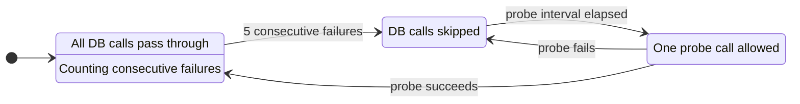
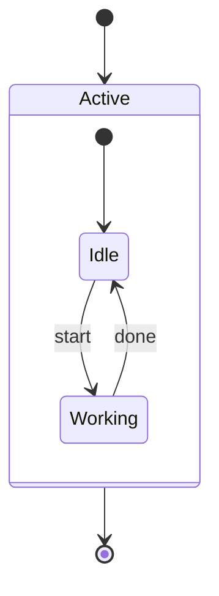
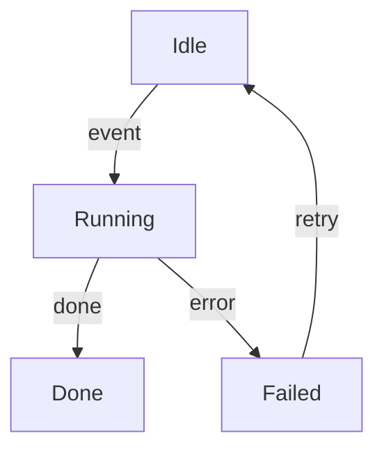
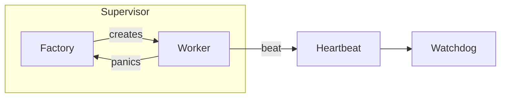
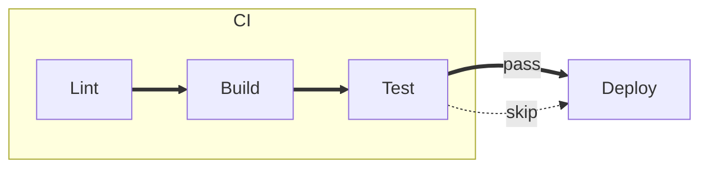
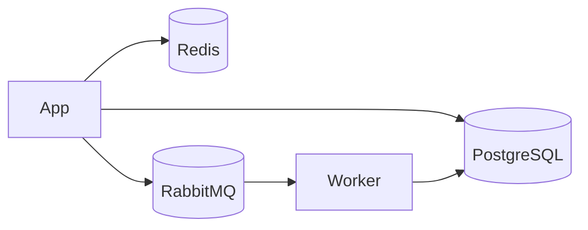
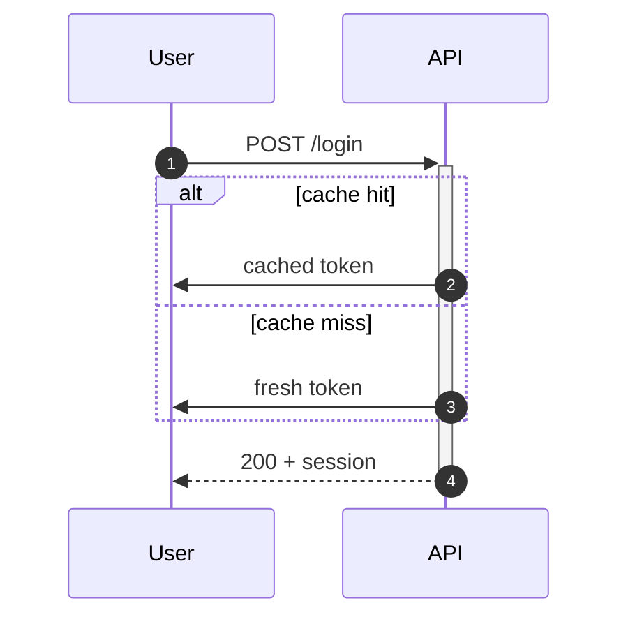
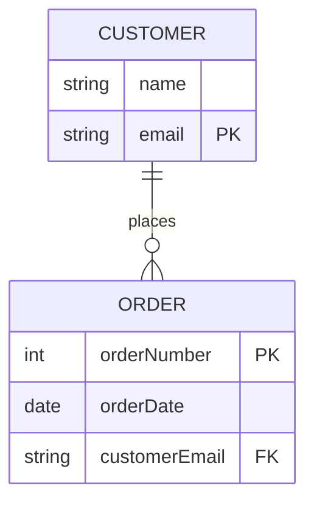
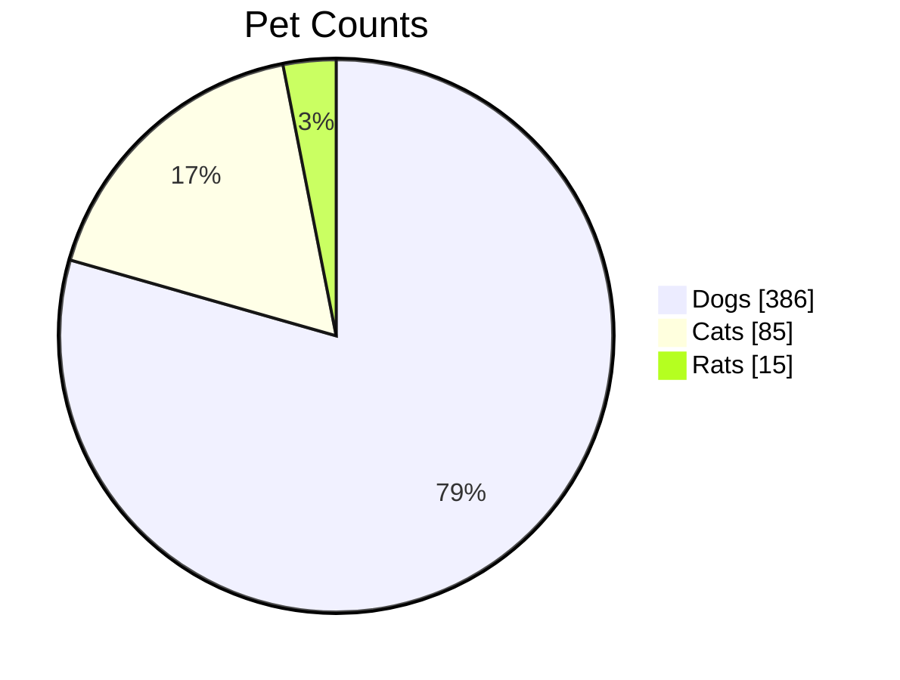
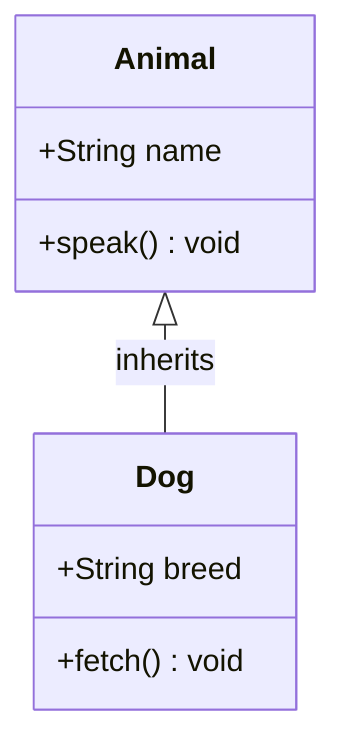

# mermaid-text

Render [Mermaid](https://mermaid.js.org/) `graph`/`flowchart` diagrams as
Unicode box-drawing text — no browser, no image protocol, pure Rust.

<!-- badge placeholder:  -->
<!-- badge placeholder:  -->

## Demo

**Input** (Mermaid source — kept as text on purpose so this side
shows the literal input, not a second rendering):

```text
graph LR; A[Build] --> B[Test] --> C[Deploy]
```

**Output**:

```
┌───────┐      ┌──────┐      ┌────────┐
│ Build │─────▸│ Test │─────▸│ Deploy │
└───────┘      └──────┘      └────────┘
```

---

## Installation

```toml
[dependencies]
mermaid-text = "0.1"
```

or:

```sh
cargo add mermaid-text
```

---

## Usage

### Library API

```rust
fn main() {
    let src = "graph LR; A[Build] --> B[Test] --> C[Deploy]";
    let output = mermaid_text::render(src).unwrap();
    println!("{output}");
}
```

For width-constrained output (terminal-friendly):

```rust
let output = mermaid_text::render_with_width(src, Some(80)).unwrap();
```

The output is a plain `String` — deterministic, newline-delimited, no ANSI
escapes.  Agents and pipelines can parse it line-by-line or search for node
labels by substring.

### CLI

Build and run from the crate root:

```sh
# From a file
cargo run -p mermaid-text -- diagram.mmd

# From stdin
echo "graph LR; A-->B-->C" | cargo run -p mermaid-text

# With a column budget
echo "graph LR; A-->B-->C" | cargo run -p mermaid-text -- --width 60
```

After installing (`cargo install mermaid-text`):

```sh
echo "graph LR; A-->B" | mermaid-text
mermaid-text --width 80 my_diagram.mmd
```

---

## Supported Syntax

| Feature | Supported |
|---------|-----------|
| `graph`/`flowchart` keyword | yes |
| Directions: `LR`, `TD`/`TB`, `RL`, `BT` | yes |
| Rectangle `A[text]` | yes |
| Rounded `A(text)` | yes |
| Diamond `A{text}` | yes |
| Circle `A((text))` | yes |
| Stadium `A([text])` | yes |
| Subroutine `A[[text]]` | yes |
| Cylinder `A[(text)]` | yes |
| Hexagon `A{{text}}` | yes |
| Asymmetric `A>text]` | yes |
| Parallelogram `A[/text/]` | yes |
| Trapezoid `A[/text\]` | yes |
| Double circle `A(((text)))` | yes |
| Solid arrow `-->` | yes |
| Plain line `---` | yes |
| Dotted arrow `-.->` | yes |
| Thick arrow `==>` | yes |
| Bidirectional `<-->` | yes |
| Circle endpoint `--o` | yes |
| Cross endpoint `--x` | yes |
| Edge labels `\|label\|` and `-- label -->` | yes |
| Subgraphs (`subgraph … end`) | yes |
| Nested subgraphs | yes |
| Per-subgraph `direction` override | partial |
| `style <id> fill:#…,stroke:#…,color:#…` (color output) | yes (opt-in) |
| `linkStyle <i> stroke:#…[,color:#…]` (color output) | yes (opt-in) |
| `classDef name fill:#…,stroke:#…,color:#…` (color output) | yes (opt-in) |
| `class id1,id2 className` | yes (opt-in) |
| `id:::className` shorthand (stackable: `A:::a:::b`) | yes (opt-in) |
| `stateDiagram` / `stateDiagram-v2` | yes (transformed to flowchart) |
| `sequenceDiagram` (incl. `autonumber`, notes, activation bars, block statements `loop`/`alt`/`opt`/`par`/`critical`/`break`) | yes (separate pipeline) |
| `pie` (with optional `showData`, `title`) | yes (renders as horizontal bar chart) |
| `erDiagram` (entities + attributes + cardinality) | yes (attribute tables, 1/?/+/* glyphs, identifying vs non-identifying) |
| `classDiagram` (class boxes + members + relationships) | yes (see below) |
| `gantt` (project schedule bar chart) | yes (Phase 1) |
| `journey` (user-journey, section/task tree with score bars) | yes |
| `timeline` (vertical time-period bullet list) | yes (Phase 1) |
| `gitGraph` (branch/commit lane diagram) | yes (Phase 1) |
| `mindmap` (hierarchical outline tree) | yes (Phase 1) |
| `quadrantChart` (2x2 priority matrix with labeled quadrants and data points) | yes (Phase 1) |
| `requirementDiagram` (formal requirements + elements + relationships) | yes (Phase 1) |
| `sankey-beta` / `sankey` (directed flow between named nodes) | yes — grouped-flow list with proportional Unicode bars (full-block `█` + sub-cell eighths `▏▎▍▌▋▊▉`); true curvilinear bands deferred |
| `xychart-beta` / `xychart` (bar/line chart with categorical or numeric axes) | yes (Phase 1) |
| `block-beta` / `block` (fixed-width block grid with directed edges) | yes (Phase 1) |
| `packet-beta` / `packet` (network packet header bit-range diagram) | yes (Phase 1 — fixed 32-bit row width; no custom colours) |
| `architecture-beta` / `architecture` (system architecture with groups, services, and edges) | yes (Path A — groups as subgraph containers, services as nodes, edges spatially routed via Sugiyama; port specifiers stored but deferred to Path B) |

---

### ANSI color (opt-in)

Mermaid `style <id> …` and `linkStyle <indexes> …` directives can drive
24-bit ANSI color output. The default rendering is unchanged — zero ANSI
bytes — so existing pipelines and snapshot tests are unaffected.

**CLI:**

```sh
mermaid-text --color diagram.mmd
mermaid-text --color --ascii diagram.mmd     # composes with --ascii
mermaid-text -c -w 80 diagram.mmd
```

**Library:**

```rust
use mermaid_text::{render_with_options, RenderOptions};

let opts = RenderOptions { color: true, ..Default::default() };
let out = render_with_options(
    "graph LR\n\
     A[Start] --> B[End]\n\
     style A fill:#336,stroke:#fff,color:#fff",
    &opts,
)?;
// `out` contains \x1b[38;2;…m / \x1b[48;2;…m sequences
```

Recognised attributes:

| Directive | Attribute | Effect |
|---|---|---|
| `style <id>` | `fill:#RRGGBB`  | node interior background |
| `style <id>` | `stroke:#RRGGBB` | node border foreground |
| `style <id>` | `color:#RRGGBB`  | node label foreground |
| `linkStyle <i\|default>` | `stroke:#RRGGBB` | edge glyph + label foreground (label falls back to `stroke` if `color` is omitted) |
| `linkStyle <i\|default>` | `color:#RRGGBB`  | edge label foreground only |

`#RGB` and `#RRGGBB` hex forms are both accepted; unknown keys and bad
hex values are silently ignored so a stray attribute can never break an
otherwise-valid diagram. 24-bit truecolor (`xterm-direct` / `truecolor`)
is required — most modern terminals (iTerm2, Kitty, Ghostty, WezTerm,
Alacritty, Terminal.app, GNOME Terminal, Windows Terminal) qualify.

**Reusable palettes via `classDef` + `class` / `:::`:**

```rust
let opts = RenderOptions { color: true, ..Default::default() };
let out = render_with_options(
    "graph LR\n\
     A[Cache] --> B[DB] --> C[Done]\n\
     classDef datastore fill:#234,stroke:#9cf,color:#fff\n\
     class A,B datastore",
    &opts,
)?;
```

`classDef` defines a named style; `class id1,id2 …` and the inline
`A:::className` shorthand (stackable as `A:::base:::overlay`) apply
it. Forward references work — `class A foo` may appear before
`classDef foo …` in the source. Subgraphs (composite states /
flowchart subgraphs) coloured via `class CompositeId styleName`
get a coloured border.

Out of scope for now: `classDef DEFAULT` special semantics
(merge into every class), `click` directives, sequence-diagram
colors (separate pipeline), subgraph interior fill, and
256-color / 16-color fallbacks.

### State diagrams

Both `stateDiagram` and `stateDiagram-v2` are accepted (they share the
same grammar in upstream Mermaid; only the JS renderer differs). State
diagrams are transformed into the flowchart `Graph` type at parse time,
so the entire flowchart pipeline — layout, edge routing, ANSI color,
ASCII fallback, width compaction — applies to them unchanged.

**Example — circuit-breaker FSM:**



The `[*]` start marker renders as a small rounded circle with `●`; the
`[*]` end marker renders as a double-circle with `●` (visually
distinguishing start from end). State descriptions stack into a
multi-line label inside the box. **Default direction is `LR`** —
`mermaid-text` intentionally diverges from Mermaid's `TB` default here
because text rendering inserts `layer_gap` blank rows between each
row of nodes, so TB balloons vertically. Add `direction TB` near the
top if you want the Mermaid default.

**Composite states** (`state X { … }`) render as a rounded rectangle
labeled with the composite's id, enclosing its inner states. Recursive
nesting works. External edges to / from a composite id are rewritten
at parse time so the arrow visibly lands on the composite's inner
start (incoming) or end (outgoing) marker:



Each composite has its own `[*]` scope — `[*]` inside `Active` refers
to Active's start/end, distinct from the top-level. Per-composite
`direction LR` works inside the body.

**Supported subset (the "Always" / "Common" tiers of the Mermaid spec):**

| Feature | Supported |
|---|---|
| `[*]` start / end markers | yes |
| `A --> B` / `A --> B : label` transitions | yes |
| Self-transitions | yes |
| `STATE : description` (multi-line accumulating) | yes |
| `state "Display" as Id` | yes |
| `state Id` bare declaration | yes |
| `direction LR/TB/BT/RL` | yes |
| `%%` comments | yes |
| Composite states `state X { … }` (recursive nesting) | yes |
| External edge to / from a composite ID | yes (rewritten to scoped `[*]`) |
| Per-composite `direction` override | yes |
| Concurrent regions `--` | not yet |
| `<<choice>>` shape modifier | yes (renders as decision Diamond) |
| `<<fork>>` / `<<join>>` shape modifiers | yes (renders as Bar perpendicular to flow) |
| Notes (`note left of X : …` / `note right of …` / `note over …`, single + multi-line) | yes |
| Floating notes (`note "text" as N1`) | silently ignored |
| `note over X,Y` multi-anchor | silently ignored |
| `classDef` / `class` / `:::className` / `style` / `linkStyle` | yes (opt-in via `--color`) |
| `class CompositeId styleName` (subgraph border colour) | yes (opt-in) |
| `click` | silently ignored |

### ASCII fallback

For environments that cannot render Unicode box-drawing characters — SSH sessions
to old hosts, CI log viewers that strip non-ASCII bytes, terminals configured
with legacy code pages — an ASCII-only mode is available:

**Library:**

```rust
let out = mermaid_text::render_ascii("graph LR; A[Build] --> B[Deploy]").unwrap();
// Every character is guaranteed to be < 0x80.
assert!(out.is_ascii());
```

**CLI:**

```sh
echo "graph LR; A-->B-->C" | mermaid-text --ascii
mermaid-text --ascii --width 60 diagram.mmd
```

**Example output (same source, Unicode vs ASCII):**

Unicode:
```
┌───────┐      ┌──────┐      ┌────────┐
│ Build │─────▸│ Test │─────▸│ Deploy │
└───────┘      └──────┘      └────────┘
```

ASCII:
```
+-------+      +------+      +--------+
| Build |----->| Test |----->| Deploy |
+-------+      +------+      +--------+
```

The mapping used: `─ ━ ┄` → `-`, `│ ┃ ┆` → `|`, all corners/junctions → `+`,
`▸ ◂ ▾ ▴` → `> < v ^`, `◇` → `*`, `○ ◯` → `o`, `×` → `x`.

---

## Examples

### State machine



### Supervisor pattern



### CI/CD pipeline with edge styles



(Thick `==>` = critical path; dotted `-.->` = optional path.)

### Dependency graph



Since 0.17.0, [`ascii-dag`]-backed Sugiyama layout is the default.
It produces the correct four-layer result on this dependency graph —
proper crossing minimisation and long-edge dummy nodes instead of
the collapsed three-layer layout that the old backend produced:

```
            ╭───────╮
            │ ───── │
           ▸│ Redis │
           │╰───────╯
           │
           │
           │                                ╭────────────╮
┌─────┐────┘╭──────────╮     ┌────────┐   ┌▸│ ────────── │
│ App │────┐│ ──────── │    ▸│ Worker │───┘▸│ PostgreSQL │
└─────┘─┐  ▸│ RabbitMQ │────┘└────────┘    │╰────────────╯
        │   ╰──────────╯                   │
        └──────────────────────────────────┘
```

To revert to the pre-0.17.0 in-house layered layout, set
`backend: LayoutBackend::Native` in `RenderOptions`.

[`ascii-dag`]: https://crates.io/crates/ascii-dag

### Sequence diagram (autonumber + activations + alt)



The four sequence-diagram polish features (autonumber, notes, activation
bars, block statements) all compose. See
[`docs/mermaid-gallery.md`](https://github.com/leboiko/markdown-reader/blob/master/docs/mermaid-gallery.md)
for one example of each.

### Entity-relationship diagram



Entity boxes render with aligned attribute tables (type / name /
keys). Relationship endpoints carry single-character cardinality
glyphs: `1` (exactly one), `?` (zero or one), `+` (one or many),
`*` (zero or many). Identifying relationships use solid `─` lines;
non-identifying (`..`) use dashed `┄`.

### Pie chart



Bar columns auto-scale to the `--width` budget (default 80). Without
`showData` the value column is omitted.

### Class diagram



Class boxes render with visibility glyphs (`+`, `-`, `#`, `~`), typed
attributes and methods, and optional static (`$`) and abstract (`*`)
suffixes. All seven relationship kinds are supported:

| Mermaid syntax | Kind | Endpoint glyph |
|---|---|---|
| `A <\|-- B` | Inheritance | `△` at parent (open triangle) |
| `A *-- B` | Composition | `◆` at whole (filled diamond) |
| `A o-- B` | Aggregation | `◇` at whole (open diamond) |
| `A --> B` | Directed association | `▸` arrow |
| `A -- B` | Plain association | plain line |
| `A <\|.. B` | Realization | `△` at interface (dashed line) |
| `A ..> B` | Dependency | `▸` arrow (dashed line) |

**Supported subset (v1):**

| Feature | Supported |
|---|---|
| Class declarations (`class X { … }` and bare `class X`) | yes |
| Attributes: `+Type name` and `+name Type` | yes |
| Methods: `+method(params) ReturnType` | yes |
| Visibility: `+` public, `-` private, `#` protected, `~` package | yes |
| Static suffix `$` | yes |
| Abstract suffix `*` | yes |
| Stereotypes `<<interface>>`, `<<abstract>>`, etc. | yes (rendered above name) |
| All 7 relationship types | yes |
| Relationship labels `: label` | yes |
| Multiplicity `"1"` / `"*"` | yes (parsed, label-rendered) |
| Default direction TB | yes |
| Generics `~T~`, `direction`, `note`, `link`, `click`, namespaces | not supported (rejected with error) |
| Colon shorthand `ClassName : member` | not supported (rejected with error) |

In ASCII mode: `△ → ^`, `◆ → #`, `◇ → *`.

---

## How It Works

**Parse** — The hand-rolled parser (`parser/flowchart.rs`) splits the input
on newlines and semicolons, identifies node definitions, edge chains, and
subgraph blocks, and builds a `Graph` struct containing typed `Node`, `Edge`,
and `Subgraph` values. Edge style (solid/dotted/thick) and endpoint type
(arrow/circle/cross/none) are parsed and stored.

**Layer + order** — The layered layout (`layout/layered.rs`) assigns each node
to a layer via longest-path from sources, then runs an iterative barycenter
heuristic (up to 8 passes with early termination after 4 non-improving passes,
keeping the best-seen ordering) to minimise edge crossings within each layer.
Per-subgraph `direction` overrides are handled by collapsing the subgraph's
nodes to a single parent layer and then re-running longest-path for downstream
nodes.

**Render** — A 2D character grid (`layout/grid.rs`) stores one `char` per cell
plus a parallel 4-bit direction-mask layer. Each cell's direction mask encodes
which sides have an outgoing line segment; a lookup table converts the mask to
the correct box-drawing glyph (`┼`, `├`, `┤`, `┬`, `┴`, `─`, `│`, etc.)
automatically. Edges are routed via A* pathfinding that treats node bounding
boxes as hard obstacles and already-drawn edges as soft obstacles. After
routing, styled (thick/dotted) edges overwrite the solid glyphs; endpoint
markers (circle, cross, bidirectional arrows) are placed last.

---

## Performance Notes

The library is synchronous and depends only on `unicode-width`. The A*
router has O(W×H) memory for the grid and O(E × W×H log(W×H)) time in the
worst case, where W and H are the grid dimensions. In practice, graphs of
up to ~100 nodes render in well under 10 ms on modern hardware. Very dense
graphs (hundreds of nodes or edges) may produce large grids that increase
render time proportionally.

---

## Limitations

- **Dotted junctions render as solid** — Unicode has no dotted T-junction or
  cross glyphs, so dotted segments revert to solid box-drawing characters at
  intersections.
- **RL/BT subgraph direction does not reverse internal order** — nodes inside
  a RL/BT subgraph are laid out in forward order.
- **Deeply-nested alternating `direction` overrides** — only the top-level
  graph direction is used when evaluating whether a subgraph is orthogonal.
  LR-inside-TB-inside-LR collapses the inner LR band but does not propagate
  the fix outward.
- **Long labels in narrow columns** — compaction reduces gaps but cannot
  reflow labels; extremely narrow `max_width` values may produce overlapping
  node boxes.

---

## Contributing

1. Run `cargo test -p mermaid-text --all-targets` — all tests must pass.
2. Run `cargo clippy -p mermaid-text --all-targets -- -D warnings` — no warnings.
3. Run `cargo doc -p mermaid-text --no-deps` — no doc warnings.
4. Add or update tests for any behavioural change.
5. Update this README and `CHANGELOG.md` if the change is user-visible.

---

## License

MIT

---

## Acknowledgements

Rendering techniques — including the direction-bit canvas, barycenter
heuristic constants, and subgraph border padding — were adapted from
[termaid](https://github.com/fasouto/termaid), a Python prior art library
for rendering Mermaid diagrams as terminal text.
